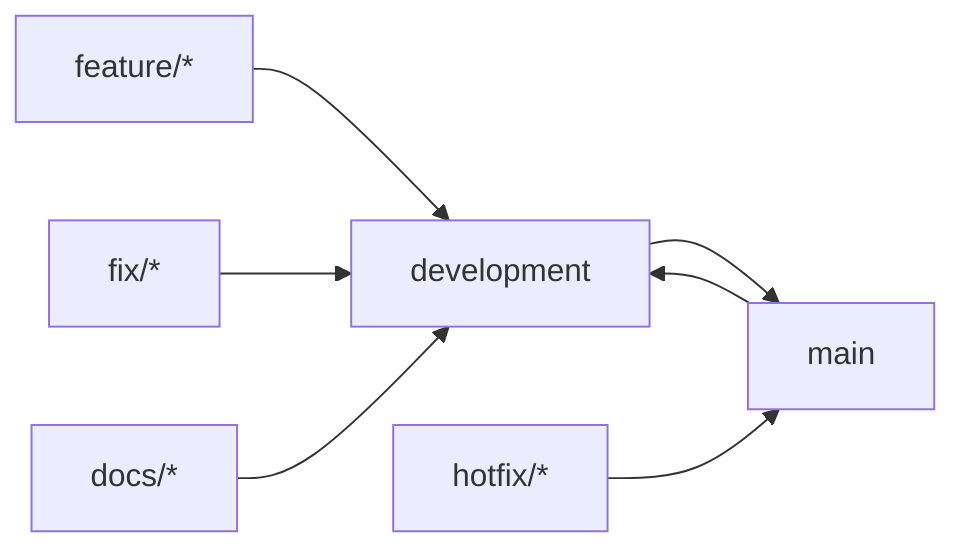

# Contributing to Inkorporated

Thank you for helping improve Inkorporated — the hybrid-cloud infrastructure and enterprise operating system monorepo.

## Quick start

1. Prefer the [devcontainer](.devcontainer/) when available.
2. Read [docs/project-conventions.md](docs/project-conventions.md) for naming, formatting, safety, docs, and testing.
3. Read [docs/guides/overview.md](docs/guides/overview.md) for product context.
4. For documentation site work: `./docs/manage-docs.sh serve` (see [docs/CONTRIBUTING.md](docs/CONTRIBUTING.md)).

## Branching, commits, PRs, and promotion

### Long-lived branches

| Branch | Purpose | Who merges | Protection |
| --- | --- | --- | --- |
| `development` | Primary integration. All feature work lands here first. | Pull requests only | Protected, linear history preferred |
| `main` | Production-ready code after explicit promotion | PRs only (normally from `development`) | Protected |
| `dev` | Optional intermediate soak gate | PRs only | Protected |

Never force-push `development` or `main`.  
Never commit directly to protected branches.

### Branch naming

Create short-lived branches from the latest `development`:

- `feature/<short-description>` — new functionality
- `fix/<short-description>` — non-urgent fixes
- `hotfix/<short-description>` — urgent production fixes (from `main`)
- `chore/<short-description>` — tooling, CI, no user-visible behavior change
- `docs/<short-description>` — documentation-only

Examples: `feature/argo-appset-hardening`, `docs/enterprise-os-and-practices`, `fix/domain-validation-false-positive`.

### Commit messages

Preferred style (Conventional Commits inspired):

```text
<type>: <short summary in imperative mood>

[optional body — why]

[optional footer]
```

**Types:** `feat`, `fix`, `hotfix`, `chore`, `docs`, `refactor`, `test`, `ci`, `build`

Rules:

- Summary ≤ 72 characters, imperative mood (“add”, “fix”, “update”).
- Body explains *why* when not obvious. Wrap ~72–80 characters.
- Reference issues in footer (`Closes #123`).
- Never put secrets or “WIP” in final messages.

### Pull request titles and descriptions

**Title:** Same style as a good commit summary.

**Description template:**

```markdown
## Summary
One or two sentences: *what* and *why*.

## Changes
- Concrete bullets
- New flags, env vars, config keys

## Safety / ops impact
- Domains, secrets, production access, GitOps, cyborg CRITICAL actions
- Or: “No safety impact.”

## Test plan
- Commands run (e.g. `./run_all_tests.sh`, `./docs/manage-docs.sh build --strict`)

## Checklist
- [ ] Tests / validation pass
- [ ] Docs updated if user-facing or public API
- [ ] No secrets committed
- [ ] Domain templates still not hardcoding customer domains
```

### Promotion (`development` → `main`)

1. Tip of `development` is green (tests + docs strict build as applicable).
2. Open promotion PR into `main` with validation notes.
3. After merge, create an **annotated tag** when cutting a release:

   ```bash
   git tag -a vX.Y.Z -m "Release vX.Y.Z"
   ```

4. Do not push tags or open promotion PRs from agent automation unless a maintainer explicitly asks.

### Hotfix flow

1. Branch from `main`: `hotfix/...`
2. PR → `main`
3. Immediately back-merge or cherry-pick into `development`

## Documentation

- Site engine: **MkDocs Material** with multi-version **mike** (`latest` / `development`).
- Page standards: [docs/CONTRIBUTING.md](docs/CONTRIBUTING.md) and [docs/project-conventions.md](docs/project-conventions.md).
- Enterprise content (roles, policies, cyborgs) lives under `docs/`; machine cyborg specs under `cyborgs/`.

## Security

See [SECURITY.md](SECURITY.md). Never commit `.devcontainer/.env`, kubeconfigs, or live credentials.

## Code of conduct

Contributors are expected to follow [docs/policies/code_of_conduct.md](docs/policies/code_of_conduct.md).


## Branch and promotion model


