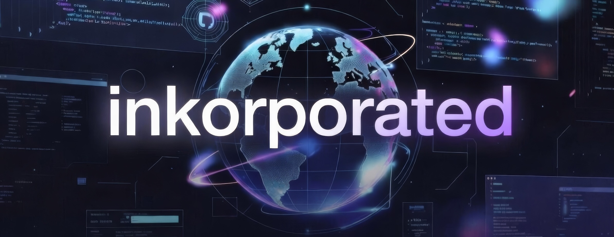
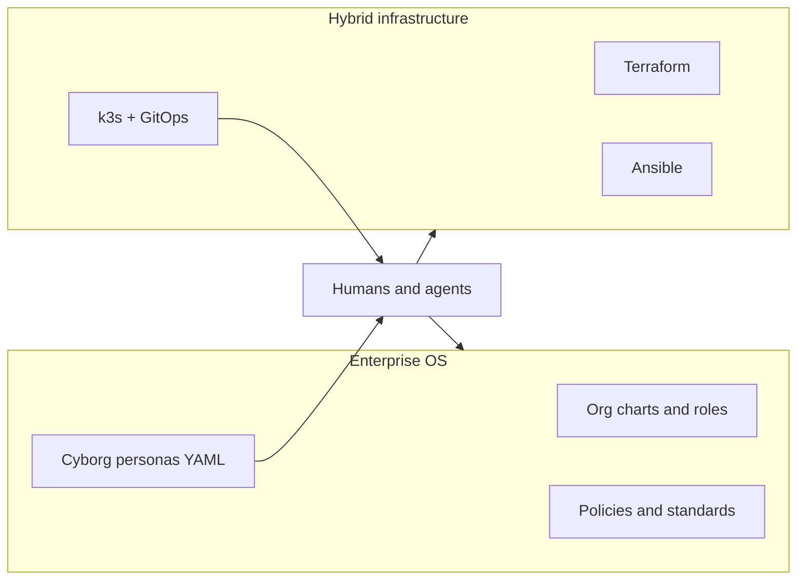
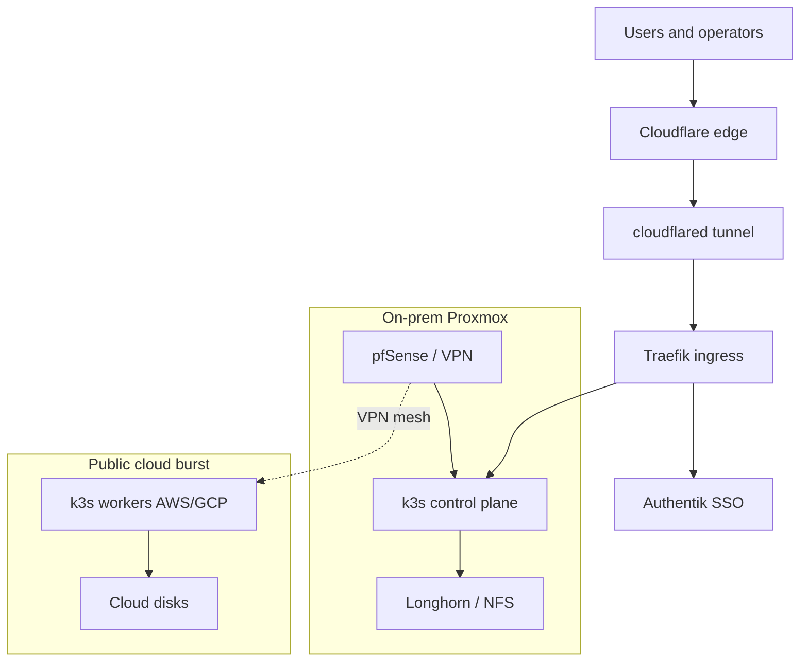
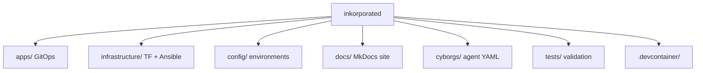
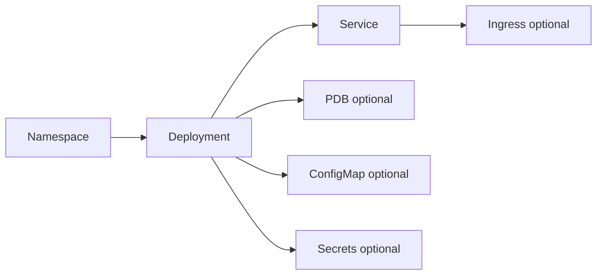
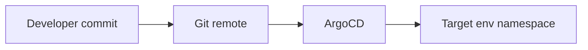
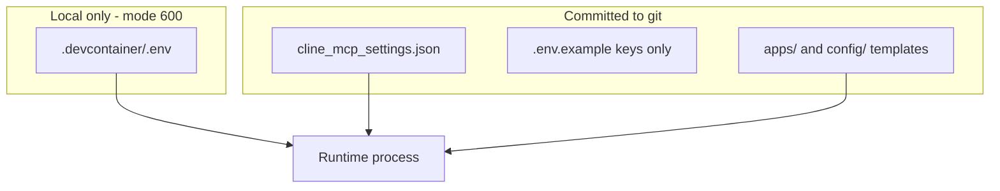
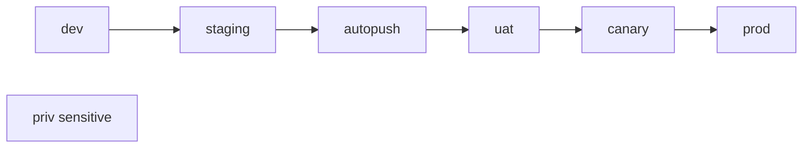
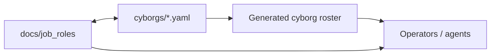

# Inkorporated - Eazy Homelab <> Corp IaC

## Overview

Inkorporated is a **one-stop shop to spin up a full enterprise**: hybrid-cloud infrastructure-as-code *and* an enterprise operating system (org design, job roles, policies, interview loops, and AI **cyborg** personas).

**Start here:** [docs](docs/index.md) (MkDocs) · [CONTRIBUTING.md](CONTRIBUTING.md) · [project conventions](docs/project-conventions.md) · [cyborg roster](docs/cyborgs/generated/index.md)

The following diagram shows the two halves of the monorepo and how they connect for operators and AI agents.

This repository provides a production-minded path from homelab to corplab to cloud burst capacity—declarative infra, GitOps, zero-trust access, and the org/process docs needed to run like a global company.

## Architecture

Inkorporated uses a **hybrid cloud** model: Proxmox hosts the persistent control plane; AWS/GCP provide ephemeral burst capacity. Clusters run **k3s**, exposed through zero-trust edge access.

| Layer | Role |
| --- | --- |
| **Proxmox** | Control plane and persistent workloads |
| **AWS / GCP** | Burst and temporary capacity |
| **VPN** | Secure hybrid node connectivity |
| **Storage** | Longhorn / NFS on-prem; cloud-native disks in cloud |

Deeper topology: [docs/architecture/ARCHITECTURE.md](docs/architecture/ARCHITECTURE.md).

## Project Structure

Top-level layout for developers landing in the repo:

| Path | Purpose |
| --- | --- |
| `infrastructure/terraform` | Hybrid cloud provisioning (Proxmox, AWS, GCP) |
| `infrastructure/ansible` | k3s and host configuration |
| `apps/` | ArgoCD Applications / ApplicationSets |
| `config/` | Environment configuration |
| `docs/` | MkDocs documentation site |
| `cyborgs/` | Machine-readable AI persona specs |
| `tests/` | Bazel / script validation |

Other platform pieces: Cloudflare Tunnel, Authentik, Prometheus/Grafana/Loki, Longhorn, Velero/MinIO, Traefik, Gitea, and more (see service catalog in docs).

## Deployment Patterns

Services follow a consistent Kubernetes shape. The flow below is the mental model for every app manifest.

GitOps path from a change in git to a live environment:

## Configuration Management

Sensitive credentials never live next to non-secret settings.

| File | Contains |
| --- | --- |
| `cline_mcp_settings.json` | Non-secret server/settings |
| `.devcontainer/.env` | Secrets (gitignored, `chmod 600`) |
| Env overlays | Per-environment non-secret config under `config/environments/` |

## Environment Structure

Configuration and app overlays are split by environment:

| Env | Intent |
| --- | --- |
| `dev` | Development |
| `staging` | Pre-prod integration |
| `autopush` | Continuous push validation |
| `uat` | User acceptance |
| `canary` | Limited production exposure |
| `prod` | Production |
| `priv` | Sensitive / restricted services |

Paths: `config/environments/`, `apps/environments/`.

## Humans and cyborgs

Role documentation and machine personas stay aligned so AI agents and people share the same org model.

Browse the visual roster (cards, chips, security coloring) in the docs site after build: [Cyborg roster](docs/cyborgs/generated/index.md).

## Security Approach

1. **Separation of concerns** — secrets vs settings  
2. **No secrets in git**  
3. **Restrictive file modes** (`600` on local env)  
4. **Runtime env loading**  
5. **Zero-trust edge** — Cloudflare Tunnel  
6. **Central SSO** — Authentik  
7. **Network segmentation** — pfSense / VLANs  
8. **Cyborg HITL** — CRITICAL personas require human approval

## Infrastructure Components

The project implements a multi-zone network architecture with the following components:

### Core Infrastructure Services
- **Cloudflare Tunnel (cloudflared)**: Zero-trust access to services
- **Traefik**: Ingress controller with TLS termination
- **Authentik**: Central identity provider with OIDC + 2FA enforcement
- **Longhorn**: Distributed block storage
- **NFS CSI Driver**: Synology NAS integration
- **MinIO**: S3 object storage for backups
- **Velero**: Backup and restore solution
- **cert-manager**: TLS automation
- **MetalLB**: LoadBalancer provider

### Collaboration Services
- **Rocket.Chat**: Team chat platform
- **WorkAdventure**: 2D virtual office
- **Jitsi Meet**: Video conferencing
- **Coturn**: TURN/STUN server for NAT traversal

### Productivity Services
- **AppFlowy**: Collaborative knowledge base
- **LinkWarden**: Bookmark manager
- **Homebox**: Inventory tracker
- **Home Assistant**: Smart home hub

### Remote Work Services
- **Kasm Workspaces**: Browser-based workspaces
- **Coder**: Cloud IDE workspaces

### AI Services
- **Ollama**: Local LLM runner
- **Open WebUI**: Ollama web interface
- **Langflow**: Visual LangChain builder
- **Kokoro TTS**: Local TTS server
- **Docling**: Document parsing server
- **SearXNG**: Metasearch engine
- **SurfSense**: AI research agent
- **Perplexica**: AI search engine

### Security Services
- **Vaultwarden**: Bitwarden-compatible password manager
- **HashiCorp Vault**: Secrets management

## Implementation Phases

The project follows a structured implementation approach:

### Phase 1: Foundation & Preparation
- Validate physical infrastructure readiness
- Create Proxmox Cloud-Init template
- Workstation setup with required tools

### Phase 2: Repository & Code Setup
- Create bootstrap repository with Terraform/Ansible
- Create apps repository with GitOps manifests

### Phase 3: Bootstrap Infrastructure
- Provision VMs with Terraform
- Install k3s with Ansible
- Bootstrap ArgoCD

### Phase 4: Core Infrastructure Deployment
- Deploy storage solutions (Longhorn, NFS CSI)
- Deploy database services (CloudNativePG, MongoDB)
- Deploy backup and monitoring stack
- Deploy core services (Authentik, Traefik, Cloudflared)

### Phase 5: Post-Deployment
- Configure authentication providers and groups
- Deploy user dashboard (Homepage)
- Enable backups and testing
- Performance and security hardening
- Documentation runbook creation

## Testing Framework

A comprehensive testing framework has been implemented to ensure reliability and security:
- Configuration validation tests
- Security permission checks
- Kubernetes manifest validation
- Integration testing for services
- Automated test suite with CI/CD integration
- Infrastructure health monitoring tests
- Backup and restore validation tests

## Development Workflow

The project follows these development workflow patterns:
- GitOps with ArgoCD for infrastructure and application deployment
- Environment variable configuration for domain flexibility
- Centralized configuration management system
- Kubernetes manifest pattern for custom resources
- Helm chart pattern for application deployment
- Service-oriented architecture with proper namespace separation
- MCP-based infrastructure automation workflows
- Automated security and compliance validation

## Tooling Preferences

The project uses the following tooling preferences:
- **Container Orchestration**: Kubernetes (k3s)
- **Deployment Management**: ArgoCD (GitOps)
- **Authentication**: Authentik (OIDC + SSO)
- **Ingress Controller**: Traefik with forward-auth
- **Zero-trust Access**: Cloudflare Tunnel (cloudflared)
- **Network Security**: pfSense VM
- **Storage**: Longhorn (block storage), NFS CSI driver (Synology NAS)
- **Backup & DR**: Velero with MinIO
- **Monitoring**: kube-prometheus-stack (Prometheus, Grafana, Loki)
- **Infrastructure as Code**: Terraform, Ansible
- **Development Tools**: kubectl, helm, terraform, ansible, cloudflared CLI
- **MCP Integration**: context7 MCP server for documentation and patterns
- **Security Tools**: Automated vulnerability scanning with MCP

## Performance Requirements

- Resource quotas and limits for all namespaces
- High availability with PodDisruptionBudgets
- Efficient resource utilization for all services
- Monitoring and alerting for performance metrics
- Backup and restore testing for disaster recovery
- Automated performance optimization with MCP tools

## Documentation Standards

All documentation follows these standards:
- Comprehensive technical documentation
- Service-specific documentation with configurations
- Implementation status tracking
- Configuration management guidelines
- Security and best practices documentation
- Troubleshooting and maintenance guides
- MCP integration documentation
- Infrastructure automation workflows documentation

## Accessibility Guidelines

While the project is primarily focused on infrastructure and backend services, accessibility considerations include:
- User-friendly dashboard interfaces
- Clear navigation and organization of services
- Consistent design patterns across applications
- Support for keyboard navigation where applicable

## Internationalization Needs

The project supports internationalization through:
- Configurable domain names and URLs
- Environment variable configuration for localization
- Multi-language support in user-facing applications
- Flexible configuration management for different regions

## Security Considerations

- All sensitive data stored as Kubernetes secrets
- Sealed secrets for Git-safe storage
- Proper RBAC and access controls
- Network policies for security segmentation
- Regular security updates for container images
- Centralized authentication with SSO
- Zero-trust network architecture
- Backup and disaster recovery procedures
- Automated security scanning with MCP tools
- Infrastructure hardening and compliance validation

## Integration Patterns

### Authentication Flow
1. User accesses any service via subdomain (e.g., `https://chat.example.com`)
2. Traefik forwards request to Authentik for authentication
3. Authentik validates credentials and issues JWT
4. User is redirected back to service with authenticated session
5. Service validates JWT and grants access

### Data Flow
1. Services communicate through internal Kubernetes networks
2. External services use Cloudflare Tunnel for secure access
3. All data is encrypted in-transit using TLS
4. Persistent data stored on Longhorn volumes or MinIO

## Maintenance and Operations

- Regular security audits and updates
- Automated container image updates
- Monitoring and alerting review
- Backup testing and verification
- Performance optimization
- Documentation updates
- Automated infrastructure health checks
- MCP-based operational workflows

## Future Enhancements

Planned features and improvements:
- Enhanced AI integration capabilities
- Improved monitoring and alerting
- Additional security hardening
- Performance optimization
- Automated testing and CI/CD improvements
- MCP-based infrastructure automation
- Advanced backup and disaster recovery
- Enhanced observability with AI insights
- More comprehensive security scanning
- Automated compliance validation

## Support My Projects

If you find this repository helpful and would like to support its development, consider making a donation:

### GitHub Sponsors

### Buy Me a Coffee

### PayPal

### Ko-fi

### Coinbase

Your support helps maintain and improve this collection of development tools and templates. Thank you for contributing to open source!
