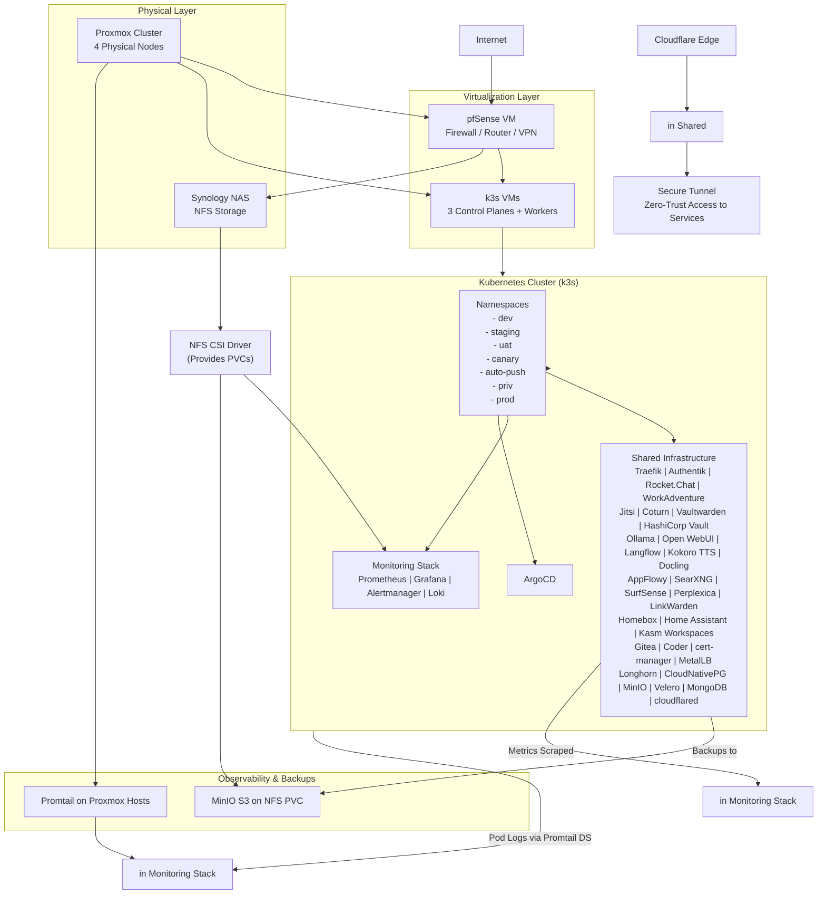

# Inkorporated Homelab - Complete Project Documentation

## Project Overview

**Inkorporated** is a comprehensive, self-hosted, open-source internal work environment designed for homelab deployments. This project provides a complete, integrated solution that combines infrastructure automation, GitOps deployment, and a rich set of productivity and collaboration tools.

### Key Features

- **GitOps Deployment**: Full infrastructure and application management through Git
- **Infrastructure as Code**: Terraform for VM provisioning, Ansible for k3s setup
- **Zero-trust Access**: Cloudflare Tunnel for secure external access
- **Centralized Authentication**: Authentik SSO/OIDC integration
- **Observability**: Prometheus, Grafana, and Loki stack
- **Storage Solutions**: Longhorn and NFS CSI driver
- **Backup & Recovery**: Velero with MinIO
- **Service Mesh**: Traefik with forward-auth middleware
- **Version Control**: Gitea instance for GitOps workflow
- **CI/CD**: Gitea runners for automated deployments

## Architecture Overview



## Repository Structure

### Core Repositories

1. **inkorporated-bootstrap** - Terraform + Ansible for Proxmox VMs, Synology folder, k3s install, Promtail on hosts
2. **inkorporated-k8s-apps** - GitOps manifests organized by `infra/shared`, `environments`, `apps/per-env`, `apps/priv-optional`, `app-of-apps/root`

### Project Directories

```
.
├── apps/                     # Application deployments
│   └── shared/               # Shared applications
│       └── cloudflared/      # Cloudflare tunnel deployment
├── infrastructure/           # Infrastructure provisioning
│   ├── terraform/            # Terraform configurations
│   └── ansible/              # Ansible playbooks
├── kubernetes/               # Kubernetes manifests
│   ├── base/                 # Base configurations
│   ├── overlays/             # Environment-specific configurations
│   └── argocd/               # ArgoCD configurations
├── docs/                     # Documentation
└── memory-bank/              # Project documentation and context
```

### Documentation Navigation
- [Project Overview](PROJECT_OVERVIEW.md) - Executive summary and key features
- [Service Specifications](SERVICE_SPECIFIC_DOCUMENTATION.md) - Detailed service configurations
- [Implementation Status](IMPLEMENTATION_STATUS_TRACKING.md) - Current progress tracking
- [Discovery Summary](DISCOVERY_AND_DOCUMENTATION_SUMMARY.md) - Consolidated documentation overview
```

## Implementation Phases

### Phase 1: Foundation & Preparation

**Task 1.01: Validate Physical Infrastructure Readiness**
- Verify Proxmox: 4 nodes online, ≥64GB RAM total, ≥16 CPU cores, ≥500GB storage
- Synology: Enable NFSv4.1, create `/volume1/k8s-backups`, permissions for LAN subnet
- Cloudflare: Create account, add domain overeasy.io, generate tunnel token

**Task 1.02: Create Proxmox Cloud-Init Template**
- Upload Ubuntu 24.04 ISO
- Create VM ID 9000: 2 CPU, 4GB RAM, 32GB disk, install minimal, enable qemu-guest-agent, SSH
- Convert to template

**Task 1.03: Workstation Setup**
- Install Terraform, Ansible, kubectl, helm, argocd CLI, kubeseal, cloudflared CLI
- Generate SSH key

### Phase 2: Repository & Code Setup

**Task 2.01: Create Bootstrap Repository**
- Create repo for Terraform/Ansible code
- Add terraform for VMs (3 CP, 2 workers), Synology folder
- Add Ansible for k3s

**Task 2.02: Create Apps Repository**
- Create repo for GitOps manifests
- Add dirs for shared (including cloudflared subdir with Deployment.yaml, ConfigMap for tunnel config.yaml, secret for token)

### Phase 3: Bootstrap Infrastructure

**Task 3.01: Provision VMs with Terraform**
- Fill tfvars (creds, template)
- `terraform apply`

**Task 3.02: Install k3s with Ansible**
- Update inventory
- Run playbook

**Task 3.03: Bootstrap ArgoCD**
- Create ns argocd
- Apply manifests
- Add repo, apply root app

### Phase 4: Core Infrastructure Deployment

**Task 4.01: Deploy NFS CSI Driver**
- Add Application: Helm chart, server=synology-ip, share=/volume1/k8s-backups

**Task 4.02: Deploy Longhorn Storage**
- Add Application: Chart v1.6.0, defaultReplicaCount=3, replicaSoftAntiAffinity=true

**Task 4.03: Deploy MinIO Object Storage**
- Add Application: Bitnami/minio, mode=standalone, storageClass=nfs-csi, size=5Ti, buckets=["longhorn-backups","velero-backups","cnpg-backups"]

**Task 4.04: Deploy CloudNativePG and MongoDB**
- CNPG operator v1.23.1, Cluster: instances=3, storage=longhorn 50Gi, backup to minio
- Mongo: Bitnami chart, replicaset=3, longhorn

**Task 4.05: Deploy Velero**
- Add Application: vmware-tanzu/velero, provider=aws, s3Url=http://minio.minio.svc:9000, bucket=velero-backups, credentials=sealed

**Task 4.06: Deploy cert-manager**
- Add Application: jetstack/cert-manager v1.14.0, installCRDs=true, replicas=3

**Task 4.07: Deploy MetalLB**
- Add Application: metallb/metallb v0.15.3, controller.replicas=1, speaker.daemonset=true

**Task 4.08: Deploy Traefik**
- Add Application: traefik/traefik v28.1.0, ports.websecure.tls=true

**Task 4.09: Deploy Authentik**
- Add Application: goauthentik/authentik, postgresql.host=postgres-ha-rw, database=authentik, secret=sealed

**Task 4.10: Deploy Vaultwarden**
- Add Application: vaultwarden/server, postgres.host=postgres-ha-rw, database=vaultwarden, secret=sealed

**Task 4.11: Deploy HashiCorp Vault**
- Add Application: hashicorp/vault v0.28.0, ha.replicas=3, raft.enabled=true, ui=true

**Task 4.12: Deploy cloudflared Tunnel**
- Create Cloudflare Tunnel in dashboard, get token=sealed
- Add Application: Deployment image=cloudflare/cloudflared:latest, command=["tunnel", "--config", "/etc/config.yaml"]

### Phase 5: Post-Deployment

**Task 5.01: Configure Authentik Providers and Groups**
- UI: OIDC providers for each service
- Groups: admins, developers, testers, priv-users, guests
- Bind apps to groups

**Task 5.02: Deploy User Dashboard (Homepage)**
- Add Application: homepage/homepage latest, namespace=homepage
- Config: services configuration with grouped shortcuts
- Forward-auth middleware
- Ingress: dashboard.example.com

**Task 5.03: Enable Backups and Test**
- Schedule: includeNamespaces=["*"], ttl=720h, schedule="0 3 * * *"
- Test backup/restore dev

**Task 5.04: Performance and Security Hardening**
- Quotas non-prod: cpu=4, mem=8Gi
- LimitRange default cpu=500m mem=512Mi
- Network policies deny default

**Task 5.05: Documentation Runbook**
- docs/ with URLs, creds, backups
- Add to Homepage

## Services Overview

### Collaboration Services
| Service | Purpose | Authentication | Storage |
|---------|---------|----------------|---------|
| Rocket.Chat | Team chat platform | Authentik | MongoDB |
| WorkAdventure | 2D virtual office | Authentik | PostgreSQL |
| Jitsi Meet | Video conferencing | Authentik | Config |
| Coturn | TURN/STUN server | Authentik | Config |

### Productivity Services
| Service | Purpose | Authentication | Storage |
|---------|---------|----------------|---------|
| AppFlowy | Collaborative knowledge base | Authentik | PostgreSQL |
| LinkWarden | Bookmark manager | Authentik | PostgreSQL |
| Homebox | Inventory tracker | Authentik | PostgreSQL |
| Home Assistant | Smart home hub | Authentik | Longhorn PVC |

### Remote Work Services
| Service | Purpose | Authentication | Storage |
|---------|---------|----------------|---------|
| Kasm Workspaces | Browser-based workspaces | Authentik | PostgreSQL |
| Coder | Cloud IDE workspaces | Authentik | PostgreSQL |

### AI Services
| Service | Purpose | Authentication | Storage |
|---------|---------|----------------|---------|
| Ollama | Local LLM runner | None | Longhorn PVC |
| Open WebUI | Ollama web interface | Authentik | PostgreSQL |
| Langflow | Visual LangChain builder | Authentik | PostgreSQL |
| Kokoro TTS | Local TTS server | None | Model cache |
| Docling | Document parsing server | None | Config |
| SearXNG | Metasearch engine | Authentik | Config |
| SurfSense | AI research agent | Authentik | PostgreSQL |
| Perplexica | AI search engine | Authentik | Embeddings |

### Security Services
| Service | Purpose | Authentication | Storage |
|---------|---------|----------------|---------|
| Vaultwarden | Bitwarden-compatible password manager | Authentik | PostgreSQL |
| HashiCorp Vault | Secrets management | Authentik | Integrated |

### Infrastructure Services
| Service | Purpose | Authentication | Storage |
|---------|---------|----------------|---------|
| CloudNativePG | PostgreSQL operator | None | Longhorn |
| Longhorn | Distributed block storage | None | Synology NFS |
| MinIO | S3 object storage | None | NFS PVC |
| Velero | Backup/restore | None | MinIO S3 |
| ArgoCD | GitOps engine | None | N/A |
| cert-manager | TLS automation | None | N/A |
| MetalLB | LoadBalancer provider | None | N/A |

## Network Topology

The Inkorporated homelab implements a multi-zone network architecture to provide security segmentation and logical separation of services:

| Department/Zone | Subnet | Example Gateway IP | Purpose/Notes |
|-----------------|--------|-------------------|---------------|
| Headquarters | 10.0.1.0/24 | 10.0.1.1 | Executive offices and admin staff |
| Sales | 10.0.2.0/24 | 10.0.2.1 | Sales team workstations and CRM access |
| Engineering | 10.0.3.0/24 | 10.0.3.1 | Development and testing environments |
| Finance | 10.0.4.0/24 | 10.0.4.1 | Accounting and financial systems |
| Human Resources | 10.0.5.0/24 | 10.0.5.1 | HR personnel and sensitive data storage |
| IT | 10.0.6.0/24 | 10.0.6.1 | IT support and monitoring tools |
| Servers | 10.0.7.0/24 | 10.0.7.1 | Internal servers (e.g., file shares, databases) |
| DMZ | 10.0.8.0/24 | 10.0.8.1 | Public-facing services (e.g., web/email servers) |
| Guest WiFi | 10.0.9.0/24 | 10.0.9.1 | Visitor network - isolated with captive portal |
| Remote Access | 10.0.10.0/24 | 10.0.10.1 | VPN pool for remote workers |
| inkternal | 10.0.11.0/24 | 10.0.11.1 | Employee devices connect here |
| inklab | 10.0.12.0/24 | 10.0.12.1 | Internal-facing services |
| publink | 10.0.13.0/24 | 10.0.13.1 | Production services for external access |

## Security Implementation

### Authentication & Authorization
- **Authentik**: Central identity provider with OIDC + 2FA enforcement
- **SSO Flow**: Login once → seamless across all services
- **Groups**: admins/full, developers limited AI models, etc.

### Network Security
- **pfSense**: Primary firewall (block all except necessary ports)
- **VPN Termination**: OpenVPN/WireGuard for remote access
- **IDS/IPS**: Via pfSense packages

### Data Protection
- **In-transit**: All encrypted via Traefik TLS
- **At-rest**: Longhorn storage encryption
- **Secrets**: Vault for apps; Vaultwarden for users; SealedSecrets in GitOps

## Backup & Disaster Recovery

- **Velero**: Scheduled cluster backups to MinIO
- **Longhorn**: Recurring S3 exports
- **CNPG/MongoDB**: Continuous archiving
- **pfSense**: Config backup via package or manual export
- **Test restores**: Regular testing in dev namespace

## Observability

### Monitoring Stack
- **Grafana**: Single pane dashboard for every service + Proxmox + pfSense
- **Loki**: Unified logs (pods + hosts)
- **Alerts**: For failures, resource exhaustion, backup issues, pfSense events

### Metrics Collection
- **Prometheus**: Metrics scraping from all services
- **Built-in exporters**: For most applications
- **Custom exporters**: Where needed

## Deployment & Operations

### Deployment Process
1. **Terraform** → **Ansible bootstrap** (including pfSense VM)
2. **Configure pfSense** post-deploy (interfaces, rules, VPN)
3. **ArgoCD sync** (wave order: storage → DBs → Authentik → backends → frontends)
4. **Post-deploy** configuration (Authentik applications, homepage shortcuts, etc.)

### Maintenance
- **Manual infra syncs** for infrastructure changes
- **Monitor Grafana** for system health
- **Regular security updates** for container images

## Implementation Status

### Current Progress
- ✅ Project renamed from "devset" to "inkorporated"
- ✅ README updated with proper project context
- ✅ Cloudflared tunnel service deployment files created
- ✅ Implementation plan and task breakdown documented
- 🔄 Cloudflared tunnel token integration pending
- 🔄 Core infrastructure components deployment in progress

### Next Immediate Actions
1. **Complete Cloudflared Integration**
   - Obtain Cloudflare tunnel token from Cloudflare dashboard
   - Create proper Kubernetes secret with real tunnel token
   - Apply the secret to the cluster
   - Verify cloudflared pods start successfully

2. **Infrastructure Setup**
   - Validate physical infrastructure readiness
   - Create Proxmox Cloud-Init template
   - Set up workstation tools
   - Create bootstrap repository with Terraform/Ansible

3. **Core Infrastructure Deployment**
   - Provision VMs with Terraform
   - Install k3s with Ansible
   - Bootstrap ArgoCD
   - Deploy NFS CSI Driver
   - Deploy Longhorn Storage

## Configuration Management Strategy

### GitOps Principles
- All infrastructure and applications managed through Git
- Declarative configuration files
- Automated deployment through ArgoCD
- Version-controlled changes with proper commit messages

### Secrets Management
- Sensitive data stored as Kubernetes secrets
- Sealed secrets for Git-safe storage
- Proper RBAC and access controls

### Environment Management
- Multiple environments: dev, staging, uat, prod
- Environment-specific configurations
- Progressive deployment strategy

## Best Practices

### Infrastructure as Code
- Use Terraform for infrastructure provisioning
- Use Ansible for configuration management
- Maintain idempotent scripts and configurations

### Security
- Regular security audits
- Keep container images updated
- Implement proper network segmentation
- Use least privilege principles

### Monitoring & Logging
- Comprehensive metrics collection
- Centralized logging with Loki
- Alerting for critical issues
- Performance monitoring

## Troubleshooting Guide

### Common Issues
1. **Cloudflared Tunnel Issues**
   - Verify tunnel token is correct
   - Check network connectivity to Cloudflare
   - Review pod logs for errors

2. **Authentication Problems**
   - Verify Authentik configuration
   - Check service integration settings
   - Review authentication logs

3. **Storage Issues**
   - Verify Longhorn and NFS CSI drivers
   - Check PVC binding status
   - Review storage capacity

### Debugging Commands
```bash
# Check pod status
kubectl get pods -A

# View logs for a specific pod
kubectl logs -n <namespace> <pod-name>

# Describe a pod for detailed information
kubectl describe pod -n <namespace> <pod-name>

# Check service status
kubectl get svc -A

# Check ingress status
kubectl get ingress -A
```

## Future Enhancements

### Planned Features
- Enhanced AI integration capabilities
- Improved monitoring and alerting
- Additional security hardening
- Performance optimization
- Automated testing and CI/CD improvements

### Technology Roadmap
1. **Short-term**: Complete current implementation
2. **Medium-term**: Add advanced AI features
3. **Long-term**: Expand to multi-cluster support

## Contributing

This project is open-source and welcomes contributions. Please see the contribution guidelines in the repository for more information.

## License

This project is licensed under the MIT License - see the LICENSE file for details.

## Support

For support, please open an issue in the GitHub repository or contact the project maintainers.
