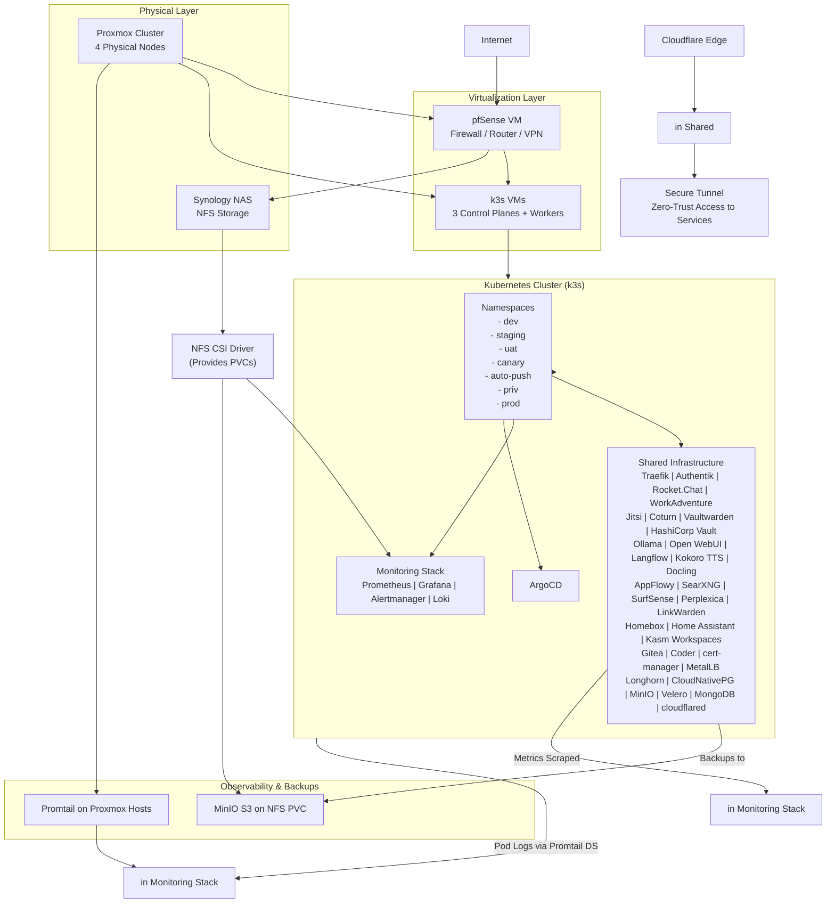

# Inkorporated Homelab Architecture

## High-Level Architecture

## Core Components

### Infrastructure Layer
- **Proxmox Cluster**: 4 physical nodes for VM hosting
- **Synology NAS**: NFS storage for persistent volumes
- **pfSense VM**: Firewall, router, and VPN termination

### Kubernetes Layer
- **k3s Cluster**: Lightweight Kubernetes distribution
- **Namespaces**: Isolated environments (dev, staging, prod, etc.)
- **Shared Infrastructure**: Common services deployed across all namespaces

### Services Overview
- **Authentication**: Authentik SSO/OIDC
- **Collaboration**: Rocket.Chat, WorkAdventure, Jitsi Meet
- **Productivity**: AppFlowy, LinkWarden, Homebox, Home Assistant
- **Remote Work**: Kasm Workspaces, Coder
- **AI Services**: Ollama, Open WebUI, Langflow, Kokoro TTS, Docling, SearXNG, SurfSense, Perplexica
- **Security**: Vaultwarden, HashiCorp Vault
- **Infrastructure**: Longhorn, MinIO, Velero, CloudNativePG, Traefik, cert-manager, MetalLB

## Network Topology

The Inkorporated homelab implements a multi-zone network architecture:

| Department/Zone | Subnet | Example Gateway IP | Purpose/Notes |
|-----------------|--------|-------------------|---------------|
| Headquarters | 10.0.1.0/24 | 10.0.1.1 | Executive offices and admin staff |
| Sales | 10.0.2.0/24 | 10.0.2.1 | Sales team workstations and CRM access |
| Engineering | 10.0.3.0/24 | 10.0.3.1 | Development and testing environments |
| Finance | 10.0.4.0/24 | 10.0.4.1 | Accounting and financial systems |
| Human Resources | 10.0.5.0/24 | 10.0.5.1 | HR personnel and sensitive data storage |
| IT | 10.0.6.0/24 | 10.0.6.1 | IT support and monitoring tools |
| Servers | 10.0.7.0/24 | 10.0.7.1 | Internal servers (e.g., file shares, databases) |
| DMZ | 10.0.8.0/24 | 10.0.8.1 | Public-facing services (e.g., web/email servers) |
| Guest WiFi | 10.0.9.0/24 | 10.0.9.1 | Visitor network - isolated with captive portal |
| Remote Access | 10.0.10.0/24 | 10.0.10.1 | VPN pool for remote workers |
| inkternal | 10.0.11.0/24 | 10.0.11.1 | Employee devices connect here |
| inklab | 10.0.12.0/24 | 10.0.12.1 | Internal-facing services |
| publink | 10.0.13.0/24 | 10.0.13.1 | Production services for external access |

## Security Implementation

### Zero-trust Architecture
- **Cloudflare Tunnel**: Secure external access with zero-trust principles
- **Authentik SSO**: Centralized authentication with OIDC + 2FA
- **Network Segmentation**: pfSense firewall with VLANs
- **Secrets Management**: Vault for apps, Vaultwarden for users, SealedSecrets in GitOps

### Data Protection
- **In-transit**: All encrypted via Traefik TLS
- **At-rest**: Longhorn storage encryption
- **Backup**: Velero scheduled backups to MinIO S3

## Observability Stack

### Monitoring
- **Prometheus**: Metrics collection from all services
- **Grafana**: Dashboards for system monitoring
- **Alertmanager**: Alerting for critical system events

### Logging
- **Loki**: Unified logs (pods + hosts)
- **Promtail**: Log collection agents on hosts and pods

## Storage Solutions

### Primary Storage
- **Longhorn**: Distributed block storage with 3-replica redundancy
- **NFS CSI Driver**: Provides PVCs from Synology NFS storage

### Object Storage
- **MinIO**: S3-compatible object storage for backups and file storage
- **Velero**: Backup and restore solution for Kubernetes resources

## Deployment Strategy

### GitOps Workflow
1. **Terraform** → **Ansible bootstrap** (including pfSense VM)
2. **Configure pfSense** post-deploy (interfaces, rules, VPN)
3. **ArgoCD sync** (wave order: storage → DBs → Authentik → backends → frontends)
4. **Post-deploy** configuration (Authentik applications, homepage shortcuts, etc.)

### Infrastructure as Code
- **Terraform**: VM provisioning and initial setup
- **Ansible**: k3s cluster configuration
- **Kubernetes manifests**: Declarative configuration
- **ArgoCD**: GitOps engine for application deployment

## Implementation Phases

### Phase 1: Foundation & Preparation
- Validate physical infrastructure readiness
- Create Proxmox Cloud-Init template
- Set up workstation tools

### Phase 2: Repository & Code Setup
- Create bootstrap repository with Terraform/Ansible
- Create apps repository with GitOps manifests
- Complete cloudflared tunnel deployment structure

### Phase 3: Bootstrap Infrastructure
- Provision VMs with Terraform
- Install k3s with Ansible
- Bootstrap ArgoCD for GitOps

### Phase 4: Core Infrastructure Deployment
- Deploy NFS CSI Driver
- Deploy Longhorn Storage
- Deploy MinIO Object Storage
- Deploy CloudNativePG and MongoDB
- Deploy Velero for backups
- Deploy cert-manager for TLS
- Deploy MetalLB for LoadBalancer
- Deploy Traefik for Ingress
- Deploy Authentik for SSO
- Deploy Vaultwarden for passwords
- Deploy HashiCorp Vault for secrets
- Deploy cloudflared Tunnel for secure access

### Phase 5: Post-Deployment
- Configure Authentik providers and groups
- Deploy user dashboard (Homepage)
- Enable backups and testing
- Performance and security hardening
- Documentation runbook creation
