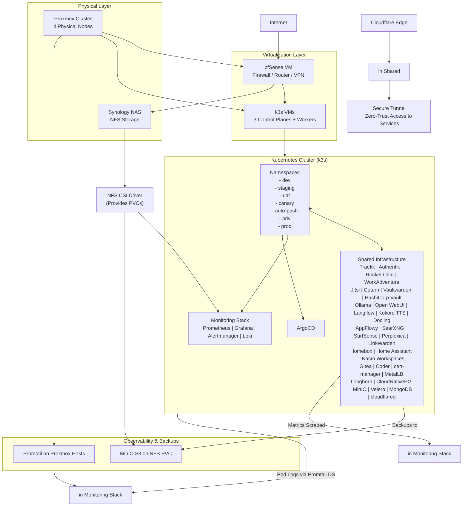

# Network Topology

The Inkorporated homelab implements a multi-zone network architecture to provide security segmentation and logical separation of services:

| Department/Zone | Subnet | Example Gateway IP | Purpose/Notes |
|-----------------|--------|-------------------|---------------|
| Headquarters | 10.0.1.0/24 | 10.0.1.1 | Executive offices and admin staff |
| Sales | 10.0.2.0/24 | 10.0.2.1 | Sales team workstations and CRM access |
| Engineering | 10.0.3.0/24 | 10.0.3.1 | Development and testing environments |
| Finance | 10.0.4.0/24 | 10.0.4.1 | Accounting and financial systems |
| Human Resources | 10.0.5.0/24 | 10.0.5.1 | HR personnel and sensitive data storage |
| IT | 10.0.6.0/24 | 10.0.6.1 | IT support and monitoring tools |
| Servers | 10.0.7.0/24 | 10.0.7.1 | Internal servers (e.g., file shares, databases) |
| DMZ | 10.0.8.0/24 | 10.0.8.1 | Public-facing services (e.g., web/email servers) |
| Guest WiFi | 10.0.9.0/24 | 10.0.9.1 | Visitor network - isolated with captive portal |
| Remote Access | 10.0.10.0/24 | 10.0.10.1 | VPN pool for remote workers |
| inkternal | 10.0.11.0/24 | 10.0.11.1 | Employee devices connect here |
| inklab | 10.0.12.0/24 | 10.0.12.1 | Internal-facing services |
| publink | 10.0.13.0/24 | 10.0.13.1 | Production services for external access |

## Architecture Overview

