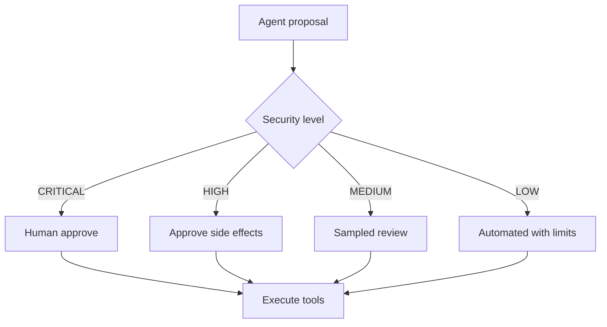

# AI operating model

**What's on this page**

- How humans and cyborgs collaborate at Inkorporated
- Risk tiers and human-in-the-loop
- Knowledge sources (this docs monorepo)
- Anti-patterns for agent sprawl

**What this enables**

## Human-in-the-loop tiers

- Productive automation without silent high-risk actions
- Consistent persona quality via job roles + YAML specs

## Principles

1. **Role-aligned agents** — Every cyborg maps to a role code.
2. **Docs as knowledge** — Agents load relevant `docs/` paths listed in YAML `knowledge_docs`.
3. **Tool allowlists** — MCP/tools declared explicitly; no ambient superuser.
4. **HITL for CRITICAL** — Side effects require human approval.
5. **Auditability** — Decisions and tool calls are logged.

## Lifecycle

Design role → write job page → author cyborg YAML → wire tools → evaluate → deploy to namespace → monitor.

## Related

- [Cyborgs overview](../cyborgs/index.md)
- [AI governance policy](../policies/code_of_conduct.md) (expand with dedicated AI policy as catalog grows)
