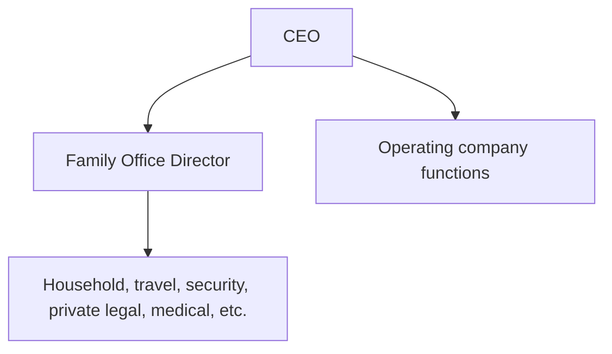

# Family office strategy

**What's on this page**

- Why Family Office is integrated under the CEO in Inkorporated
- Corporate vs personal asset firewalls
- Staffing model and cyborg restrictions
- Cost center and confidentiality rules

**What this enables**

- Executive effectiveness without blurring corporate fiduciary duties
- Safe automation with PERS cyborgs

## Integration model

Family Office is a **first-class branch** on the master org chart. It is not optional in this template, though operators may staff it lightly.

## Firewalls

1. **Personal assets and trusts** are not operating-company assets.
2. **Corporate funds** follow finance policy; personal disbursements follow FO policy with CEO accountability.
3. **Information** about FO operations is need-to-know; GTM and product agents must not access FO namespaces.
4. **Legal**: private counsel vs corporate counsel remain distinct roles (see PERS vs LEGL codes).

## Cyborgs

PERS* personas deploy to `cyborg-family-office` with restricted `allowed_invokers` (typically CEO and FO Director). See [Cyborg deployment map](../organization/cyborg_deployment_map.md).
