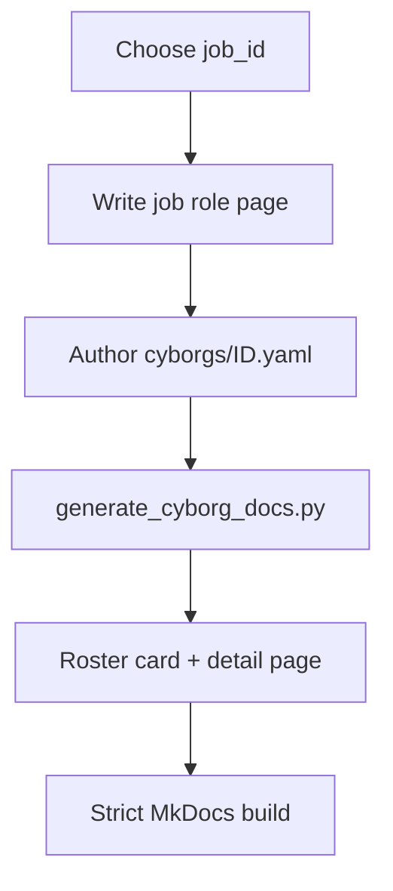

# Cyborg catalog notes

**What's on this page**

- How to add a persona
- Where the auto-generated roster lives
- Pointer to machine index

**What this enables**

- Consistent expansion of the agent fleet without hand-maintaining HTML

## Prefer the visual roster

The scannable catalog lives at **[Cyborg roster](generated/index.md)** (cards, chips, filters). That page is **generated** from YAML.

## Machine index

See [`cyborgs/_index.yaml`](https://github.com/toxicoder/inkorporated/blob/main/cyborgs/_index.yaml) for the checked-in ID list.

## How to add a cyborg

1. Allocate a stable `job_id` (see [project conventions](../project-conventions.md)).
2. Add `docs/job_roles/...` with an AI Agent Profile when applicable.
3. Add `cyborgs/<job_id>.yaml` with full schema fields ([schema](schema.md)).
4. Run `./docs/manage-docs.sh build` (or `python docs/generate_cyborg_docs.py`).
5. Review the new card on the [roster](generated/index.md) and the detail page under `generated/personas/`.

