# Cyborg org and stats graphs

**What's on this page**

- A **compact executive overview** of the agent hierarchy
- **Domain slices** of the reporting tree (readable size)
- Population charts by prefix and security level

**What this enables**

- Structural review of the agent fleet without a single unreadable mega-graph

[← Roster](index.md)

## How to read these diagrams

- Node labels show **display name** (when known) and **job id**.
- Edges come from `reports_to` / `direct_reports` in `cyborgs/*.yaml`.
- Large domains are **split** so each diagram stays scannable.
- If a slice has sparse reporting edges, it falls back to a domain fan-out list.

## Executive overview

Top-of-house hierarchy only (board, CEO/C-suite anchors, and key vertical heads).

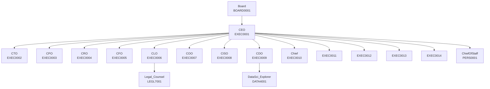

## Reporting hierarchy by domain

- [Board & executive](#board-executive)
- [Engineering & reliability](#engineering-reliability)
- [Product, design & data](#product-design-data)
- [Go-to-market & regions](#go-to-market-regions)
- [G&A, legal, people & IT](#g-a-legal-people-it)
- [Customer experience](#customer-experience)
- [Family office](#family-office)
- [Squad leads](#squad-leads)

### Board & executive {#board-executive}

Top of house: board, C-suite, and corporate chief of staff. **20** personas in this slice.

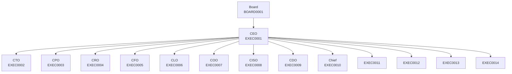

### Engineering & reliability {#engineering-reliability}

Software, platform, SRE, and security-engineering personas. **41** personas in this slice.

```mermaid
flowchart TB
  SREL0003["DirInfra\nSREL0003"]
  SREL0004["SecOps_Guardian\nSREL0004"]
  SREL0003 --> SREL0004
  SREL1001["SRE_Commander\nSREL1001"]
  SREL0003 --> SREL1001
  SREL1004["SecOps_Guardian\nSREL1004"]
  SREL0003 --> SREL1004
  SREL1005["Application\nSREL1005"]
  SREL0003 --> SREL1005
  SREL1006["SOC\nSREL1006"]
  SREL0003 --> SREL1006
  SREL1007["GRC\nSREL1007"]
  SREL0003 --> SREL1007
  SREL1008["SREL1008"]
  SREL0003 --> SREL1008
  SREL1009["SREL1009"]
  SREL0003 --> SREL1009
  SREL1010["SREL1010"]
  SREL0003 --> SREL1010
  SREL1011["SREL1011"]
  SREL0003 --> SREL1011
  SREL1012["SREL1012"]
  SREL0003 --> SREL1012
  SREL1013["SREL1013"]
  SREL0003 --> SREL1013
  SREL1014["SREL1014"]
  SREL0003 --> SREL1014
  SREL1015["SREL1015"]
  SREL0003 --> SREL1015
  SWEN0005["EngMgr\nSWEN0005"]
  SWEN0001["VPEng\nSWEN0001"]
  SWEN0005 --> SWEN0001
  SWEN0004["DirAppDev\nSWEN0004"]
  SWEN0005 --> SWEN0004
  SWEN1001["CoreDev\nSWEN1001"]
  SWEN0005 --> SWEN1001
  SWEN1002["Backend_Architect\nSWEN1002"]
  SWEN0005 --> SWEN1002
  SWEN1003["Frontend_Builder\nSWEN1003"]
  SWEN0005 --> SWEN1003
  SWEN1004["Mobile_Dev\nSWEN1004"]
  SWEN0005 --> SWEN1004
  SWEN1006["Quality_Bot\nSWEN1006"]
  SWEN0005 --> SWEN1006
  SWEN1007["Platform\nSWEN1007"]
  SWEN0005 --> SWEN1007
  SWEN1008["Staff\nSWEN1008"]
  SWEN0005 --> SWEN1008
  SWEN1009["ML\nSWEN1009"]
  SWEN0005 --> SWEN1009
  SWEN1010["Technical\nSWEN1010"]
  SWEN0005 --> SWEN1010
  SWEN1011["SWEN1011"]
  SWEN0005 --> SWEN1011
  SWEN1012["SWEN1012"]
  SWEN0005 --> SWEN1012
  SWEN1013["SWEN1013"]
  SWEN0005 --> SWEN1013
  SWEN1014["SWEN1014"]
  SWEN0005 --> SWEN1014
  SWEN1015["SWEN1015"]
  SWEN0005 --> SWEN1015
  SWEN1016["SWEN1016"]
  SWEN0005 --> SWEN1016
  SWEN1017["SWEN1017"]
  SWEN0005 --> SWEN1017
  SWEN1018["SWEN1018"]
  SWEN0005 --> SWEN1018
  SWEN1019["SWEN1019"]
  SWEN0005 --> SWEN1019
  SWEN1020["SWEN1020"]
  SWEN0005 --> SWEN1020
  SWEN1021["SWEN1021"]
  SWEN0005 --> SWEN1021
  SWEN1022["SWEN1022"]
  SWEN0005 --> SWEN1022
  SWEN1023["SWEN1023"]
  SWEN0005 --> SWEN1023
  SWEN1024["SWEN1024"]
  SWEN0005 --> SWEN1024
```

### Product, design & data {#product-design-data}

Product, design, research, program, and data personas. **27** personas in this slice.

```mermaid
flowchart TB
  DESN0001["VPDesign\nDESN0001"]
  RSCH3002["User_Voice_Agent\nRSCH3002"]
  DESN0001 --> RSCH3002
  RSCH3003["RSCH3003"]
  DESN0001 --> RSCH3003
  DESN0003["DesignMgr\nDESN0003"]
  DESN0003 --> DESN0001
  DESN0002["DirDesign\nDESN0002"]
  DESN0003 --> DESN0002
  DESN3001["Designer\nDESN3001"]
  DESN0003 --> DESN3001
  DESN3003["UX_Writer_Bot\nDESN3003"]
  DESN0003 --> DESN3003
  DESN3004["DESN3004"]
  DESN0003 --> DESN3004
  DESN3005["DESN3005"]
  DESN0003 --> DESN3005
  DESN3006["DESN3006"]
  DESN0003 --> DESN3006
  EXEC0009["CDO\nEXEC0009"]
  DATA4001["DataSci_Explorer\nDATA4001"]
  EXEC0009 --> DATA4001
  DATA4002["DataPipe_Builder\nDATA4002"]
  EXEC0009 --> DATA4002
  DATA4003["DATA4003"]
  EXEC0009 --> DATA4003
  DATA4004["DATA4004"]
  EXEC0009 --> DATA4004
  DATA4005["DATA4005"]
  EXEC0009 --> DATA4005
  DATA4006["DATA4006"]
  EXEC0009 --> DATA4006
  DATA4007["DATA4007"]
  EXEC0009 --> DATA4007
  DATA4008["DATA4008"]
  EXEC0009 --> DATA4008
  PROD0001["VPProduct\nPROD0001"]
  TPGM5001["Program_Conductor\nTPGM5001"]
  PROD0001 --> TPGM5001
  PROD0002["DirProduct\nPROD0002"]
  PROD0002 --> PROD0001
  PROD0003["GroupPM\nPROD0003"]
  PROD0002 --> PROD0003
  PROD2001["Product_Visionary\nPROD2001"]
  PROD0002 --> PROD2001
  PROD2002["Tech_PM\nPROD2002"]
  PROD0002 --> PROD2002
  PROD2003["PROD2003"]
  PROD0002 --> PROD2003
  PROD2004["PROD2004"]
  PROD0002 --> PROD2004
  PROD2005["PROD2005"]
  PROD0002 --> PROD2005
```

### Go-to-market & regions {#go-to-market-regions}

Sales, marketing, CS, comms, policy, and regional leads. **36** personas in this slice.

```mermaid
flowchart TB
  EXEC0001["CEO\nEXEC0001"]
  COMM9005["PR_Comms_Bot\nCOMM9005"]
  EXEC0001 --> COMM9005
  EXEC0004["CRO\nEXEC0004"]
  REGN0001["Regional\nREGN0001"]
  EXEC0004 --> REGN0001
  REGN0002["Regional\nREGN0002"]
  EXEC0004 --> REGN0002
  REGN0003["Regional\nREGN0003"]
  EXEC0004 --> REGN0003
  REGN0004["REGN0004"]
  EXEC0004 --> REGN0004
  REGN0005["REGN0005"]
  EXEC0004 --> REGN0005
  REGN0006["REGN0006"]
  EXEC0004 --> REGN0006
  EXEC0006["CLO\nEXEC0006"]
  POLI7002["Policy_Analyst\nPOLI7002"]
  EXEC0006 --> POLI7002
  MKTG0002["DirMktg\nMKTG0002"]
  MKTG0001["VPMarketing\nMKTG0001"]
  MKTG0002 --> MKTG0001
  MKTG0004["MktgMgr\nMKTG0004"]
  MKTG0002 --> MKTG0004
  MKTG9003["Brand\nMKTG9003"]
  MKTG0002 --> MKTG9003
  MKTG9010["Product\nMKTG9010"]
  MKTG0002 --> MKTG9010
  MKTG9011["Demand\nMKTG9011"]
  MKTG0002 --> MKTG9011
  MKTG9012["MKTG9012"]
  MKTG0002 --> MKTG9012
  MKTG9013["MKTG9013"]
  MKTG0002 --> MKTG9013
  MKTG9014["MKTG9014"]
  MKTG0002 --> MKTG9014
  MKTG9015["MKTG9015"]
  MKTG0002 --> MKTG9015
  MKTG9016["MKTG9016"]
  MKTG0002 --> MKTG9016
  MKTG9017["MKTG9017"]
  MKTG0002 --> MKTG9017
  MKTG9018["MKTG9018"]
  MKTG0002 --> MKTG9018
  SALE0001["VPSales\nSALE0001"]
  CSM9004["Success_Guide\nCSM9004"]
  SALE0001 --> CSM9004
  CSM9005["CSM9005"]
  SALE0001 --> CSM9005
  SALE0003["SalesMgr\nSALE0003"]
  SALE0003 --> SALE0001
  SALE0002["DirSales\nSALE0002"]
  SALE0003 --> SALE0002
  SALE9001["Sales_Closer\nSALE9001"]
  SALE0003 --> SALE9001
  SALE9002["Outbound_Hunter\nSALE9002"]
  SALE0003 --> SALE9002
  SALE9003["Solutions_Eng_Ag…\nSALE9003"]
  SALE0003 --> SALE9003
  SALE9004["SALE9004"]
  SALE0003 --> SALE9004
  SALE9005["SALE9005"]
  SALE0003 --> SALE9005
  SALE9006["SALE9006"]
  SALE0003 --> SALE9006
  SALE9007["SALE9007"]
  SALE0003 --> SALE9007
  SALE9008["SALE9008"]
  SALE0003 --> SALE9008
  SALE9009["SALE9009"]
  SALE0003 --> SALE9009
  SALE9010["Revenue\nSALE9010"]
  SALE0003 --> SALE9010
```

### G&A, legal, people & IT {#g-a-legal-people-it}

Finance, people, legal, ops, workplace, and corporate IT. **44** personas in this slice.

```mermaid
flowchart TB
  EXEC0006["CLO\nEXEC0006"]
  LEGL7001["Legal_Counsel\nLEGL7001"]
  EXEC0006 --> LEGL7001
  LEGL7003["Labor_Law_Bot\nLEGL7003"]
  EXEC0006 --> LEGL7003
  LEGL7010["Compliance\nLEGL7010"]
  EXEC0006 --> LEGL7010
  LEGL7011["Privacy\nLEGL7011"]
  EXEC0006 --> LEGL7011
  LEGL7012["LEGL7012"]
  EXEC0006 --> LEGL7012
  LEGL7013["LEGL7013"]
  EXEC0006 --> LEGL7013
  EXEC0007["COO\nEXEC0007"]
  OPS0001["Ops_Strategist\nOPS0001"]
  EXEC0007 --> OPS0001
  OPS0002["OPS0002"]
  EXEC0007 --> OPS0002
  OPS0003["OPS0003"]
  EXEC0007 --> OPS0003
  OPS0004["OPS0004"]
  EXEC0007 --> OPS0004
  REAL0002["Workplace_Mgr\nREAL0002"]
  EXEC0007 --> REAL0002
  REAL0003["REAL0003"]
  EXEC0007 --> REAL0003
  FINC0002["DirFinance\nFINC0002"]
  FINC0001["VPFinance\nFINC0001"]
  FINC0002 --> FINC0001
  FINC6001["Finance_Forecaster\nFINC6001"]
  FINC0002 --> FINC6001
  FINC6002["Controller\nFINC6002"]
  FINC0002 --> FINC6002
  FINC6010["Internal\nFINC6010"]
  FINC0002 --> FINC6010
  FINC6011["FINC6011"]
  FINC0002 --> FINC6011
  FINC6012["FINC6012"]
  FINC0002 --> FINC6012
  FINC6013["FINC6013"]
  FINC0002 --> FINC6013
  FINC6014["FINC6014"]
  FINC0002 --> FINC6014
  FINC6015["FINC6015"]
  FINC0002 --> FINC6015
  FINC6016["FINC6016"]
  FINC0002 --> FINC6016
  FINC6017["FINC6017"]
  FINC0002 --> FINC6017
  FINC6018["FINC6018"]
  FINC0002 --> FINC6018
  FINC6019["FINC6019"]
  FINC0002 --> FINC6019
  ITOP0006["ITOP0006"]
  ITOP0001["IT\nITOP0001"]
  ITOP0006 --> ITOP0001
  ITOP0002["Identity\nITOP0002"]
  ITOP0006 --> ITOP0002
  ITOP0003["ITOP0003"]
  ITOP0006 --> ITOP0003
  ITOP0004["ITOP0004"]
  ITOP0006 --> ITOP0004
  ITOP0005["ITOP0005"]
  ITOP0006 --> ITOP0005
  ITOP0007["ITOP0007"]
  ITOP0006 --> ITOP0007
  PEOP0002["DirPeople\nPEOP0002"]
  PEOP0001["VPPeople\nPEOP0001"]
  PEOP0002 --> PEOP0001
  PEOP8001["HR_Partner\nPEOP8001"]
  PEOP0002 --> PEOP8001
  PEOP8010["Talent\nPEOP8010"]
  PEOP0002 --> PEOP8010
  PEOP8011["PEOP8011"]
  PEOP0002 --> PEOP8011
  PEOP8012["PEOP8012"]
  PEOP0002 --> PEOP8012
  PEOP8013["PEOP8013"]
  PEOP0002 --> PEOP8013
  PEOP8014["PEOP8014"]
  PEOP0002 --> PEOP8014
  PEOP8015["PEOP8015"]
  PEOP0002 --> PEOP8015
  PEOP8016["PEOP8016"]
  PEOP0002 --> PEOP8016
  PEOP8017["PEOP8017"]
  PEOP0002 --> PEOP8017
```

### Customer experience {#customer-experience}

Support, TAM, implementation, and related CX personas. **10** personas in this slice.

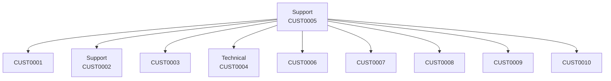

### Family office {#family-office}

PERS* agents under FO director / CEO boundary. **14** personas in this slice.

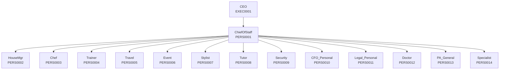

### Squad leads {#squad-leads}

Cross-functional SQAD orchestrator personas. **10** personas in this slice.

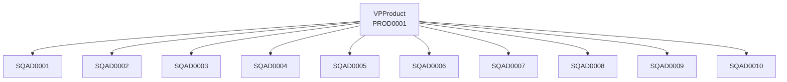

## Population by prefix

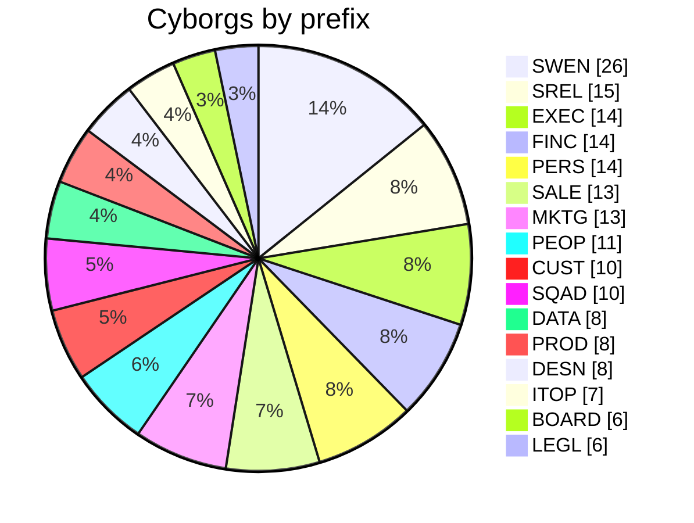

## Population by security level

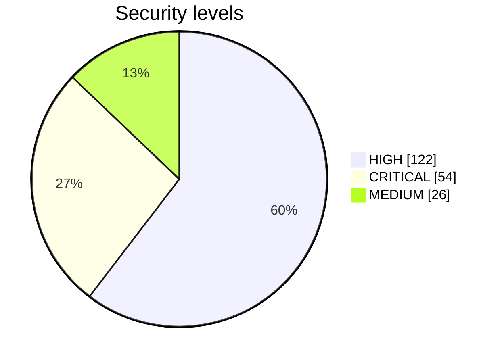
