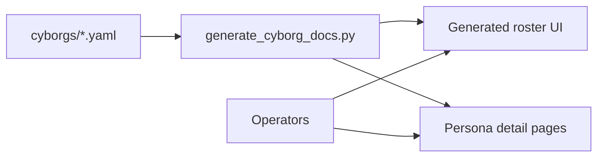

# Cyborgs

**What's on this page**

- What a cyborg is in Inkorporated
- How YAML specs become the visual roster
- Links to schema, operating model, and generated catalog

**What this enables**

- Role-faithful AI assistants for every major enterprise function
- Fast developer comprehension via cards, chips, and security coloring

## Definition

A **cyborg** is an AI agent persona that instantiates a **job role** (`job_id`). It is not a free-floating chatbot: it has a system prompt, personalities, tool allowlist, security level, org position, and deployment metadata.



| Artifact | Location |
| --- | --- |
| Machine source of truth | [`cyborgs/*.yaml`](https://github.com/toxicoder/inkorporated/tree/main/cyborgs) |
| Visual roster | [generated/index.md](generated/index.md) |
| Human role context | [`docs/job_roles/`](../job_roles/job_role_organization.md) |

## Browse

| Page | Purpose |
| --- | --- |
| [**Roster**](generated/index.md) | Card grid with chips + filters |
| [By namespace](generated/by_namespace.md) | Deploy topology view |
| [By security](generated/by_security.md) | Risk-tier review |
| [Org graph](generated/org_graph.md) | Mermaid reporting + stats |
| [Schema](schema.md) | Field dictionary |
| [Operating model](operating_model.md) | HITL, audit, kill switches |
| [Catalog notes](catalog.md) | How to add personas |

## Regenerating

```bash
./docs/manage-docs.sh build --strict
# or
python docs/generate_cyborg_docs.py
```

Do **not** hand-edit `docs/cyborgs/generated/`.
