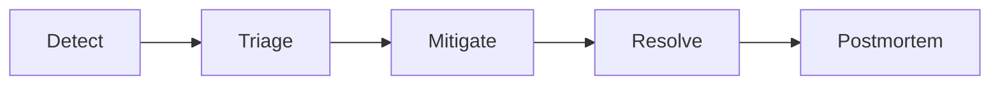

# Incident Management Guide

**What's on this page**

- Core content for this topic in the Inkorporated enterprise OS.
- Practical guidance, roles, or standards as applicable.

**What this enables**

## Incident lifecycle

- Consistent enterprise operations and decision-making.
- Shared language for humans and cyborg AI agents.

> **"Reliability is our #1 Feature."**

Incidents are high-stress, high-stakes events. How we respond to them defines our operational maturity and our commitment to our customers. This document outlines the protocols, roles, and philosophies for managing incidents at our company.

---

## 1. The Core Philosophy

### Mobilize First, Debug Second
When an incident strikes, the natural instinct of an engineer is to open a terminal and start debugging. **Resist this urge.** The first step is always to **mobilize the team**. You cannot fight a fire alone.

### Blameless Culture
We operate with a blameless mindset. We assume everyone comes to work to do a good job. Incidents are caused by systemic failures, process gaps, or inadequate tooling—not by "bad engineers." If a human can make a mistake that takes down production, the system is at fault for allowing it.

### Mitigation over Resolution
During an incident, the goal is **mitigation**, not root cause analysis. Stop the bleeding first. If a rollback fixes the symptoms, roll back immediately. You can figure out *why* the bug happened later, when the customer is no longer in pain.

---

## 2. Severity Levels (SEV Definitions)

We classify incidents to determine the urgency and resources required.

| Severity | Definition | Impact | Response Requirement | Communication Cadence |
| :--- | :--- | :--- | :--- | :--- |
| **SEV 1 (Critical)** | **System Down.** Critical business functions unavailable for all or a majority of users. Data loss or major security breach. | Revenue loss, massive reputational damage. | **Immediate (24/7).** Wake up everyone. | Every 30 mins |
| **SEV 2 (Major)** | **System Degraded.** Core functionality broken for a subset of users. Significant performance degradation. Workarounds are difficult or impossible. | Poor user experience, increased support load. | **Immediate (24/7).** Page the on-call team. | Every 60 mins |
| **SEV 3 (Minor)** | **Minor Impact.** Non-critical functionality broken. Workarounds exist. A "broken window." | Annoyance, but usable. | **Business Hours.** Fix it tomorrow morning. | Once at start/end |
| **SEV 4 (Trivial)** | **Cosmetic/Bug.** Typos, minor UI glitches, internal tool issues. | Minimal. | **Backlog.** Fix in next sprint. | None |

---

## 3. Incident Roles

Clear role definition is crucial to avoid chaos. In a SEV 1 or SEV 2, these roles **must** be explicitly assigned.

### Incident Commander (IC)
*   **The Boss.** The IC holds the highest authority during the incident.
*   **Responsibilities:**
    *   Declares the SEV level.
    *   Assigns roles (Ops Lead, Comms Lead).
    *   Coordinates the response.
    *   Maintains the "Big Picture" view.
    *   **Does NOT touch the keyboard/debug.** (This is critical).
*   **Checklist:**
    *   [ ] Assess impact and declare SEV.
    *   [ ] Start the Zoom bridge / Slack channel.
    *   [ ] Assign Ops Lead and Comms Lead.
    *   [ ] Keep the team focused on *mitigation*.
    *   [ ] Facilitate decision-making (e.g., "Do we failover to the DR region?").

### Operations Lead (Ops)
*   **The Fixer.** The primary engineer responsible for fixing the issue.
*   **Responsibilities:**
    *   Investigates the technical root cause (after mitigation is considered).
    *   Proposes and executes remediation steps (e.g., rollback, restart, config change).
    *   Reports status to the IC.
*   **Checklist:**
    *   [ ] Check the Golden Signals (Latency, Traffic, Errors, Saturation).
    *   [ ] Check recent deployments/changes.
    *   [ ] Communicate actions *before* taking them ("I am about to restart the database").

### Communications Lead (Comms)
*   **The Voice.** manages all internal and external communication.
*   **Responsibilities:**
    *   Updates the Status Page.
    *   Updates the executive team.
    *   Manages the incident Slack channel (keeping it noise-free).
    *   Drafts the post-incident summary.
*   **Checklist:**
    *   [ ] Post the initial "We are investigating" message.
    *   [ ] Update stakeholders on the agreed cadence.
    *   [ ] Shield the Ops Lead and IC from questions ("ETA?").

### Scribe (Optional but Recommended)
*   **The Historian.** Records the timeline of events.
*   **Responsibilities:**
    *   Notes down key timestamps (When did it start? When did we rollback?).
    *   Captures screenshots of graphs/errors.
    *   This data is gold for the Post-Mortem.

---

## 4. The Incident Lifecycle

### Phase 1: Detection
*   **Automated:** An alert fires in PagerDuty.
*   **Manual:** A customer reports an issue via Support.
*   **Action:** Verify the issue. If real, **Declare the Incident**.

### Phase 2: Mobilization
*   **Channel:** Create a Slack channel `#incident-<date>-<name>`.
*   **Video:** Start a Zoom/Google Meet call immediately for SEV 1/2.
*   **Roles:** The first responder assumes IC until handed off. Assign Ops and Comms.
*   **Banner:** Update the Status Page to "Investigating".

### Phase 3: Investigation (The OODA Loop)
*   **Observe:** Look at logs, dashboards, and error rates. What changed?
*   **Orient:** Form a hypothesis. "Is it the database? Is it the new deployment?"
*   **Decide:** Choose an action. "Let's roll back."
*   **Act:** Execute the action.
*   **Repeat:** Did it work? If no, go back to Observe.

### Phase 4: Mitigation
*   **The "Big Red Buttons":**
    *   **Rollback:** The most common fix. Undo the last change.
    *   **Feature Flags:** Turn off the broken feature.
    *   **Scale Up:** Add more servers if it's a load issue.
    *   **Load Shedding:** Drop non-critical traffic.
    *   **Failover:** Switch to a backup database or region.

### Phase 5: Resolution
*   **Criteria:** The system is stable. User pain has ended.
*   **Monitoring:** Watch the graphs closely for 30 minutes to ensure no regression.
*   **Closure:** Update Status Page to "Resolved". Archive the Slack channel.

### Phase 6: Post-Mortem
*   **Requirement:** Mandatory for all SEV 1 and SEV 2 incidents.
*   **Timeline:** Draft within 24 hours. Review meeting within 5 days.
*   **Output:** A document detailing *Root Cause*, *Timeline*, and *Action Items* to prevent recurrence.

---

## 5. Communication Protocol

### The "Canary" Rule
Communication should be structured and concise. Avoid "stream of consciousness" typing in the main channel. Use threads for debugging discussions.

### Internal Status Updates (Template)
The Comms Lead posts this every 30-60 mins:

> **🚨 Incident Update: [Incident Name]**
>
> **Current Status:** [Investigating / Mitigating / Monitoring / Resolved]
> **Severity:** [SEV 1 / SEV 2]
> **Impact:** [Description of user impact, e.g., "Checkout is failing for 50% of users"]
> **Current Action:** [What is the team doing right now?]
> **Next Update:** [Time]
> **IC:** @user | **Ops:** @user

### External Status Updates (Status Page)
*   **Investigating:** "We are currently investigating reports of issues with [Service]. Our team is actively working on a resolution."
*   **Identified:** "The issue has been identified as [Cause]. We are implementing a fix."
*   **Monitoring:** "A fix has been implemented and we are monitoring the results."
*   **Resolved:** "The issue has been resolved and all systems are operational."

---

## 6. The Golden Signals

When investigating, always start with the four Golden Signals (from the Google SRE Book):

1.  **Latency:** How long does it take to serve a request? (Avg, p50, p95, p99).
2.  **Traffic:** How much demand is being placed on the system? (RPS, Bandwidth).
3.  **Errors:** What is the rate of requests failing? (HTTP 500s, Exceptions).
4.  **Saturation:** How "full" is the service? (CPU, Memory, Disk I/O, Queue Depth).

---

## 7. War Room Etiquette

*   **Mute by default:** Keep the line clear for the IC and Ops Lead.
*   **Clear Handoffs:** "I am stepping away for 5 mins. @Bob is taking over Ops."
*   **No Hip-Shooting:** Do not run commands on production without stating your intent to the IC first. "I am going to restart the web server now."
*   **Stay Calm:** Panic is contagious. Calmness is also contagious.

---

## 8. Tooling Reference

*   **PagerDuty:** For alerting and on-call scheduling.
*   **StatusPage:** For public-facing communication.
*   **Datadog/Prometheus:** For metrics and dashboards.
*   **Splunk/ELK:** For log aggregation.
*   **Slack:** For coordination (#incidents).
*   **Zoom:** For the war room bridge.

---

## 9. Appendix: Glossary

*   **MTTR (Mean Time To Recovery):** The average time it takes to fix a broken system. We optimize for this.
*   **MTBF (Mean Time Between Failures):** The average time between incidents.
*   **RTO (Recovery Time Objective):** How quickly *must* we recover?
*   **RPO (Recovery Point Objective):** How much data can we afford to lose? (e.g., 5 mins of data).
*   **SLA (Service Level Agreement):** The contract with the customer (e.g., 99.9% uptime).
*   **SLO (Service Level Objective):** The internal goal we aim for (usually stricter than the SLA).
*   **SLI (Service Level Indicator):** The actual metric we measure (e.g., error rate).
