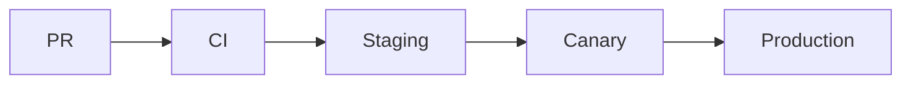

Our release process is designed to deliver value to customers quickly and
safely. We aim for continuous delivery while minimizing the risk of breakage.

## CI/CD Pipeline

Every change must pass through our automated CI/CD pipeline before reaching
production.

1. **Build:** Code is compiled and packaged.
2. **Test:** Unit, integration, and linter checks run.
3. **Artifact:** A deployable artifact (e.g., Docker image) is created and
   versioned.
4. **Deploy to Staging:** Artifact is deployed to a pre-production environment
   for final verification.
5. **Deploy to Production:** Artifact is promoted to production.

## Deployment Strategies

### Canary Deployments

For critical services, we use canary deployments.

1. Deploy the new version to a small percentage of traffic (e.g., 1% or 5%).
2. Monitor metrics (errors, latency) for a set period.
3. If metrics look good, gradually increase traffic (10% -> 50% -> 100%).
4. If metrics degrade, automatically roll back.

### Blue/Green Deployments

For stateless services, we may use Blue/Green.

1. Deploy the new version (Green) alongside the old version (Blue).
2. Switch traffic to Green.
3. Keep Blue running briefly for quick rollback if needed.
4. Terminate Blue.

## Feature Flags

We use feature flags to decouple deployment from release.

* **Merge code early:** Code can be merged and deployed behind a disabled
  feature flag.
* **Test in production:** Enable the flag for internal users or a whitelist to
  test in the real environment.
* **Gradual Rollout:** Slowly enable the feature for more users.
* **Kill Switch:** Instantly disable the feature if issues arise.

## Change Management

* **No Friday Deploys:** Avoid deploying risky changes on Fridays or before
  holidays unless necessary.
* **Change Freeze:** During critical business periods (e.g., Black Friday), we
  implement a code freeze where only emergency fixes are allowed.
* **Db Migrations:** Database schema changes must be backward compatible.
  Separate schema changes from code changes.

## Release flow

