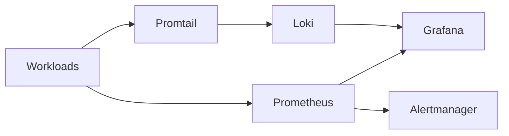

# Observability

**What's on this page**

- Documentation for this infrastructure topic.

**What this enables**

## Telemetry pipeline

- Operators can deploy and operate Inkorporated systems confidently.

## Monitoring Stack
- **Grafana**: Single pane dashboard for every service + Proxmox + pfSense
- **Loki**: Unified logs (pods + hosts)
- **Alerts**: For failures, resource exhaustion, backup issues, pfSense events

## Metrics Collection
- **Prometheus**: Metrics scraping from all services
- **Built-in exporters**: For most applications
- **Custom exporters**: Where needed
