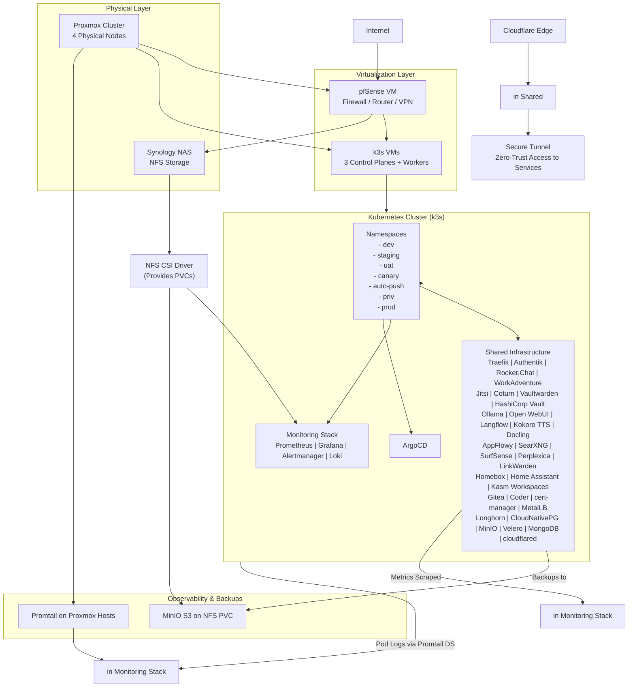

# Inkorporated Homelab - Complete Project Overview

## Executive Summary

**Inkorporated** is a comprehensive, self-hosted, open-source internal work environment designed for homelab deployments. This project provides a complete, integrated solution that combines infrastructure automation, GitOps deployment, and a rich set of productivity and collaboration tools.

### Key Features

- **GitOps Deployment**: Full infrastructure and application management through Git
- **Infrastructure as Code**: Terraform for VM provisioning, Ansible for k3s setup
- **Zero-trust Access**: Cloudflare Tunnel for secure external access
- **Centralized Authentication**: Authentik SSO/OIDC integration
- **Observability**: Prometheus, Grafana, and Loki stack
- **Storage Solutions**: Longhorn and NFS CSI driver
- **Backup & Recovery**: Velero with MinIO
- **Service Mesh**: Traefik with forward-auth middleware
- **Version Control**: Gitea instance for GitOps workflow
- **CI/CD**: Gitea runners for automated deployments

## Project Structure

```
.
├── apps/                     # Application deployments
│   └── shared/               # Shared applications
│       └── cloudflared/      # Cloudflare tunnel deployment
├── infrastructure/           # Infrastructure provisioning
│   ├── terraform/            # Terraform configurations
│   └── ansible/              # Ansible playbooks
├── kubernetes/               # Kubernetes manifests
│   ├── base/                 # Base configurations
│   ├── overlays/             # Environment-specific configurations
│   └── argocd/               # ArgoCD configurations
├── docs/                     # Documentation
└── memory-bank/              # Project documentation and context
```

## Architecture Overview

### High-Level Architecture



## Implementation Phases

### Phase 1: Foundation & Preparation
- Validate physical infrastructure readiness
- Create Proxmox Cloud-Init template
- Set up workstation tools

### Phase 2: Repository & Code Setup
- Create bootstrap repository with Terraform/Ansible
- Create apps repository with GitOps manifests
- Complete cloudflared tunnel deployment structure

### Phase 3: Bootstrap Infrastructure
- Provision VMs with Terraform
- Install k3s with Ansible
- Bootstrap ArgoCD for GitOps

### Phase 4: Core Infrastructure Deployment
- Deploy NFS CSI Driver
- Deploy Longhorn Storage
- Deploy MinIO Object Storage
- Deploy CloudNativePG and MongoDB
- Deploy Velero for backups
- Deploy cert-manager for TLS
- Deploy MetalLB for LoadBalancer
- Deploy Traefik for Ingress
- Deploy Authentik for SSO
- Deploy Vaultwarden for passwords
- Deploy HashiCorp Vault for secrets
- Deploy cloudflared Tunnel for secure access

### Phase 5: Post-Deployment
- Configure Authentik providers and groups
- Deploy user dashboard (Homepage)
- Enable backups and testing
- Performance and security hardening
- Documentation runbook creation

## Services Overview

### Collaboration Services
- **Rocket.Chat**: Team chat platform
- **WorkAdventure**: 2D virtual office
- **Jitsi Meet**: Video conferencing
- **Coturn**: TURN/STUN server

### Productivity Services
- **AppFlowy**: Collaborative knowledge base
- **LinkWarden**: Bookmark manager
- **Homebox**: Inventory tracker
- **Home Assistant**: Smart home hub

### Remote Work Services
- **Kasm Workspaces**: Browser-based workspaces
- **Coder**: Cloud IDE workspaces

### AI Services
- **Ollama**: Local LLM runner
- **Open WebUI**: Ollama web interface
- **Langflow**: Visual LangChain builder
- **Kokoro TTS**: Local TTS server
- **Docling**: Document parsing server
- **SearXNG**: Metasearch engine
- **SurfSense**: AI research agent
- **Perplexica**: AI search engine

### Security Services
- **Vaultwarden**: Bitwarden-compatible password manager
- **HashiCorp Vault**: Secrets management

### Infrastructure Services
- **CloudNativePG**: PostgreSQL operator
- **Longhorn**: Distributed block storage
- **MinIO**: S3 object storage
- **Velero**: Backup/restore
- **ArgoCD**: GitOps engine
- **cert-manager**: TLS automation
- **MetalLB**: LoadBalancer provider

## Network Topology

The Inkorporated homelab implements a multi-zone network architecture:

| Department/Zone | Subnet | Example Gateway IP | Purpose/Notes |
|-----------------|--------|-------------------|---------------|
| Headquarters | 10.0.1.0/24 | 10.0.1.1 | Executive offices |
| Sales | 10.0.2.0/24 | 10.0.2.1 | Sales team |
| Engineering | 10.0.3.0/24 | 10.0.3.1 | Development |
| Finance | 10.0.4.0/24 | 10.0.4.1 | Accounting |
| Human Resources | 10.0.5.0/24 | 10.0.5.1 | HR personnel |
| IT | 10.0.6.0/24 | 10.0.6.1 | IT support |
| Servers | 10.0.7.0/24 | 10.0.7.1 | Internal servers |
| DMZ | 10.0.8.0/24 | 10.0.8.1 | Public-facing services |
| Guest WiFi | 10.0.9.0/24 | 10.0.9.1 | Visitor network |
| Remote Access | 10.0.10.0/24 | 10.0.10.1 | VPN pool |
| inkternal | 10.0.11.0/24 | 10.0.11.1 | Employee devices |
| inklab | 10.0.12.0/24 | 10.0.12.1 | Internal services |
| publink | 10.0.13.0/24 | 10.0.13.1 | Production services |

## Security Implementation

### Authentication & Authorization
- **Authentik**: Central identity provider with OIDC + 2FA enforcement
- **SSO Flow**: Seamless across all services
- **Groups**: admins, developers, testers, priv-users, guests

### Network Security
- **pfSense**: Primary firewall with NAT, VPN termination
- **IDS/IPS**: Via pfSense packages

### Data Protection
- **In-transit**: All encrypted via Traefik TLS
- **At-rest**: Longhorn storage encryption
- **Secrets**: Vault for apps; Vaultwarden for users; SealedSecrets in GitOps

## Backup & Disaster Recovery

- **Velero**: Scheduled cluster backups to MinIO
- **Longhorn**: Recurring S3 exports
- **CNPG/MongoDB**: Continuous archiving
- **pfSense**: Config backup via package or manual export
- **Test restores**: Regular testing in dev namespace

## Observability

### Monitoring Stack
- **Grafana**: Single pane dashboard for every service + Proxmox + pfSense
- **Loki**: Unified logs (pods + hosts)
- **Alerts**: For failures, resource exhaustion, backup issues, pfSense events

### Metrics Collection
- **Prometheus**: Metrics scraping from all services
- **Built-in exporters**: For most applications
- **Custom exporters**: Where needed

## Deployment & Operations

### Deployment Process
1. **Terraform** → **Ansible bootstrap** (including pfSense VM)
2. **Configure pfSense** post-deploy (interfaces, rules, VPN)
3. **ArgoCD sync** (wave order: storage → DBs → Authentik → backends → frontends)
4. **Post-deploy** configuration (Authentik applications, homepage shortcuts, etc.)

### Maintenance
- **Manual infra syncs** for infrastructure changes
- **Monitor Grafana** for system health
- **Regular security updates** for container images

## Current Implementation Status

### Completed
- ✅ Project renamed from "devset" to "inkorporated"
- ✅ README updated with proper project context
- ✅ Cloudflared tunnel service deployment files created
- ✅ Implementation plan and task breakdown documented
- ✅ Technical design document completed

### In Progress
- 🔄 Cloudflared tunnel token integration pending
- 🔄 Core infrastructure components deployment in progress
- 🔄 Documentation runbook creation

### Pending
- 📋 Infrastructure validation and setup
- 📋 Repository creation and setup
- 📋 Core infrastructure deployment
- 📋 Authentication and security configuration
- 📋 User interface deployment
- 📋 Backup and monitoring setup

## Next Immediate Actions

### 1. Complete Cloudflared Integration
- [ ] Obtain Cloudflare tunnel token from Cloudflare dashboard
- [ ] Create proper Kubernetes secret with real tunnel token
- [ ] Apply the secret to the cluster
- [ ] Verify cloudflared pods start successfully

### 2. Infrastructure Setup
- [ ] Validate physical infrastructure readiness
- [ ] Create Proxmox Cloud-Init template
- [ ] Set up workstation tools
- [ ] Create bootstrap repository with Terraform/Ansible

### 3. Core Infrastructure Deployment
- [ ] Provision VMs with Terraform
- [ ] Install k3s with Ansible
- [ ] Bootstrap ArgoCD
- [ ] Deploy NFS CSI Driver
- [ ] Deploy Longhorn Storage

## Best Practices

### Infrastructure as Code
- Use Terraform for infrastructure provisioning
- Use Ansible for configuration management
- Maintain idempotent scripts and configurations

### Security
- Regular security audits
- Keep container images updated
- Implement proper network segmentation
- Use least privilege principles

### Monitoring & Logging
- Comprehensive metrics collection
- Centralized logging with Loki
- Alerting for critical issues
- Performance monitoring

## Documentation Structure

### Core Documentation Files
1. **COMPREHENSIVE_PROJECT_DOCUMENTATION.md** - Complete project overview and technical specifications
2. **SERVICE_SPECIFIC_DOCUMENTATION.md** - Detailed service configurations and integration points
3. **IMPLEMENTATION_STATUS_TRACKING.md** - Current implementation progress and task tracking

### Repository Structure
- **inkorporated-bootstrap** - Terraform + Ansible for Proxmox VMs, Synology folder, k3s install, Promtail on hosts
- **inkorporated-k8s-apps** - GitOps manifests organized by `infra/shared`, `environments`, `apps/per-env`, `apps/priv-optional`, `app-of-apps/root`

### Related Documentation
- [Complete Architecture](ARCHITECTURE.md) - Full technical documentation and implementation phases
- [Service Specifications](SERVICE_SPECIFIC_DOCUMENTATION.md) - Detailed service configurations with YAML examples
- [Implementation Status](IMPLEMENTATION_STATUS_TRACKING.md) - Current progress tracking and risk assessments
- [Discovery Summary](DISCOVERY_AND_DOCUMENTATION_SUMMARY.md) - Consolidated documentation overview

## Future Enhancements

### Planned Features
- Enhanced AI integration capabilities
- Improved monitoring and alerting
- Additional security hardening
- Performance optimization
- Automated testing and CI/CD improvements

### Technology Roadmap
1. **Short-term**: Complete current implementation
2. **Medium-term**: Add advanced AI features
3. **Long-term**: Expand to multi-cluster support

## Contributing

This project is open-source and welcomes contributions. Please see the contribution guidelines in the repository for more information.

## License

This project is licensed under the MIT License - see the LICENSE file for details.

## Support

For support, please open an issue in the GitHub repository or contact the project maintainers.
