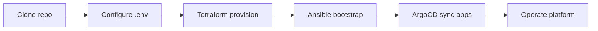

# Inkorporated Homelab Project Overview


**What's on this page**

- Documentation for this infrastructure topic.

**What this enables**


## Repository at a glance


```mermaid
flowchart LR
  clone[Clone repo] --> cfg[Configure .env]
  cfg --> tf[Terraform provision]
  tf --> ans[Ansible bootstrap]
  ans --> gitops[ArgoCD sync apps]
  gitops --> use[Operate platform]
```

- Operators can deploy and operate Inkorporated systems confidently.

**Inkorporated** is a comprehensive, self-hosted, open-source internal work environment designed for homelab deployments. This project provides a complete, integrated solution that combines infrastructure automation, GitOps deployment, and a rich set of productivity and collaboration tools.

## Key Features

- **GitOps Deployment**: Full infrastructure and application management through Git
- **Infrastructure as Code**: Terraform for VM provisioning, Ansible for k3s setup
- **Zero-trust Access**: Cloudflare Tunnel for secure external access
- **Centralized Authentication**: Authentik SSO/OIDC integration
- **Observability**: Prometheus, Grafana, and Loki stack
- **Storage Solutions**: Longhorn and NFS CSI driver
- **Backup & Recovery**: Velero with MinIO
- **Service Mesh**: Traefik with forward-auth middleware
- **Version Control**: Gitea instance for GitOps workflow
- **CI/CD**: Gitea runners for automated deployments

## Repository Structure

### Core Repositories

1. **inkorporated-bootstrap** - Terraform + Ansible for Proxmox VMs, Synology folder, k3s install, Promtail on hosts
2. **inkorporated** - GitOps manifests organized by `infra/shared`, `environments`, `apps/per-env`, `apps/priv-optional`, `app-of-apps/root`

### Project Directories

```
.
├── apps/                     # Application deployments
│   └── shared/               # Shared applications
│       └── cloudflared/      # Cloudflare tunnel deployment
├── infrastructure/           # Infrastructure provisioning
│   ├── terraform/            # Terraform configurations
│   └── ansible/              # Ansible playbooks
├── kubernetes/               # Kubernetes manifests
│   ├── base/                 # Base configurations
│   ├── overlays/             # Environment-specific configurations
│   └── argocd/               # ArgoCD configurations
├── docs/                     # Documentation
└── memory-bank/              # Project documentation and context
```
