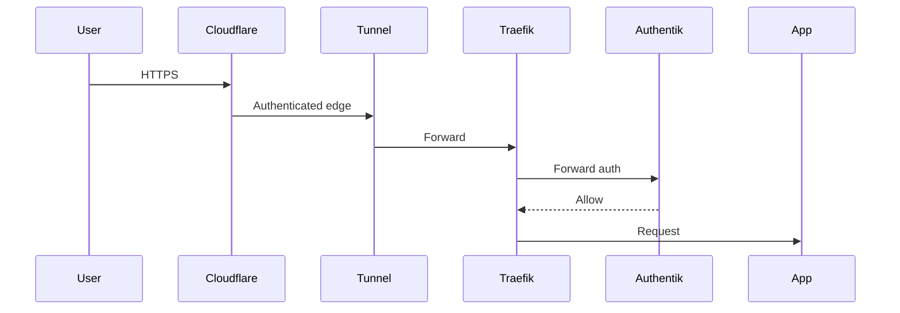

# Security Implementation

**What's on this page**

- Documentation for this infrastructure topic.

**What this enables**

## Zero-trust access path

- Operators can deploy and operate Inkorporated systems confidently.

## Authentication & Authorization
- **Authentik**: Central identity provider with OIDC + 2FA enforcement
- **SSO Flow**: Login once → seamless across all services
- **Groups**: admins/full, developers limited AI models, etc.

## Network Security
- **pfSense**: Primary firewall (block all except necessary ports)
- **VPN Termination**: OpenVPN/WireGuard for remote access
- **IDS/IPS**: Via pfSense packages

## Data Protection
- **In-transit**: All encrypted via Traefik TLS
- **At-rest**: Longhorn storage encryption
- **Secrets**: Vault for apps; Vaultwarden for users; SealedSecrets in GitOps
