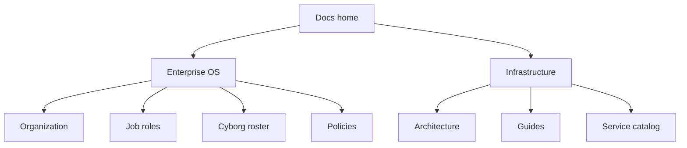

# Inkorporated

**What's on this page**

- Dual identity: enterprise OS + hybrid-cloud homelab/corplab
- Entry points for organization, roles, cyborgs, and infrastructure
- Links to contributing and conventions

**What this enables**

## Mental model

- One monorepo to understand how the company is designed *and* how the platform is run
- Fast onboarding for humans and AI agents

Inkorporated is a **one-stop shop to spin up a full-blown global enterprise**: corporate strategy, org design, job roles, policies, interview loops, and AI **cyborg** personas — on top of production-minded hybrid infrastructure (Proxmox + AWS/GCP, k3s, ArgoCD, Bazel).

## Enterprise operating system

| Area | Start here |
| --- | --- |
| Organization & org charts | [Organization system](organization/index.md) |
| Corporate strategy | [Mission, vision & values](corporate_strategy/mission_vision_values.md) |
| Job roles | [Job role catalog](job_roles/job_role_organization.md) |
| Cyborg AI personas | [Cyborgs](cyborgs/index.md) |
| Engineering standards | [Engineering principles](engineering_standards/engineering_principles.md) |
| Policies | [Code of conduct](policies/code_of_conduct.md) |

## Infrastructure & operations

| Area | Start here |
| --- | --- |
| Overview | [Project overview](guides/overview.md) |
| Architecture | [Architecture index](architecture/index.md) |
| Install | [Installation](guides/installation.md) |
| Security | [Security handbook](guides/security.md) |
| Observability | [Observability](guides/observability.md) |
| Services | [Service catalog](reference/services.md) |

## Contribute

- [Project conventions](project-conventions.md)
- [Contributing to docs](CONTRIBUTING.md)
- [Git workflow](guides/git_workflow.md)
- Root [CONTRIBUTING.md](https://github.com/toxicoder/inkorporated/blob/main/CONTRIBUTING.md) · [SECURITY.md](https://github.com/toxicoder/inkorporated/blob/main/SECURITY.md)

## Multi-version docs

When published via mike:

- **latest** — from `main`
- **development** — from `development`
