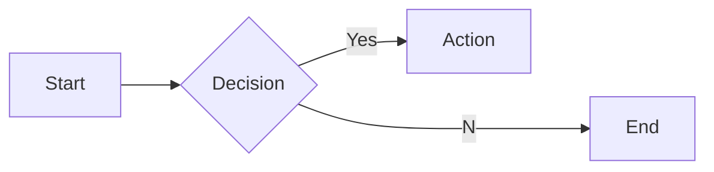
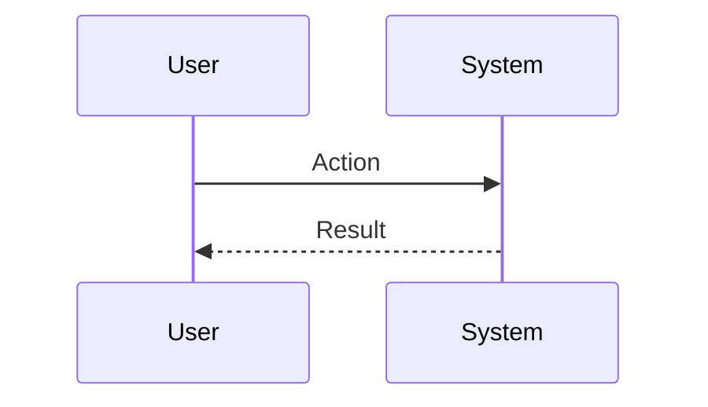

# Interview Questions: VP of Sales (ROLE)

**What's on this page**

- Core content for this topic in the Inkorporated enterprise OS.
- Practical guidance, roles, or standards as applicable.

**What this enables**

- Consistent enterprise operations and decision-making.
- Shared language for humans and cyborg AI agents.

This document contains 100 interview questions tailored for the VP of Sales role. The questions are designed to assess technical skills, soft skills, and cultural fit.

---

## 1. Brand vs Performance

**Scenario:** Budget allocation.

**Question:** How do you balance Brand Marketing vs Performance Marketing?

**Key Concepts:** `Strategy`, `Budgeting`

### Candidate Response Paths
*   **Junior**: All in on ads.
*   **Senior**: Performance for short term, Brand for long term CAC reduction.

---

## 2. SEO Strategy

**Scenario:** Organic growth.

**Question:** What are the pillars of a strong SEO strategy?

**Key Concepts:** `SEO`, `Content`

### Candidate Response Paths
*   **Junior**: Keywords.
*   **Senior**: Technical SEO, Content Quality, and Backlink Authority.

---

## 3. Funnel Optimization

**Scenario:** Conversion rates.

**Question:** How do you optimize the marketing funnel?

**Key Concepts:** `CRO`, `Analytics`

### Candidate Response Paths
*   **Junior**: More traffic.
*   **Senior**: Analyzing drop-off points and A/B testing landing pages.

---

## 4. Content Strategy

**Scenario:** Thought leadership.

**Question:** How do you measure the success of content marketing?

**Key Concepts:** `Content`, `Metrics`

### Candidate Response Paths
*   **Junior**: Views.
*   **Senior**: Engagement, Leads generated, and attribution to revenue.

---

## 5. Social Media

**Scenario:** B2B vs B2C.

**Question:** How does your social media strategy differ for B2B vs B2C?

**Key Concepts:** `Social`, `Strategy`

### Candidate Response Paths
*   **Junior**: Same strategy.
*   **Senior**: B2B focuses on LinkedIn/Education, B2C on emotion/Instagram/TikTok.

---

## 6. Email Marketing

**Scenario:** Nurture.

**Question:** What makes an effective email nurture sequence?

**Key Concepts:** `Email`, `Automation`

### Candidate Response Paths
*   **Junior**: Send lots of emails.
*   **Senior**: Segmentation, personalization, and value-add content (not just sales pitches).

---

## 7. Product Marketing

**Scenario:** Launch.

**Question:** How do you position a new product in a crowded market?

| Metric | Target | Status |
|---|---|---|
| KPI 1 | 100% | Green |
| KPI 2 | < 5% | Yellow |

**Key Concepts:** `PMM`, `Positioning`

### Candidate Response Paths
*   **Junior**: Say we are better.
*   **Senior**: Find the unique differentiator, target a specific wedge, and craft a compelling narrative.

---

## 8. Analytics

**Scenario:** Attribution.

**Question:** How do you handle multi-touch attribution?

**Key Concepts:** `Data`, `Attribution`

### Candidate Response Paths
*   **Junior**: Last click.
*   **Senior**: Using models (Time decay, U-shaped) to understand the full customer journey.

---

## 9. Budgeting

**Scenario:** ROI.

**Question:** How do you justify your marketing budget to the CFO?

**Key Concepts:** `Finance`, `ROI`

### Candidate Response Paths
*   **Junior**: We need brand awareness.
*   **Senior**: Show CAC, LTV, and payback period projections.

---

## 10. Events

**Scenario:** Conference.

**Question:** How do you maximize ROI from a trade show?

**Key Concepts:** `Events`, `Sales Alignment`

### Candidate Response Paths
*   **Junior**: Get a booth.
*   **Senior**: Pre-show outreach, booth engagement strategy, and immediate post-show follow-up.

---

## 11. Conflict Resolution

**Scenario:** Disagreement with a peer.

**Question:** Tell me about a time you had a significant disagreement with a colleague. How did you resolve it?

**Key Concepts:** `Communication`, `Soft Skills`

### Candidate Response Paths
*   **Junior**: I told them I was right.
*   **Senior**: I listened to their perspective, found common ground, and we compromised.

---

## 12. Failure Handling

**Scenario:** A project went wrong.

**Question:** Describe a time you failed. What happened and what did you learn?

**Key Concepts:** `Growth Mindset`, `Resilience`

### Candidate Response Paths
*   **Junior**: I tried hard but it failed.
*   **Senior**: I analyzed the root cause, implemented a fix, and shared the learning.

---

## 13. Prioritization

**Scenario:** Too many tasks.

**Question:** How do you prioritize when you have multiple conflicting deadlines?

**Key Concepts:** `Time Management`, `Organization`

### Candidate Response Paths
*   **Junior**: I work longer hours.
*   **Senior**: I communicate with stakeholders to adjust expectations and focus on high-impact tasks.

---

## 14. Adaptability

**Scenario:** Changing requirements.

**Question:** How do you handle sudden changes in project scope or direction?

| Metric | Target | Status |
|---|---|---|
| KPI 1 | 100% | Green |
| KPI 2 | < 5% | Yellow |

**Key Concepts:** `Agility`, `Flexibility`

### Candidate Response Paths
*   **Junior**: I get frustrated but do it.
*   **Senior**: I assess the impact, communicate risks, and pivot quickly.

---

## 15. Communication

**Scenario:** Explaining complex topics.

**Question:** Describe a time you had to explain a complex technical/business concept to a non-expert.

**Key Concepts:** `Clarity`, `Empathy`

### Candidate Response Paths
*   **Junior**: I just said it simpler.
*   **Senior**: I used analogies and checked for understanding throughout.

---

## 16. Teamwork

**Scenario:** Collaborating with difficult personalities.

**Question:** How do you handle working with someone who is difficult to work with?

**Key Concepts:** `Collaboration`, `EQ`

### Candidate Response Paths
*   **Junior**: I avoid them.
*   **Senior**: I try to understand their motivations and find a way to work together effectively.

---

## 17. Innovation

**Scenario:** Improving a process.

**Question:** Tell me about a time you improved a process or workflow.

**Key Concepts:** `Innovation`, `Efficiency`

### Candidate Response Paths
*   **Junior**: I followed the rules.
*   **Senior**: I identified a bottleneck, proposed a solution, and measured the improvement.

---

## 18. Feedback

**Scenario:** Receiving constructive criticism.

**Question:** Tell me about a time you received difficult feedback. How did you react?

**Key Concepts:** `Self-awareness`, `Growth`

### Candidate Response Paths
*   **Junior**: I got defensive.
*   **Senior**: I listened, asked for examples, and worked on a plan to improve.

---

## 19. Leadership

**Scenario:** Leading without authority.

**Question:** Describe a time you demonstrated leadership when you weren't the formal manager.

**Key Concepts:** `Leadership`, `Influence`

### Candidate Response Paths
*   **Junior**: I told people what to do.
*   **Senior**: I rallied the team around a goal and supported them to achieve it.

---

## 20. Decision Making

**Scenario:** Incomplete information.

**Question:** How do you make decisions when you don't have all the data?

**Key Concepts:** `Judgment`, `Risk Mgmt`

### Candidate Response Paths
*   **Junior**: I wait for all data.
*   **Senior**: I assess the risk, make a call based on available info, and adjust as needed.

---

## 21. Challenges in Video Mktg

**Scenario:** Problem Solving.

**Question:** What are the biggest challenges you've faced regarding Video Mktg?

| Metric | Target | Status |
|---|---|---|
| KPI 1 | 100% | Green |
| KPI 2 | < 5% | Yellow |

**Key Concepts:** `Video Mktg`, `Problem Solving`

### Candidate Response Paths
*   **Junior**: It was hard.
*   **Senior**: Specific examples of obstacles and strategies to overcome them.

---

## 22. Start vs Scale for Events

**Scenario:** Context.

**Question:** How does your approach to Events differ in a startup vs a large corp?

**Key Concepts:** `Events`, `Context`

### Candidate Response Paths
*   **Junior**: It's the same.
*   **Senior**: Speed/Chaos vs Process/Stability.

---

## 23. Scaling Webinars

**Scenario:** Growth.

**Question:** How do you scale Webinars as the company grows?

**Key Concepts:** `Webinars`, `Scale`

### Candidate Response Paths
*   **Junior**: Hire more people.
*   **Senior**: Process automation, documentation, and leverage.

---

## 24. Start vs Scale for Analytics

**Scenario:** Context.

**Question:** How does your approach to Analytics differ in a startup vs a large corp?

**Key Concepts:** `Analytics`, `Context`

### Candidate Response Paths
*   **Junior**: It's the same.
*   **Senior**: Speed/Chaos vs Process/Stability.

---

## 25. Start vs Scale for PR

**Scenario:** Context.

**Question:** How does your approach to PR differ in a startup vs a large corp?

**Key Concepts:** `PR`, `Context`

### Candidate Response Paths
*   **Junior**: It's the same.
*   **Senior**: Speed/Chaos vs Process/Stability.

---

## 26. Collaboration in PPC

**Scenario:** Teamwork.

**Question:** How does PPC require cross-functional collaboration?

**Key Concepts:** `PPC`, `Collaboration`

### Candidate Response Paths
*   **Junior**: I talk to people.
*   **Senior**: Alignment with other depts and shared goals.

---

## 27. Tooling: Community Mgmt

**Scenario:** Proficiency.

**Question:** How do you utilize Community Mgmt to improve efficiency?

**Key Concepts:** `Community Mgmt`, `Productivity`

### Candidate Response Paths
*   **Junior**: I use it daily.
*   **Senior**: Advanced features and automation.

---

## 28. Ethics in Podcasting

**Scenario:** Ethics.

**Question:** What are the ethical considerations regarding Podcasting?

| Metric | Target | Status |
|---|---|---|
| KPI 1 | 100% | Green |
| KPI 2 | < 5% | Yellow |

**Key Concepts:** `Podcasting`, `Ethics`

### Candidate Response Paths
*   **Junior**: Be nice.
*   **Senior**: Privacy, bias, and societal impact.

---

## 29. Teaching PR

**Scenario:** Mentorship.

**Question:** How would you teach PR to a junior team member?

**Key Concepts:** `PR`, `Mentorship`

### Candidate Response Paths
*   **Junior**: Send them a link.
*   **Senior**: Structured learning path and hands-on practice.

---

## 30. Mistakes in SEO

**Scenario:** Learning.

**Question:** What common mistakes do people make with SEO?

**Key Concepts:** `SEO`, `Experience`

### Candidate Response Paths
*   **Junior**: Doing it wrong.
*   **Senior**: Subtle pitfalls and how to avoid them.

---

## 31. Start vs Scale for Email Marketing

**Scenario:** Context.

**Question:** How does your approach to Email Marketing differ in a startup vs a large corp?

**Key Concepts:** `Email Marketing`, `Context`

### Candidate Response Paths
*   **Junior**: It's the same.
*   **Senior**: Speed/Chaos vs Process/Stability.

---

## 32. Metrics for Analytics

**Scenario:** Measurement.

**Question:** How do you measure success in Analytics?

**Key Concepts:** `Analytics`, `Analytics`

### Candidate Response Paths
*   **Junior**: I guess.
*   **Senior**: Specific KPIs and leading/lagging indicators.

---

## 33. Scaling Social Media

**Scenario:** Growth.

**Question:** How do you scale Social Media as the company grows?

**Key Concepts:** `Social Media`, `Scale`

### Candidate Response Paths
*   **Junior**: Hire more people.
*   **Senior**: Process automation, documentation, and leverage.

---

## 34. Community Mgmt Best Practices

**Scenario:** Standardization.

**Question:** What are the industry best practices for Community Mgmt?

**Key Concepts:** `Community Mgmt`, `Standards`

### Candidate Response Paths
*   **Junior**: List a few.
*   **Senior**: Discusses why they are best practices and when to break them.

---

## 35. Collaboration in SEO

**Scenario:** Teamwork.

**Question:** How does SEO require cross-functional collaboration?

| Metric | Target | Status |
|---|---|---|
| KPI 1 | 100% | Green |
| KPI 2 | < 5% | Yellow |

**Key Concepts:** `SEO`, `Collaboration`

### Candidate Response Paths
*   **Junior**: I talk to people.
*   **Senior**: Alignment with other depts and shared goals.

---

## 36. Teaching PPC

**Scenario:** Mentorship.

**Question:** How would you teach PPC to a junior team member?

**Key Concepts:** `PPC`, `Mentorship`

### Candidate Response Paths
*   **Junior**: Send them a link.
*   **Senior**: Structured learning path and hands-on practice.

---

## 37. Mistakes in Social Media

**Scenario:** Learning.

**Question:** What common mistakes do people make with Social Media?

**Key Concepts:** `Social Media`, `Experience`

### Candidate Response Paths
*   **Junior**: Doing it wrong.
*   **Senior**: Subtle pitfalls and how to avoid them.

---

## 38. Email Marketing Best Practices

**Scenario:** Standardization.

**Question:** What are the industry best practices for Email Marketing?

**Key Concepts:** `Email Marketing`, `Standards`

### Candidate Response Paths
*   **Junior**: List a few.
*   **Senior**: Discusses why they are best practices and when to break them.

---

## 39. Teaching Brand

**Scenario:** Mentorship.

**Question:** How would you teach Brand to a junior team member?

**Key Concepts:** `Brand`, `Mentorship`

### Candidate Response Paths
*   **Junior**: Send them a link.
*   **Senior**: Structured learning path and hands-on practice.

---

## 40. Collaboration in Copywriting

**Scenario:** Teamwork.

**Question:** How does Copywriting require cross-functional collaboration?

**Key Concepts:** `Copywriting`, `Collaboration`

### Candidate Response Paths
*   **Junior**: I talk to people.
*   **Senior**: Alignment with other depts and shared goals.

---

## 41. Teaching Events

**Scenario:** Mentorship.

**Question:** How would you teach Events to a junior team member?

**Key Concepts:** `Events`, `Mentorship`

### Candidate Response Paths
*   **Junior**: Send them a link.
*   **Senior**: Structured learning path and hands-on practice.

---

## 42. Ethics in Influencer Mktg

**Scenario:** Ethics.

**Question:** What are the ethical considerations regarding Influencer Mktg?

| Metric | Target | Status |
|---|---|---|
| KPI 1 | 100% | Green |
| KPI 2 | < 5% | Yellow |

**Key Concepts:** `Influencer Mktg`, `Ethics`

### Candidate Response Paths
*   **Junior**: Be nice.
*   **Senior**: Privacy, bias, and societal impact.

---

## 43. Challenges in Influencer Mktg

**Scenario:** Problem Solving.

**Question:** What are the biggest challenges you've faced regarding Influencer Mktg?

**Key Concepts:** `Influencer Mktg`, `Problem Solving`

### Candidate Response Paths
*   **Junior**: It was hard.
*   **Senior**: Specific examples of obstacles and strategies to overcome them.

---

## 44. Deep Dive: Video Mktg

**Scenario:** Assessing depth in Video Mktg.

**Question:** Can you explain Video Mktg in detail and how you have applied it in your past role?

**Key Concepts:** `Video Mktg`, `Experience`

### Candidate Response Paths
*   **Junior**: Basic definition.
*   **Senior**: Deep practical application and nuances.

---

## 45. Future of Influencer Mktg

**Scenario:** Trends.

**Question:** Where do you see Influencer Mktg heading in the next 5 years?

**Key Concepts:** `Influencer Mktg`, `Vision`

### Candidate Response Paths
*   **Junior**: It will get better.
*   **Senior**: Emerging trends, AI impact, and market shifts.

---

## 46. Teaching Influencer Mktg

**Scenario:** Mentorship.

**Question:** How would you teach Influencer Mktg to a junior team member?

**Key Concepts:** `Influencer Mktg`, `Mentorship`

### Candidate Response Paths
*   **Junior**: Send them a link.
*   **Senior**: Structured learning path and hands-on practice.

---

## 47. Mistakes in PPC

**Scenario:** Learning.

**Question:** What common mistakes do people make with PPC?

**Key Concepts:** `PPC`, `Experience`

### Candidate Response Paths
*   **Junior**: Doing it wrong.
*   **Senior**: Subtle pitfalls and how to avoid them.

---

## 48. Tooling: PPC

**Scenario:** Proficiency.

**Question:** How do you utilize PPC to improve efficiency?

**Key Concepts:** `PPC`, `Productivity`

### Candidate Response Paths
*   **Junior**: I use it daily.
*   **Senior**: Advanced features and automation.

---

## 49. Metrics for Events

**Scenario:** Measurement.

**Question:** How do you measure success in Events?

| Metric | Target | Status |
|---|---|---|
| KPI 1 | 100% | Green |
| KPI 2 | < 5% | Yellow |

**Key Concepts:** `Events`, `Analytics`

### Candidate Response Paths
*   **Junior**: I guess.
*   **Senior**: Specific KPIs and leading/lagging indicators.

---

## 50. Mistakes in Events

**Scenario:** Learning.

**Question:** What common mistakes do people make with Events?

**Key Concepts:** `Events`, `Experience`

### Candidate Response Paths
*   **Junior**: Doing it wrong.
*   **Senior**: Subtle pitfalls and how to avoid them.

---

## 51. Collaboration in Analytics

**Scenario:** Teamwork.

**Question:** How does Analytics require cross-functional collaboration?

**Key Concepts:** `Analytics`, `Collaboration`

### Candidate Response Paths
*   **Junior**: I talk to people.
*   **Senior**: Alignment with other depts and shared goals.

---

## 52. Metrics for PPC

**Scenario:** Measurement.

**Question:** How do you measure success in PPC?

**Key Concepts:** `PPC`, `Analytics`

### Candidate Response Paths
*   **Junior**: I guess.
*   **Senior**: Specific KPIs and leading/lagging indicators.

---

## 53. Metrics for Email Marketing

**Scenario:** Measurement.

**Question:** How do you measure success in Email Marketing?

**Key Concepts:** `Email Marketing`, `Analytics`

### Candidate Response Paths
*   **Junior**: I guess.
*   **Senior**: Specific KPIs and leading/lagging indicators.

---

## 54. Scaling SEO

**Scenario:** Growth.

**Question:** How do you scale SEO as the company grows?

**Key Concepts:** `SEO`, `Scale`

### Candidate Response Paths
*   **Junior**: Hire more people.
*   **Senior**: Process automation, documentation, and leverage.

---

## 55. Content Marketing Best Practices

**Scenario:** Standardization.

**Question:** What are the industry best practices for Content Marketing?

**Key Concepts:** `Content Marketing`, `Standards`

### Candidate Response Paths
*   **Junior**: List a few.
*   **Senior**: Discusses why they are best practices and when to break them.

---

## 56. Teaching Analytics

**Scenario:** Mentorship.

**Question:** How would you teach Analytics to a junior team member?

| Metric | Target | Status |
|---|---|---|
| KPI 1 | 100% | Green |
| KPI 2 | < 5% | Yellow |

**Key Concepts:** `Analytics`, `Mentorship`

### Candidate Response Paths
*   **Junior**: Send them a link.
*   **Senior**: Structured learning path and hands-on practice.

---

## 57. Challenges in Brand

**Scenario:** Problem Solving.

**Question:** What are the biggest challenges you've faced regarding Brand?

**Key Concepts:** `Brand`, `Problem Solving`

### Candidate Response Paths
*   **Junior**: It was hard.
*   **Senior**: Specific examples of obstacles and strategies to overcome them.

---

## 58. Mistakes in Email Marketing

**Scenario:** Learning.

**Question:** What common mistakes do people make with Email Marketing?

**Key Concepts:** `Email Marketing`, `Experience`

### Candidate Response Paths
*   **Junior**: Doing it wrong.
*   **Senior**: Subtle pitfalls and how to avoid them.

---

## 59. Metrics for Copywriting

**Scenario:** Measurement.

**Question:** How do you measure success in Copywriting?

**Key Concepts:** `Copywriting`, `Analytics`

### Candidate Response Paths
*   **Junior**: I guess.
*   **Senior**: Specific KPIs and leading/lagging indicators.

---

## 60. Metrics for Brand

**Scenario:** Measurement.

**Question:** How do you measure success in Brand?

**Key Concepts:** `Brand`, `Analytics`

### Candidate Response Paths
*   **Junior**: I guess.
*   **Senior**: Specific KPIs and leading/lagging indicators.

---

## 61. SEO Best Practices

**Scenario:** Standardization.

**Question:** What are the industry best practices for SEO?

**Key Concepts:** `SEO`, `Standards`

### Candidate Response Paths
*   **Junior**: List a few.
*   **Senior**: Discusses why they are best practices and when to break them.

---

## 62. Mistakes in Content Marketing

**Scenario:** Learning.

**Question:** What common mistakes do people make with Content Marketing?

**Key Concepts:** `Content Marketing`, `Experience`

### Candidate Response Paths
*   **Junior**: Doing it wrong.
*   **Senior**: Subtle pitfalls and how to avoid them.

---

## 63. Challenges in Email Marketing

**Scenario:** Problem Solving.

**Question:** What are the biggest challenges you've faced regarding Email Marketing?

| Metric | Target | Status |
|---|---|---|
| KPI 1 | 100% | Green |
| KPI 2 | < 5% | Yellow |

**Key Concepts:** `Email Marketing`, `Problem Solving`

### Candidate Response Paths
*   **Junior**: It was hard.
*   **Senior**: Specific examples of obstacles and strategies to overcome them.

---

## 64. Deep Dive: Analytics

**Scenario:** Assessing depth in Analytics.

**Question:** Can you explain Analytics in detail and how you have applied it in your past role?

**Key Concepts:** `Analytics`, `Experience`

### Candidate Response Paths
*   **Junior**: Basic definition.
*   **Senior**: Deep practical application and nuances.

---

## 65. Deep Dive: Events

**Scenario:** Assessing depth in Events.

**Question:** Can you explain Events in detail and how you have applied it in your past role?

**Key Concepts:** `Events`, `Experience`

### Candidate Response Paths
*   **Junior**: Basic definition.
*   **Senior**: Deep practical application and nuances.

---

## 66. Future of Webinars

**Scenario:** Trends.

**Question:** Where do you see Webinars heading in the next 5 years?

**Key Concepts:** `Webinars`, `Vision`

### Candidate Response Paths
*   **Junior**: It will get better.
*   **Senior**: Emerging trends, AI impact, and market shifts.

---

## 67. Ethics in Analytics

**Scenario:** Ethics.

**Question:** What are the ethical considerations regarding Analytics?

**Key Concepts:** `Analytics`, `Ethics`

### Candidate Response Paths
*   **Junior**: Be nice.
*   **Senior**: Privacy, bias, and societal impact.

---

## 68. Deep Dive: Community Mgmt

**Scenario:** Assessing depth in Community Mgmt.

**Question:** Can you explain Community Mgmt in detail and how you have applied it in your past role?

**Key Concepts:** `Community Mgmt`, `Experience`

### Candidate Response Paths
*   **Junior**: Basic definition.
*   **Senior**: Deep practical application and nuances.

---

## 69. Metrics for SEO

**Scenario:** Measurement.

**Question:** How do you measure success in SEO?

**Key Concepts:** `SEO`, `Analytics`

### Candidate Response Paths
*   **Junior**: I guess.
*   **Senior**: Specific KPIs and leading/lagging indicators.

---

## 70. Mistakes in PR

**Scenario:** Learning.

**Question:** What common mistakes do people make with PR?

| Metric | Target | Status |
|---|---|---|
| KPI 1 | 100% | Green |
| KPI 2 | < 5% | Yellow |

**Key Concepts:** `PR`, `Experience`

### Candidate Response Paths
*   **Junior**: Doing it wrong.
*   **Senior**: Subtle pitfalls and how to avoid them.

---

## 71. Video Mktg Best Practices

**Scenario:** Standardization.

**Question:** What are the industry best practices for Video Mktg?

**Key Concepts:** `Video Mktg`, `Standards`

### Candidate Response Paths
*   **Junior**: List a few.
*   **Senior**: Discusses why they are best practices and when to break them.

---

## 72. Start vs Scale for Influencer Mktg

**Scenario:** Context.

**Question:** How does your approach to Influencer Mktg differ in a startup vs a large corp?

**Key Concepts:** `Influencer Mktg`, `Context`

### Candidate Response Paths
*   **Junior**: It's the same.
*   **Senior**: Speed/Chaos vs Process/Stability.

---

## 73. Deep Dive: SEO

**Scenario:** Assessing depth in SEO.

**Question:** Can you explain SEO in detail and how you have applied it in your past role?

**Key Concepts:** `SEO`, `Experience`

### Candidate Response Paths
*   **Junior**: Basic definition.
*   **Senior**: Deep practical application and nuances.

---

## 74. Social Media Best Practices

**Scenario:** Standardization.

**Question:** What are the industry best practices for Social Media?

**Key Concepts:** `Social Media`, `Standards`

### Candidate Response Paths
*   **Junior**: List a few.
*   **Senior**: Discusses why they are best practices and when to break them.

---

## 75. Start vs Scale for Brand

**Scenario:** Context.

**Question:** How does your approach to Brand differ in a startup vs a large corp?

**Key Concepts:** `Brand`, `Context`

### Candidate Response Paths
*   **Junior**: It's the same.
*   **Senior**: Speed/Chaos vs Process/Stability.

---

## 76. Future of Content Marketing

**Scenario:** Trends.

**Question:** Where do you see Content Marketing heading in the next 5 years?

**Key Concepts:** `Content Marketing`, `Vision`

### Candidate Response Paths
*   **Junior**: It will get better.
*   **Senior**: Emerging trends, AI impact, and market shifts.

---

## 77. Collaboration in Influencer Mktg

**Scenario:** Teamwork.

**Question:** How does Influencer Mktg require cross-functional collaboration?

| Metric | Target | Status |
|---|---|---|
| KPI 1 | 100% | Green |
| KPI 2 | < 5% | Yellow |

**Key Concepts:** `Influencer Mktg`, `Collaboration`

### Candidate Response Paths
*   **Junior**: I talk to people.
*   **Senior**: Alignment with other depts and shared goals.

---

## 78. Mistakes in Podcasting

**Scenario:** Learning.

**Question:** What common mistakes do people make with Podcasting?

**Key Concepts:** `Podcasting`, `Experience`

### Candidate Response Paths
*   **Junior**: Doing it wrong.
*   **Senior**: Subtle pitfalls and how to avoid them.

---

## 79. Metrics for Podcasting

**Scenario:** Measurement.

**Question:** How do you measure success in Podcasting?

**Key Concepts:** `Podcasting`, `Analytics`

### Candidate Response Paths
*   **Junior**: I guess.
*   **Senior**: Specific KPIs and leading/lagging indicators.

---

## 80. Challenges in Podcasting

**Scenario:** Problem Solving.

**Question:** What are the biggest challenges you've faced regarding Podcasting?

**Key Concepts:** `Podcasting`, `Problem Solving`

### Candidate Response Paths
*   **Junior**: It was hard.
*   **Senior**: Specific examples of obstacles and strategies to overcome them.

---

## 81. Challenges in Analytics

**Scenario:** Problem Solving.

**Question:** What are the biggest challenges you've faced regarding Analytics?

**Key Concepts:** `Analytics`, `Problem Solving`

### Candidate Response Paths
*   **Junior**: It was hard.
*   **Senior**: Specific examples of obstacles and strategies to overcome them.

---

## 82. Scaling Content Marketing

**Scenario:** Growth.

**Question:** How do you scale Content Marketing as the company grows?

**Key Concepts:** `Content Marketing`, `Scale`

### Candidate Response Paths
*   **Junior**: Hire more people.
*   **Senior**: Process automation, documentation, and leverage.

---

## 83. Challenges in Copywriting

**Scenario:** Problem Solving.

**Question:** What are the biggest challenges you've faced regarding Copywriting?

**Key Concepts:** `Copywriting`, `Problem Solving`

### Candidate Response Paths
*   **Junior**: It was hard.
*   **Senior**: Specific examples of obstacles and strategies to overcome them.

---

## 84. Future of Events

**Scenario:** Trends.

**Question:** Where do you see Events heading in the next 5 years?

| Metric | Target | Status |
|---|---|---|
| KPI 1 | 100% | Green |
| KPI 2 | < 5% | Yellow |

**Key Concepts:** `Events`, `Vision`

### Candidate Response Paths
*   **Junior**: It will get better.
*   **Senior**: Emerging trends, AI impact, and market shifts.

---

## 85. Future of Podcasting

**Scenario:** Trends.

**Question:** Where do you see Podcasting heading in the next 5 years?

**Key Concepts:** `Podcasting`, `Vision`

### Candidate Response Paths
*   **Junior**: It will get better.
*   **Senior**: Emerging trends, AI impact, and market shifts.

---

## 86. Tooling: Podcasting

**Scenario:** Proficiency.

**Question:** How do you utilize Podcasting to improve efficiency?

**Key Concepts:** `Podcasting`, `Productivity`

### Candidate Response Paths
*   **Junior**: I use it daily.
*   **Senior**: Advanced features and automation.

---

## 87. Teaching Webinars

**Scenario:** Mentorship.

**Question:** How would you teach Webinars to a junior team member?

**Key Concepts:** `Webinars`, `Mentorship`

### Candidate Response Paths
*   **Junior**: Send them a link.
*   **Senior**: Structured learning path and hands-on practice.

---

## 88. Metrics for PR

**Scenario:** Measurement.

**Question:** How do you measure success in PR?

**Key Concepts:** `PR`, `Analytics`

### Candidate Response Paths
*   **Junior**: I guess.
*   **Senior**: Specific KPIs and leading/lagging indicators.

---

## 89. Future of PPC

**Scenario:** Trends.

**Question:** Where do you see PPC heading in the next 5 years?

**Key Concepts:** `PPC`, `Vision`

### Candidate Response Paths
*   **Junior**: It will get better.
*   **Senior**: Emerging trends, AI impact, and market shifts.

---

## 90. Mistakes in Influencer Mktg

**Scenario:** Learning.

**Question:** What common mistakes do people make with Influencer Mktg?

**Key Concepts:** `Influencer Mktg`, `Experience`

### Candidate Response Paths
*   **Junior**: Doing it wrong.
*   **Senior**: Subtle pitfalls and how to avoid them.

---

## 91. Copywriting Best Practices

**Scenario:** Standardization.

**Question:** What are the industry best practices for Copywriting?

| Metric | Target | Status |
|---|---|---|
| KPI 1 | 100% | Green |
| KPI 2 | < 5% | Yellow |

**Key Concepts:** `Copywriting`, `Standards`

### Candidate Response Paths
*   **Junior**: List a few.
*   **Senior**: Discusses why they are best practices and when to break them.

---

## 92. Challenges in Social Media

**Scenario:** Problem Solving.

**Question:** What are the biggest challenges you've faced regarding Social Media?

**Key Concepts:** `Social Media`, `Problem Solving`

### Candidate Response Paths
*   **Junior**: It was hard.
*   **Senior**: Specific examples of obstacles and strategies to overcome them.

---

## 93. Mistakes in Copywriting

**Scenario:** Learning.

**Question:** What common mistakes do people make with Copywriting?

**Key Concepts:** `Copywriting`, `Experience`

### Candidate Response Paths
*   **Junior**: Doing it wrong.
*   **Senior**: Subtle pitfalls and how to avoid them.

---

## 94. Deep Dive: Webinars

**Scenario:** Assessing depth in Webinars.

**Question:** Can you explain Webinars in detail and how you have applied it in your past role?

**Key Concepts:** `Webinars`, `Experience`

### Candidate Response Paths
*   **Junior**: Basic definition.
*   **Senior**: Deep practical application and nuances.

---

## 95. Scaling Copywriting

**Scenario:** Growth.

**Question:** How do you scale Copywriting as the company grows?

**Key Concepts:** `Copywriting`, `Scale`

### Candidate Response Paths
*   **Junior**: Hire more people.
*   **Senior**: Process automation, documentation, and leverage.

---

## 96. Influencer Mktg Best Practices

**Scenario:** Standardization.

**Question:** What are the industry best practices for Influencer Mktg?

**Key Concepts:** `Influencer Mktg`, `Standards`

### Candidate Response Paths
*   **Junior**: List a few.
*   **Senior**: Discusses why they are best practices and when to break them.

---

## 97. Tooling: Influencer Mktg

**Scenario:** Proficiency.

**Question:** How do you utilize Influencer Mktg to improve efficiency?

**Key Concepts:** `Influencer Mktg`, `Productivity`

### Candidate Response Paths
*   **Junior**: I use it daily.
*   **Senior**: Advanced features and automation.

---

## 98. Deep Dive: Social Media

**Scenario:** Assessing depth in Social Media.

**Question:** Can you explain Social Media in detail and how you have applied it in your past role?

| Metric | Target | Status |
|---|---|---|
| KPI 1 | 100% | Green |
| KPI 2 | < 5% | Yellow |

**Key Concepts:** `Social Media`, `Experience`

### Candidate Response Paths
*   **Junior**: Basic definition.
*   **Senior**: Deep practical application and nuances.

---

## 99. Ethics in SEO

**Scenario:** Ethics.

**Question:** What are the ethical considerations regarding SEO?

**Key Concepts:** `SEO`, `Ethics`

### Candidate Response Paths
*   **Junior**: Be nice.
*   **Senior**: Privacy, bias, and societal impact.

---

## 100. Tooling: Copywriting

**Scenario:** Proficiency.

**Question:** How do you utilize Copywriting to improve efficiency?

**Key Concepts:** `Copywriting`, `Productivity`

### Candidate Response Paths
*   **Junior**: I use it daily.
*   **Senior**: Advanced features and automation.

---
