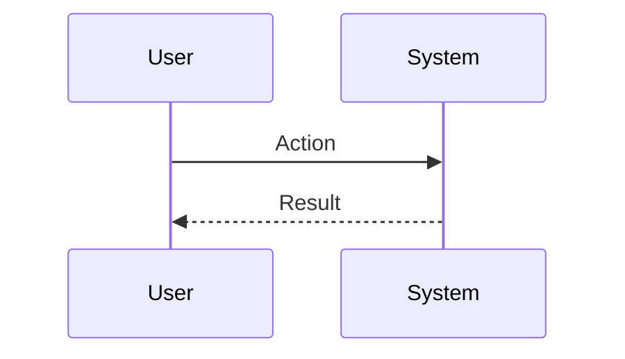
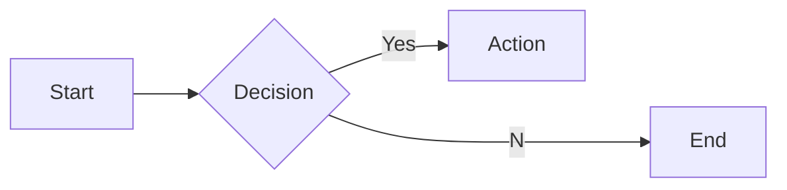

# Interview Questions: Data Scientist (ROLE)

**What's on this page**

- Core content for this topic in the Inkorporated enterprise OS.
- Practical guidance, roles, or standards as applicable.

**What this enables**

- Consistent enterprise operations and decision-making.
- Shared language for humans and cyborg AI agents.

This document contains 100 interview questions tailored for the Data Scientist role. The questions are designed to assess technical skills, soft skills, and cultural fit.

---

## 1. Design Systems

**Scenario:** Consistency.

**Question:** Why invest in a Design System?

**Key Concepts:** `UI/UX`, `Efficiency`

### Candidate Response Paths
*   **Junior**: It looks nice.
*   **Senior**: Scalability, consistency, and speed of development.

---

## 2. Accessibility

**Scenario:** WCAG.

**Question:** How do you design for accessibility?

**Key Concepts:** `A11y`, `Inclusivity`

### Candidate Response Paths
*   **Junior**: Contrast check.
*   **Senior**: Keyboard navigation, screen reader compatibility, and color blind modes.

---

## 3. User Research

**Scenario:** Validation.

**Question:** When should you conduct user research?

**Key Concepts:** `Research`, `Process`

### Candidate Response Paths
*   **Junior**: At the beginning.
*   **Senior**: Continuously throughout the product lifecycle (Discovery, Testing, Validation).

---

## 4. Handloff

**Scenario:** Dev collaboration.

**Question:** How do you ensure a smooth handoff to engineering?

**Key Concepts:** `Collaboration`, `Process`

### Candidate Response Paths
*   **Junior**: Send the Figma file.
*   **Senior**: Detailed specs, prototypes, and walkthroughs with devs.

---

## 5. Critique

**Scenario:** Feedback.

**Question:** How do you handle design critique?

**Key Concepts:** `Feedback`, `Growth`

### Candidate Response Paths
*   **Junior**: Defend my work.
*   **Senior**: Separate self from work, look for 'why', and iterate.

---

## 6. Tools

**Scenario:** Figma.

**Question:** What is your workflow in Figma?

**Key Concepts:** `Tools`, `Workflow`

### Candidate Response Paths
*   **Junior**: I draw shapes.
*   **Senior**: Components, Auto Layout, Variants, and organized layers.

---

## 7. Mobile Design

**Scenario:** Responsive.

**Question:** What are the key considerations for mobile-first design?

| Metric | Target | Status |
|---|---|---|
| KPI 1 | 100% | Green |
| KPI 2 | < 5% | Yellow |

**Key Concepts:** `Mobile`, `UX`

### Candidate Response Paths
*   **Junior**: Make it smaller.
*   **Senior**: Touch targets, gestures, and content hierarchy.

---

## 8. Prototyping

**Scenario:** Interaction.

**Question:** Why is prototyping important?

**Key Concepts:** `Prototyping`, `Validation`

### Candidate Response Paths
*   **Junior**: To show animations.
*   **Senior**: To test flow and interaction before expensive coding starts.

---

## 9. Data

**Scenario:** Metrics.

**Question:** How do you use data to inform design?

**Key Concepts:** `Data`, `UX`

### Candidate Response Paths
*   **Junior**: Look at clicks.
*   **Senior**: Heatmaps, conversion funnels, and A/B test results.

---

## 10. Empathy

**Scenario:** User needs.

**Question:** How do you build empathy for the user?

**Key Concepts:** `Empathy`, `Research`

### Candidate Response Paths
*   **Junior**: Imagine I am them.
*   **Senior**: Observation, interviews, and personas.

---

## 11. Conflict Resolution

**Scenario:** Disagreement with a peer.

**Question:** Tell me about a time you had a significant disagreement with a colleague. How did you resolve it?

**Key Concepts:** `Communication`, `Soft Skills`

### Candidate Response Paths
*   **Junior**: I told them I was right.
*   **Senior**: I listened to their perspective, found common ground, and we compromised.

---

## 12. Failure Handling

**Scenario:** A project went wrong.

**Question:** Describe a time you failed. What happened and what did you learn?

**Key Concepts:** `Growth Mindset`, `Resilience`

### Candidate Response Paths
*   **Junior**: I tried hard but it failed.
*   **Senior**: I analyzed the root cause, implemented a fix, and shared the learning.

---

## 13. Prioritization

**Scenario:** Too many tasks.

**Question:** How do you prioritize when you have multiple conflicting deadlines?

**Key Concepts:** `Time Management`, `Organization`

### Candidate Response Paths
*   **Junior**: I work longer hours.
*   **Senior**: I communicate with stakeholders to adjust expectations and focus on high-impact tasks.

---

## 14. Adaptability

**Scenario:** Changing requirements.

**Question:** How do you handle sudden changes in project scope or direction?

| Metric | Target | Status |
|---|---|---|
| KPI 1 | 100% | Green |
| KPI 2 | < 5% | Yellow |

**Key Concepts:** `Agility`, `Flexibility`

### Candidate Response Paths
*   **Junior**: I get frustrated but do it.
*   **Senior**: I assess the impact, communicate risks, and pivot quickly.

---

## 15. Communication

**Scenario:** Explaining complex topics.

**Question:** Describe a time you had to explain a complex technical/business concept to a non-expert.

**Key Concepts:** `Clarity`, `Empathy`

### Candidate Response Paths
*   **Junior**: I just said it simpler.
*   **Senior**: I used analogies and checked for understanding throughout.

---

## 16. Teamwork

**Scenario:** Collaborating with difficult personalities.

**Question:** How do you handle working with someone who is difficult to work with?

**Key Concepts:** `Collaboration`, `EQ`

### Candidate Response Paths
*   **Junior**: I avoid them.
*   **Senior**: I try to understand their motivations and find a way to work together effectively.

---

## 17. Innovation

**Scenario:** Improving a process.

**Question:** Tell me about a time you improved a process or workflow.

**Key Concepts:** `Innovation`, `Efficiency`

### Candidate Response Paths
*   **Junior**: I followed the rules.
*   **Senior**: I identified a bottleneck, proposed a solution, and measured the improvement.

---

## 18. Feedback

**Scenario:** Receiving constructive criticism.

**Question:** Tell me about a time you received difficult feedback. How did you react?

**Key Concepts:** `Self-awareness`, `Growth`

### Candidate Response Paths
*   **Junior**: I got defensive.
*   **Senior**: I listened, asked for examples, and worked on a plan to improve.

---

## 19. Leadership

**Scenario:** Leading without authority.

**Question:** Describe a time you demonstrated leadership when you weren't the formal manager.

**Key Concepts:** `Leadership`, `Influence`

### Candidate Response Paths
*   **Junior**: I told people what to do.
*   **Senior**: I rallied the team around a goal and supported them to achieve it.

---

## 20. Decision Making

**Scenario:** Incomplete information.

**Question:** How do you make decisions when you don't have all the data?

**Key Concepts:** `Judgment`, `Risk Mgmt`

### Candidate Response Paths
*   **Junior**: I wait for all data.
*   **Senior**: I assess the risk, make a call based on available info, and adjust as needed.

---

## 21. Ethics in Usability

**Scenario:** Ethics.

**Question:** What are the ethical considerations regarding Usability?

| Metric | Target | Status |
|---|---|---|
| KPI 1 | 100% | Green |
| KPI 2 | < 5% | Yellow |

**Key Concepts:** `Usability`, `Ethics`

### Candidate Response Paths
*   **Junior**: Be nice.
*   **Senior**: Privacy, bias, and societal impact.

---

## 22. Scaling Layout

**Scenario:** Growth.

**Question:** How do you scale Layout as the company grows?

**Key Concepts:** `Layout`, `Scale`

### Candidate Response Paths
*   **Junior**: Hire more people.
*   **Senior**: Process automation, documentation, and leverage.

---

## 23. Prototyping Best Practices

**Scenario:** Standardization.

**Question:** What are the industry best practices for Prototyping?

**Key Concepts:** `Prototyping`, `Standards`

### Candidate Response Paths
*   **Junior**: List a few.
*   **Senior**: Discusses why they are best practices and when to break them.

---

## 24. Deep Dive: Accessibility

**Scenario:** Assessing depth in Accessibility.

**Question:** Can you explain Accessibility in detail and how you have applied it in your past role?

**Key Concepts:** `Accessibility`, `Experience`

### Candidate Response Paths
*   **Junior**: Basic definition.
*   **Senior**: Deep practical application and nuances.

---

## 25. Collaboration in Animation

**Scenario:** Teamwork.

**Question:** How does Animation require cross-functional collaboration?

**Key Concepts:** `Animation`, `Collaboration`

### Candidate Response Paths
*   **Junior**: I talk to people.
*   **Senior**: Alignment with other depts and shared goals.

---

## 26. Deep Dive: Prototyping

**Scenario:** Assessing depth in Prototyping.

**Question:** Can you explain Prototyping in detail and how you have applied it in your past role?

**Key Concepts:** `Prototyping`, `Experience`

### Candidate Response Paths
*   **Junior**: Basic definition.
*   **Senior**: Deep practical application and nuances.

---

## 27. Start vs Scale for Mobile Design

**Scenario:** Context.

**Question:** How does your approach to Mobile Design differ in a startup vs a large corp?

**Key Concepts:** `Mobile Design`, `Context`

### Candidate Response Paths
*   **Junior**: It's the same.
*   **Senior**: Speed/Chaos vs Process/Stability.

---

## 28. Challenges in Usability

**Scenario:** Problem Solving.

**Question:** What are the biggest challenges you've faced regarding Usability?

| Metric | Target | Status |
|---|---|---|
| KPI 1 | 100% | Green |
| KPI 2 | < 5% | Yellow |

**Key Concepts:** `Usability`, `Problem Solving`

### Candidate Response Paths
*   **Junior**: It was hard.
*   **Senior**: Specific examples of obstacles and strategies to overcome them.

---

## 29. Deep Dive: Design Systems

**Scenario:** Assessing depth in Design Systems.

**Question:** Can you explain Design Systems in detail and how you have applied it in your past role?

**Key Concepts:** `Design Systems`, `Experience`

### Candidate Response Paths
*   **Junior**: Basic definition.
*   **Senior**: Deep practical application and nuances.

---

## 30. Challenges in Web Design

**Scenario:** Problem Solving.

**Question:** What are the biggest challenges you've faced regarding Web Design?

**Key Concepts:** `Web Design`, `Problem Solving`

### Candidate Response Paths
*   **Junior**: It was hard.
*   **Senior**: Specific examples of obstacles and strategies to overcome them.

---

## 31. Challenges in Interaction Design

**Scenario:** Problem Solving.

**Question:** What are the biggest challenges you've faced regarding Interaction Design?

**Key Concepts:** `Interaction Design`, `Problem Solving`

### Candidate Response Paths
*   **Junior**: It was hard.
*   **Senior**: Specific examples of obstacles and strategies to overcome them.

---

## 32. Scaling User Testing

**Scenario:** Growth.

**Question:** How do you scale User Testing as the company grows?

**Key Concepts:** `User Testing`, `Scale`

### Candidate Response Paths
*   **Junior**: Hire more people.
*   **Senior**: Process automation, documentation, and leverage.

---

## 33. Metrics for Interaction Design

**Scenario:** Measurement.

**Question:** How do you measure success in Interaction Design?

**Key Concepts:** `Interaction Design`, `Analytics`

### Candidate Response Paths
*   **Junior**: I guess.
*   **Senior**: Specific KPIs and leading/lagging indicators.

---

## 34. Future of Interaction Design

**Scenario:** Trends.

**Question:** Where do you see Interaction Design heading in the next 5 years?

**Key Concepts:** `Interaction Design`, `Vision`

### Candidate Response Paths
*   **Junior**: It will get better.
*   **Senior**: Emerging trends, AI impact, and market shifts.

---

## 35. Start vs Scale for Wireframing

**Scenario:** Context.

**Question:** How does your approach to Wireframing differ in a startup vs a large corp?

| Metric | Target | Status |
|---|---|---|
| KPI 1 | 100% | Green |
| KPI 2 | < 5% | Yellow |

**Key Concepts:** `Wireframing`, `Context`

### Candidate Response Paths
*   **Junior**: It's the same.
*   **Senior**: Speed/Chaos vs Process/Stability.

---

## 36. Scaling Web Design

**Scenario:** Growth.

**Question:** How do you scale Web Design as the company grows?

**Key Concepts:** `Web Design`, `Scale`

### Candidate Response Paths
*   **Junior**: Hire more people.
*   **Senior**: Process automation, documentation, and leverage.

---

## 37. Collaboration in Wireframing

**Scenario:** Teamwork.

**Question:** How does Wireframing require cross-functional collaboration?

**Key Concepts:** `Wireframing`, `Collaboration`

### Candidate Response Paths
*   **Junior**: I talk to people.
*   **Senior**: Alignment with other depts and shared goals.

---

## 38. Future of Usability

**Scenario:** Trends.

**Question:** Where do you see Usability heading in the next 5 years?

**Key Concepts:** `Usability`, `Vision`

### Candidate Response Paths
*   **Junior**: It will get better.
*   **Senior**: Emerging trends, AI impact, and market shifts.

---

## 39. Scaling Figma

**Scenario:** Growth.

**Question:** How do you scale Figma as the company grows?

**Key Concepts:** `Figma`, `Scale`

### Candidate Response Paths
*   **Junior**: Hire more people.
*   **Senior**: Process automation, documentation, and leverage.

---

## 40. Animation Best Practices

**Scenario:** Standardization.

**Question:** What are the industry best practices for Animation?

**Key Concepts:** `Animation`, `Standards`

### Candidate Response Paths
*   **Junior**: List a few.
*   **Senior**: Discusses why they are best practices and when to break them.

---

## 41. Collaboration in Web Design

**Scenario:** Teamwork.

**Question:** How does Web Design require cross-functional collaboration?

**Key Concepts:** `Web Design`, `Collaboration`

### Candidate Response Paths
*   **Junior**: I talk to people.
*   **Senior**: Alignment with other depts and shared goals.

---

## 42. Figma Best Practices

**Scenario:** Standardization.

**Question:** What are the industry best practices for Figma?

| Metric | Target | Status |
|---|---|---|
| KPI 1 | 100% | Green |
| KPI 2 | < 5% | Yellow |

**Key Concepts:** `Figma`, `Standards`

### Candidate Response Paths
*   **Junior**: List a few.
*   **Senior**: Discusses why they are best practices and when to break them.

---

## 43. Mistakes in Interaction Design

**Scenario:** Learning.

**Question:** What common mistakes do people make with Interaction Design?

**Key Concepts:** `Interaction Design`, `Experience`

### Candidate Response Paths
*   **Junior**: Doing it wrong.
*   **Senior**: Subtle pitfalls and how to avoid them.

---

## 44. Tooling: Information Arch

**Scenario:** Proficiency.

**Question:** How do you utilize Information Arch to improve efficiency?

**Key Concepts:** `Information Arch`, `Productivity`

### Candidate Response Paths
*   **Junior**: I use it daily.
*   **Senior**: Advanced features and automation.

---

## 45. Challenges in User Testing

**Scenario:** Problem Solving.

**Question:** What are the biggest challenges you've faced regarding User Testing?

**Key Concepts:** `User Testing`, `Problem Solving`

### Candidate Response Paths
*   **Junior**: It was hard.
*   **Senior**: Specific examples of obstacles and strategies to overcome them.

---

## 46. Teaching Animation

**Scenario:** Mentorship.

**Question:** How would you teach Animation to a junior team member?

**Key Concepts:** `Animation`, `Mentorship`

### Candidate Response Paths
*   **Junior**: Send them a link.
*   **Senior**: Structured learning path and hands-on practice.

---

## 47. Teaching Usability

**Scenario:** Mentorship.

**Question:** How would you teach Usability to a junior team member?

**Key Concepts:** `Usability`, `Mentorship`

### Candidate Response Paths
*   **Junior**: Send them a link.
*   **Senior**: Structured learning path and hands-on practice.

---

## 48. Deep Dive: Animation

**Scenario:** Assessing depth in Animation.

**Question:** Can you explain Animation in detail and how you have applied it in your past role?

**Key Concepts:** `Animation`, `Experience`

### Candidate Response Paths
*   **Junior**: Basic definition.
*   **Senior**: Deep practical application and nuances.

---

## 49. Future of Wireframing

**Scenario:** Trends.

**Question:** Where do you see Wireframing heading in the next 5 years?

| Metric | Target | Status |
|---|---|---|
| KPI 1 | 100% | Green |
| KPI 2 | < 5% | Yellow |

**Key Concepts:** `Wireframing`, `Vision`

### Candidate Response Paths
*   **Junior**: It will get better.
*   **Senior**: Emerging trends, AI impact, and market shifts.

---

## 50. User Testing Best Practices

**Scenario:** Standardization.

**Question:** What are the industry best practices for User Testing?

**Key Concepts:** `User Testing`, `Standards`

### Candidate Response Paths
*   **Junior**: List a few.
*   **Senior**: Discusses why they are best practices and when to break them.

---

## 51. Start vs Scale for Information Arch

**Scenario:** Context.

**Question:** How does your approach to Information Arch differ in a startup vs a large corp?

**Key Concepts:** `Information Arch`, `Context`

### Candidate Response Paths
*   **Junior**: It's the same.
*   **Senior**: Speed/Chaos vs Process/Stability.

---

## 52. Collaboration in Color Theory

**Scenario:** Teamwork.

**Question:** How does Color Theory require cross-functional collaboration?

**Key Concepts:** `Color Theory`, `Collaboration`

### Candidate Response Paths
*   **Junior**: I talk to people.
*   **Senior**: Alignment with other depts and shared goals.

---

## 53. Mistakes in Color Theory

**Scenario:** Learning.

**Question:** What common mistakes do people make with Color Theory?

**Key Concepts:** `Color Theory`, `Experience`

### Candidate Response Paths
*   **Junior**: Doing it wrong.
*   **Senior**: Subtle pitfalls and how to avoid them.

---

## 54. Future of Mobile Design

**Scenario:** Trends.

**Question:** Where do you see Mobile Design heading in the next 5 years?

**Key Concepts:** `Mobile Design`, `Vision`

### Candidate Response Paths
*   **Junior**: It will get better.
*   **Senior**: Emerging trends, AI impact, and market shifts.

---

## 55. Collaboration in Accessibility

**Scenario:** Teamwork.

**Question:** How does Accessibility require cross-functional collaboration?

**Key Concepts:** `Accessibility`, `Collaboration`

### Candidate Response Paths
*   **Junior**: I talk to people.
*   **Senior**: Alignment with other depts and shared goals.

---

## 56. Teaching Design Systems

**Scenario:** Mentorship.

**Question:** How would you teach Design Systems to a junior team member?

| Metric | Target | Status |
|---|---|---|
| KPI 1 | 100% | Green |
| KPI 2 | < 5% | Yellow |

**Key Concepts:** `Design Systems`, `Mentorship`

### Candidate Response Paths
*   **Junior**: Send them a link.
*   **Senior**: Structured learning path and hands-on practice.

---

## 57. Tooling: Figma

**Scenario:** Proficiency.

**Question:** How do you utilize Figma to improve efficiency?

**Key Concepts:** `Figma`, `Productivity`

### Candidate Response Paths
*   **Junior**: I use it daily.
*   **Senior**: Advanced features and automation.

---

## 58. Scaling Color Theory

**Scenario:** Growth.

**Question:** How do you scale Color Theory as the company grows?

**Key Concepts:** `Color Theory`, `Scale`

### Candidate Response Paths
*   **Junior**: Hire more people.
*   **Senior**: Process automation, documentation, and leverage.

---

## 59. Mistakes in Usability

**Scenario:** Learning.

**Question:** What common mistakes do people make with Usability?

**Key Concepts:** `Usability`, `Experience`

### Candidate Response Paths
*   **Junior**: Doing it wrong.
*   **Senior**: Subtle pitfalls and how to avoid them.

---

## 60. Future of Animation

**Scenario:** Trends.

**Question:** Where do you see Animation heading in the next 5 years?

**Key Concepts:** `Animation`, `Vision`

### Candidate Response Paths
*   **Junior**: It will get better.
*   **Senior**: Emerging trends, AI impact, and market shifts.

---

## 61. Challenges in Typography

**Scenario:** Problem Solving.

**Question:** What are the biggest challenges you've faced regarding Typography?

**Key Concepts:** `Typography`, `Problem Solving`

### Candidate Response Paths
*   **Junior**: It was hard.
*   **Senior**: Specific examples of obstacles and strategies to overcome them.

---

## 62. Deep Dive: Usability

**Scenario:** Assessing depth in Usability.

**Question:** Can you explain Usability in detail and how you have applied it in your past role?

**Key Concepts:** `Usability`, `Experience`

### Candidate Response Paths
*   **Junior**: Basic definition.
*   **Senior**: Deep practical application and nuances.

---

## 63. Usability Best Practices

**Scenario:** Standardization.

**Question:** What are the industry best practices for Usability?

| Metric | Target | Status |
|---|---|---|
| KPI 1 | 100% | Green |
| KPI 2 | < 5% | Yellow |

**Key Concepts:** `Usability`, `Standards`

### Candidate Response Paths
*   **Junior**: List a few.
*   **Senior**: Discusses why they are best practices and when to break them.

---

## 64. Ethics in Animation

**Scenario:** Ethics.

**Question:** What are the ethical considerations regarding Animation?

**Key Concepts:** `Animation`, `Ethics`

### Candidate Response Paths
*   **Junior**: Be nice.
*   **Senior**: Privacy, bias, and societal impact.

---

## 65. Scaling Animation

**Scenario:** Growth.

**Question:** How do you scale Animation as the company grows?

**Key Concepts:** `Animation`, `Scale`

### Candidate Response Paths
*   **Junior**: Hire more people.
*   **Senior**: Process automation, documentation, and leverage.

---

## 66. Layout Best Practices

**Scenario:** Standardization.

**Question:** What are the industry best practices for Layout?

**Key Concepts:** `Layout`, `Standards`

### Candidate Response Paths
*   **Junior**: List a few.
*   **Senior**: Discusses why they are best practices and when to break them.

---

## 67. Mistakes in Figma

**Scenario:** Learning.

**Question:** What common mistakes do people make with Figma?

**Key Concepts:** `Figma`, `Experience`

### Candidate Response Paths
*   **Junior**: Doing it wrong.
*   **Senior**: Subtle pitfalls and how to avoid them.

---

## 68. Wireframing Best Practices

**Scenario:** Standardization.

**Question:** What are the industry best practices for Wireframing?

**Key Concepts:** `Wireframing`, `Standards`

### Candidate Response Paths
*   **Junior**: List a few.
*   **Senior**: Discusses why they are best practices and when to break them.

---

## 69. Scaling Design Systems

**Scenario:** Growth.

**Question:** How do you scale Design Systems as the company grows?

**Key Concepts:** `Design Systems`, `Scale`

### Candidate Response Paths
*   **Junior**: Hire more people.
*   **Senior**: Process automation, documentation, and leverage.

---

## 70. Scaling Usability

**Scenario:** Growth.

**Question:** How do you scale Usability as the company grows?

| Metric | Target | Status |
|---|---|---|
| KPI 1 | 100% | Green |
| KPI 2 | < 5% | Yellow |

**Key Concepts:** `Usability`, `Scale`

### Candidate Response Paths
*   **Junior**: Hire more people.
*   **Senior**: Process automation, documentation, and leverage.

---

## 71. Accessibility Best Practices

**Scenario:** Standardization.

**Question:** What are the industry best practices for Accessibility?

**Key Concepts:** `Accessibility`, `Standards`

### Candidate Response Paths
*   **Junior**: List a few.
*   **Senior**: Discusses why they are best practices and when to break them.

---

## 72. Tooling: Mobile Design

**Scenario:** Proficiency.

**Question:** How do you utilize Mobile Design to improve efficiency?

**Key Concepts:** `Mobile Design`, `Productivity`

### Candidate Response Paths
*   **Junior**: I use it daily.
*   **Senior**: Advanced features and automation.

---

## 73. Start vs Scale for Accessibility

**Scenario:** Context.

**Question:** How does your approach to Accessibility differ in a startup vs a large corp?

**Key Concepts:** `Accessibility`, `Context`

### Candidate Response Paths
*   **Junior**: It's the same.
*   **Senior**: Speed/Chaos vs Process/Stability.

---

## 74. Tooling: Design Systems

**Scenario:** Proficiency.

**Question:** How do you utilize Design Systems to improve efficiency?

**Key Concepts:** `Design Systems`, `Productivity`

### Candidate Response Paths
*   **Junior**: I use it daily.
*   **Senior**: Advanced features and automation.

---

## 75. Interaction Design Best Practices

**Scenario:** Standardization.

**Question:** What are the industry best practices for Interaction Design?

**Key Concepts:** `Interaction Design`, `Standards`

### Candidate Response Paths
*   **Junior**: List a few.
*   **Senior**: Discusses why they are best practices and when to break them.

---

## 76. Metrics for Mobile Design

**Scenario:** Measurement.

**Question:** How do you measure success in Mobile Design?

**Key Concepts:** `Mobile Design`, `Analytics`

### Candidate Response Paths
*   **Junior**: I guess.
*   **Senior**: Specific KPIs and leading/lagging indicators.

---

## 77. Teaching Accessibility

**Scenario:** Mentorship.

**Question:** How would you teach Accessibility to a junior team member?

| Metric | Target | Status |
|---|---|---|
| KPI 1 | 100% | Green |
| KPI 2 | < 5% | Yellow |

**Key Concepts:** `Accessibility`, `Mentorship`

### Candidate Response Paths
*   **Junior**: Send them a link.
*   **Senior**: Structured learning path and hands-on practice.

---

## 78. Teaching User Testing

**Scenario:** Mentorship.

**Question:** How would you teach User Testing to a junior team member?

**Key Concepts:** `User Testing`, `Mentorship`

### Candidate Response Paths
*   **Junior**: Send them a link.
*   **Senior**: Structured learning path and hands-on practice.

---

## 79. Scaling Information Arch

**Scenario:** Growth.

**Question:** How do you scale Information Arch as the company grows?

**Key Concepts:** `Information Arch`, `Scale`

### Candidate Response Paths
*   **Junior**: Hire more people.
*   **Senior**: Process automation, documentation, and leverage.

---

## 80. Metrics for Typography

**Scenario:** Measurement.

**Question:** How do you measure success in Typography?

**Key Concepts:** `Typography`, `Analytics`

### Candidate Response Paths
*   **Junior**: I guess.
*   **Senior**: Specific KPIs and leading/lagging indicators.

---

## 81. Metrics for Design Systems

**Scenario:** Measurement.

**Question:** How do you measure success in Design Systems?

**Key Concepts:** `Design Systems`, `Analytics`

### Candidate Response Paths
*   **Junior**: I guess.
*   **Senior**: Specific KPIs and leading/lagging indicators.

---

## 82. Ethics in Web Design

**Scenario:** Ethics.

**Question:** What are the ethical considerations regarding Web Design?

**Key Concepts:** `Web Design`, `Ethics`

### Candidate Response Paths
*   **Junior**: Be nice.
*   **Senior**: Privacy, bias, and societal impact.

---

## 83. Information Arch Best Practices

**Scenario:** Standardization.

**Question:** What are the industry best practices for Information Arch?

**Key Concepts:** `Information Arch`, `Standards`

### Candidate Response Paths
*   **Junior**: List a few.
*   **Senior**: Discusses why they are best practices and when to break them.

---

## 84. Start vs Scale for Figma

**Scenario:** Context.

**Question:** How does your approach to Figma differ in a startup vs a large corp?

| Metric | Target | Status |
|---|---|---|
| KPI 1 | 100% | Green |
| KPI 2 | < 5% | Yellow |

**Key Concepts:** `Figma`, `Context`

### Candidate Response Paths
*   **Junior**: It's the same.
*   **Senior**: Speed/Chaos vs Process/Stability.

---

## 85. Scaling Mobile Design

**Scenario:** Growth.

**Question:** How do you scale Mobile Design as the company grows?

**Key Concepts:** `Mobile Design`, `Scale`

### Candidate Response Paths
*   **Junior**: Hire more people.
*   **Senior**: Process automation, documentation, and leverage.

---

## 86. Teaching Typography

**Scenario:** Mentorship.

**Question:** How would you teach Typography to a junior team member?

**Key Concepts:** `Typography`, `Mentorship`

### Candidate Response Paths
*   **Junior**: Send them a link.
*   **Senior**: Structured learning path and hands-on practice.

---

## 87. Teaching Color Theory

**Scenario:** Mentorship.

**Question:** How would you teach Color Theory to a junior team member?

**Key Concepts:** `Color Theory`, `Mentorship`

### Candidate Response Paths
*   **Junior**: Send them a link.
*   **Senior**: Structured learning path and hands-on practice.

---

## 88. Challenges in Color Theory

**Scenario:** Problem Solving.

**Question:** What are the biggest challenges you've faced regarding Color Theory?

**Key Concepts:** `Color Theory`, `Problem Solving`

### Candidate Response Paths
*   **Junior**: It was hard.
*   **Senior**: Specific examples of obstacles and strategies to overcome them.

---

## 89. Typography Best Practices

**Scenario:** Standardization.

**Question:** What are the industry best practices for Typography?

**Key Concepts:** `Typography`, `Standards`

### Candidate Response Paths
*   **Junior**: List a few.
*   **Senior**: Discusses why they are best practices and when to break them.

---

## 90. Metrics for Figma

**Scenario:** Measurement.

**Question:** How do you measure success in Figma?

**Key Concepts:** `Figma`, `Analytics`

### Candidate Response Paths
*   **Junior**: I guess.
*   **Senior**: Specific KPIs and leading/lagging indicators.

---

## 91. Tooling: Color Theory

**Scenario:** Proficiency.

**Question:** How do you utilize Color Theory to improve efficiency?

| Metric | Target | Status |
|---|---|---|
| KPI 1 | 100% | Green |
| KPI 2 | < 5% | Yellow |

**Key Concepts:** `Color Theory`, `Productivity`

### Candidate Response Paths
*   **Junior**: I use it daily.
*   **Senior**: Advanced features and automation.

---

## 92. Collaboration in Information Arch

**Scenario:** Teamwork.

**Question:** How does Information Arch require cross-functional collaboration?

**Key Concepts:** `Information Arch`, `Collaboration`

### Candidate Response Paths
*   **Junior**: I talk to people.
*   **Senior**: Alignment with other depts and shared goals.

---

## 93. Ethics in Wireframing

**Scenario:** Ethics.

**Question:** What are the ethical considerations regarding Wireframing?

**Key Concepts:** `Wireframing`, `Ethics`

### Candidate Response Paths
*   **Junior**: Be nice.
*   **Senior**: Privacy, bias, and societal impact.

---

## 94. Tooling: Accessibility

**Scenario:** Proficiency.

**Question:** How do you utilize Accessibility to improve efficiency?

**Key Concepts:** `Accessibility`, `Productivity`

### Candidate Response Paths
*   **Junior**: I use it daily.
*   **Senior**: Advanced features and automation.

---

## 95. Ethics in Typography

**Scenario:** Ethics.

**Question:** What are the ethical considerations regarding Typography?

**Key Concepts:** `Typography`, `Ethics`

### Candidate Response Paths
*   **Junior**: Be nice.
*   **Senior**: Privacy, bias, and societal impact.

---

## 96. Challenges in Figma

**Scenario:** Problem Solving.

**Question:** What are the biggest challenges you've faced regarding Figma?

**Key Concepts:** `Figma`, `Problem Solving`

### Candidate Response Paths
*   **Junior**: It was hard.
*   **Senior**: Specific examples of obstacles and strategies to overcome them.

---

## 97. Deep Dive: User Testing

**Scenario:** Assessing depth in User Testing.

**Question:** Can you explain User Testing in detail and how you have applied it in your past role?

**Key Concepts:** `User Testing`, `Experience`

### Candidate Response Paths
*   **Junior**: Basic definition.
*   **Senior**: Deep practical application and nuances.

---

## 98. Deep Dive: Mobile Design

**Scenario:** Assessing depth in Mobile Design.

**Question:** Can you explain Mobile Design in detail and how you have applied it in your past role?

| Metric | Target | Status |
|---|---|---|
| KPI 1 | 100% | Green |
| KPI 2 | < 5% | Yellow |

**Key Concepts:** `Mobile Design`, `Experience`

### Candidate Response Paths
*   **Junior**: Basic definition.
*   **Senior**: Deep practical application and nuances.

---

## 99. Mistakes in User Testing

**Scenario:** Learning.

**Question:** What common mistakes do people make with User Testing?

**Key Concepts:** `User Testing`, `Experience`

### Candidate Response Paths
*   **Junior**: Doing it wrong.
*   **Senior**: Subtle pitfalls and how to avoid them.

---

## 100. Mistakes in Layout

**Scenario:** Learning.

**Question:** What common mistakes do people make with Layout?

**Key Concepts:** `Layout`, `Experience`

### Candidate Response Paths
*   **Junior**: Doing it wrong.
*   **Senior**: Subtle pitfalls and how to avoid them.

---
