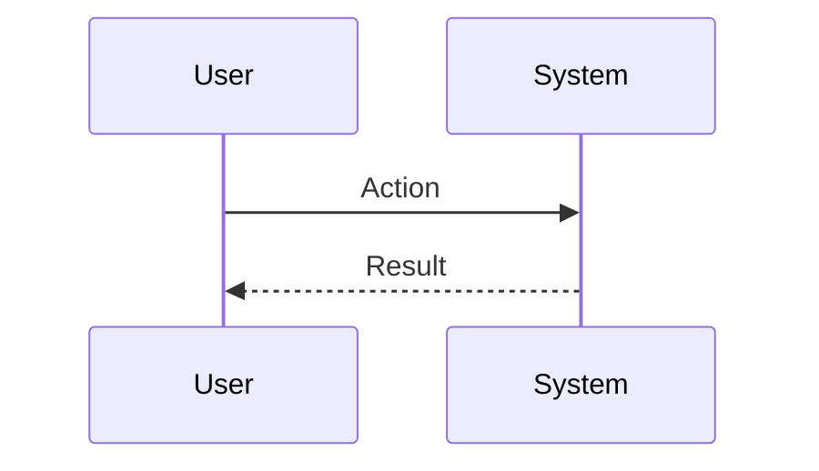
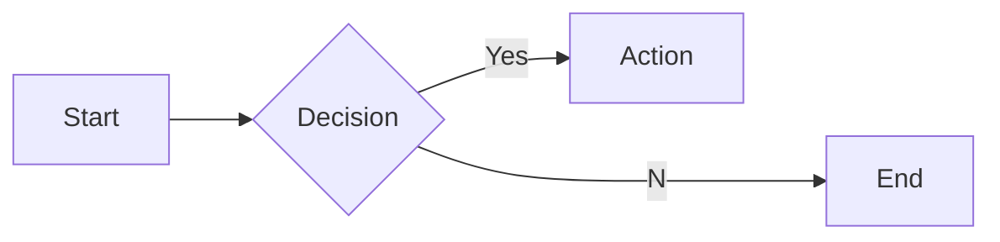

# Interview Questions: Mobile Platform (ROLE)

**What's on this page**

- Core content for this topic in the Inkorporated enterprise OS.
- Practical guidance, roles, or standards as applicable.

**What this enables**

- Consistent enterprise operations and decision-making.
- Shared language for humans and cyborg AI agents.

This document contains 100 interview questions tailored for the Mobile Platform role. The questions are designed to assess technical skills, soft skills, and cultural fit.

---

## 1. Conflict Resolution

**Scenario:** Disagreement with a peer.

**Question:** Tell me about a time you had a significant disagreement with a colleague. How did you resolve it?

**Key Concepts:** `Communication`, `Soft Skills`

### Candidate Response Paths
*   **Junior**: I told them I was right.
*   **Senior**: I listened to their perspective, found common ground, and we compromised.

---

## 2. Failure Handling

**Scenario:** A project went wrong.

**Question:** Describe a time you failed. What happened and what did you learn?

**Key Concepts:** `Growth Mindset`, `Resilience`

### Candidate Response Paths
*   **Junior**: I tried hard but it failed.
*   **Senior**: I analyzed the root cause, implemented a fix, and shared the learning.

---

## 3. Prioritization

**Scenario:** Too many tasks.

**Question:** How do you prioritize when you have multiple conflicting deadlines?

**Key Concepts:** `Time Management`, `Organization`

### Candidate Response Paths
*   **Junior**: I work longer hours.
*   **Senior**: I communicate with stakeholders to adjust expectations and focus on high-impact tasks.

---

## 4. Adaptability

**Scenario:** Changing requirements.

**Question:** How do you handle sudden changes in project scope or direction?

**Key Concepts:** `Agility`, `Flexibility`

### Candidate Response Paths
*   **Junior**: I get frustrated but do it.
*   **Senior**: I assess the impact, communicate risks, and pivot quickly.

---

## 5. Communication

**Scenario:** Explaining complex topics.

**Question:** Describe a time you had to explain a complex technical/business concept to a non-expert.

**Key Concepts:** `Clarity`, `Empathy`

### Candidate Response Paths
*   **Junior**: I just said it simpler.
*   **Senior**: I used analogies and checked for understanding throughout.

---

## 6. Teamwork

**Scenario:** Collaborating with difficult personalities.

**Question:** How do you handle working with someone who is difficult to work with?

**Key Concepts:** `Collaboration`, `EQ`

### Candidate Response Paths
*   **Junior**: I avoid them.
*   **Senior**: I try to understand their motivations and find a way to work together effectively.

---

## 7. Innovation

**Scenario:** Improving a process.

**Question:** Tell me about a time you improved a process or workflow.

| Metric | Target | Status |
|---|---|---|
| KPI 1 | 100% | Green |
| KPI 2 | < 5% | Yellow |

**Key Concepts:** `Innovation`, `Efficiency`

### Candidate Response Paths
*   **Junior**: I followed the rules.
*   **Senior**: I identified a bottleneck, proposed a solution, and measured the improvement.

---

## 8. Feedback

**Scenario:** Receiving constructive criticism.

**Question:** Tell me about a time you received difficult feedback. How did you react?

**Key Concepts:** `Self-awareness`, `Growth`

### Candidate Response Paths
*   **Junior**: I got defensive.
*   **Senior**: I listened, asked for examples, and worked on a plan to improve.

---

## 9. Leadership

**Scenario:** Leading without authority.

**Question:** Describe a time you demonstrated leadership when you weren't the formal manager.

**Key Concepts:** `Leadership`, `Influence`

### Candidate Response Paths
*   **Junior**: I told people what to do.
*   **Senior**: I rallied the team around a goal and supported them to achieve it.

---

## 10. Decision Making

**Scenario:** Incomplete information.

**Question:** How do you make decisions when you don't have all the data?

**Key Concepts:** `Judgment`, `Risk Mgmt`

### Candidate Response Paths
*   **Junior**: I wait for all data.
*   **Senior**: I assess the risk, make a call based on available info, and adjust as needed.

---

## 11. Ethics in Time Management

**Scenario:** Ethics.

**Question:** What are the ethical considerations regarding Time Management?

**Key Concepts:** `Time Management`, `Ethics`

### Candidate Response Paths
*   **Junior**: Be nice.
*   **Senior**: Privacy, bias, and societal impact.

---

## 12. Mistakes in Innovation

**Scenario:** Learning.

**Question:** What common mistakes do people make with Innovation?

**Key Concepts:** `Innovation`, `Experience`

### Candidate Response Paths
*   **Junior**: Doing it wrong.
*   **Senior**: Subtle pitfalls and how to avoid them.

---

## 13. Mistakes in Adaptability

**Scenario:** Learning.

**Question:** What common mistakes do people make with Adaptability?

**Key Concepts:** `Adaptability`, `Experience`

### Candidate Response Paths
*   **Junior**: Doing it wrong.
*   **Senior**: Subtle pitfalls and how to avoid them.

---

## 14. Metrics for Teamwork

**Scenario:** Measurement.

**Question:** How do you measure success in Teamwork?

| Metric | Target | Status |
|---|---|---|
| KPI 1 | 100% | Green |
| KPI 2 | < 5% | Yellow |

**Key Concepts:** `Teamwork`, `Analytics`

### Candidate Response Paths
*   **Junior**: I guess.
*   **Senior**: Specific KPIs and leading/lagging indicators.

---

## 15. Mistakes in Leadership

**Scenario:** Learning.

**Question:** What common mistakes do people make with Leadership?

**Key Concepts:** `Leadership`, `Experience`

### Candidate Response Paths
*   **Junior**: Doing it wrong.
*   **Senior**: Subtle pitfalls and how to avoid them.

---

## 16. Teaching Motivation

**Scenario:** Mentorship.

**Question:** How would you teach Motivation to a junior team member?

**Key Concepts:** `Motivation`, `Mentorship`

### Candidate Response Paths
*   **Junior**: Send them a link.
*   **Senior**: Structured learning path and hands-on practice.

---

## 17. Start vs Scale for Integrity

**Scenario:** Context.

**Question:** How does your approach to Integrity differ in a startup vs a large corp?

**Key Concepts:** `Integrity`, `Context`

### Candidate Response Paths
*   **Junior**: It's the same.
*   **Senior**: Speed/Chaos vs Process/Stability.

---

## 18. Future of Problem Solving

**Scenario:** Trends.

**Question:** Where do you see Problem Solving heading in the next 5 years?

**Key Concepts:** `Problem Solving`, `Vision`

### Candidate Response Paths
*   **Junior**: It will get better.
*   **Senior**: Emerging trends, AI impact, and market shifts.

---

## 19. Challenges in Time Management

**Scenario:** Problem Solving.

**Question:** What are the biggest challenges you've faced regarding Time Management?

**Key Concepts:** `Time Management`, `Problem Solving`

### Candidate Response Paths
*   **Junior**: It was hard.
*   **Senior**: Specific examples of obstacles and strategies to overcome them.

---

## 20. Ethics in Focus

**Scenario:** Ethics.

**Question:** What are the ethical considerations regarding Focus?

**Key Concepts:** `Focus`, `Ethics`

### Candidate Response Paths
*   **Junior**: Be nice.
*   **Senior**: Privacy, bias, and societal impact.

---

## 21. Ethics in Teamwork

**Scenario:** Ethics.

**Question:** What are the ethical considerations regarding Teamwork?

| Metric | Target | Status |
|---|---|---|
| KPI 1 | 100% | Green |
| KPI 2 | < 5% | Yellow |

**Key Concepts:** `Teamwork`, `Ethics`

### Candidate Response Paths
*   **Junior**: Be nice.
*   **Senior**: Privacy, bias, and societal impact.

---

## 22. Teaching Innovation

**Scenario:** Mentorship.

**Question:** How would you teach Innovation to a junior team member?

**Key Concepts:** `Innovation`, `Mentorship`

### Candidate Response Paths
*   **Junior**: Send them a link.
*   **Senior**: Structured learning path and hands-on practice.

---

## 23. Start vs Scale for Teamwork

**Scenario:** Context.

**Question:** How does your approach to Teamwork differ in a startup vs a large corp?

**Key Concepts:** `Teamwork`, `Context`

### Candidate Response Paths
*   **Junior**: It's the same.
*   **Senior**: Speed/Chaos vs Process/Stability.

---

## 24. Metrics for Focus

**Scenario:** Measurement.

**Question:** How do you measure success in Focus?

**Key Concepts:** `Focus`, `Analytics`

### Candidate Response Paths
*   **Junior**: I guess.
*   **Senior**: Specific KPIs and leading/lagging indicators.

---

## 25. Future of Adaptability

**Scenario:** Trends.

**Question:** Where do you see Adaptability heading in the next 5 years?

**Key Concepts:** `Adaptability`, `Vision`

### Candidate Response Paths
*   **Junior**: It will get better.
*   **Senior**: Emerging trends, AI impact, and market shifts.

---

## 26. Collaboration in Resilience

**Scenario:** Teamwork.

**Question:** How does Resilience require cross-functional collaboration?

**Key Concepts:** `Resilience`, `Collaboration`

### Candidate Response Paths
*   **Junior**: I talk to people.
*   **Senior**: Alignment with other depts and shared goals.

---

## 27. Future of Focus

**Scenario:** Trends.

**Question:** Where do you see Focus heading in the next 5 years?

**Key Concepts:** `Focus`, `Vision`

### Candidate Response Paths
*   **Junior**: It will get better.
*   **Senior**: Emerging trends, AI impact, and market shifts.

---

## 28. Start vs Scale for Adaptability

**Scenario:** Context.

**Question:** How does your approach to Adaptability differ in a startup vs a large corp?

| Metric | Target | Status |
|---|---|---|
| KPI 1 | 100% | Green |
| KPI 2 | < 5% | Yellow |

**Key Concepts:** `Adaptability`, `Context`

### Candidate Response Paths
*   **Junior**: It's the same.
*   **Senior**: Speed/Chaos vs Process/Stability.

---

## 29. Scaling Innovation

**Scenario:** Growth.

**Question:** How do you scale Innovation as the company grows?

**Key Concepts:** `Innovation`, `Scale`

### Candidate Response Paths
*   **Junior**: Hire more people.
*   **Senior**: Process automation, documentation, and leverage.

---

## 30. Deep Dive: Communication

**Scenario:** Assessing depth in Communication.

**Question:** Can you explain Communication in detail and how you have applied it in your past role?

**Key Concepts:** `Communication`, `Experience`

### Candidate Response Paths
*   **Junior**: Basic definition.
*   **Senior**: Deep practical application and nuances.

---

## 31. Ethics in Conflict

**Scenario:** Ethics.

**Question:** What are the ethical considerations regarding Conflict?

**Key Concepts:** `Conflict`, `Ethics`

### Candidate Response Paths
*   **Junior**: Be nice.
*   **Senior**: Privacy, bias, and societal impact.

---

## 32. Challenges in Focus

**Scenario:** Problem Solving.

**Question:** What are the biggest challenges you've faced regarding Focus?

**Key Concepts:** `Focus`, `Problem Solving`

### Candidate Response Paths
*   **Junior**: It was hard.
*   **Senior**: Specific examples of obstacles and strategies to overcome them.

---

## 33. Future of Communication

**Scenario:** Trends.

**Question:** Where do you see Communication heading in the next 5 years?

**Key Concepts:** `Communication`, `Vision`

### Candidate Response Paths
*   **Junior**: It will get better.
*   **Senior**: Emerging trends, AI impact, and market shifts.

---

## 34. Challenges in Feedback

**Scenario:** Problem Solving.

**Question:** What are the biggest challenges you've faced regarding Feedback?

**Key Concepts:** `Feedback`, `Problem Solving`

### Candidate Response Paths
*   **Junior**: It was hard.
*   **Senior**: Specific examples of obstacles and strategies to overcome them.

---

## 35. Challenges in Leadership

**Scenario:** Problem Solving.

**Question:** What are the biggest challenges you've faced regarding Leadership?

| Metric | Target | Status |
|---|---|---|
| KPI 1 | 100% | Green |
| KPI 2 | < 5% | Yellow |

**Key Concepts:** `Leadership`, `Problem Solving`

### Candidate Response Paths
*   **Junior**: It was hard.
*   **Senior**: Specific examples of obstacles and strategies to overcome them.

---

## 36. Start vs Scale for Communication

**Scenario:** Context.

**Question:** How does your approach to Communication differ in a startup vs a large corp?

**Key Concepts:** `Communication`, `Context`

### Candidate Response Paths
*   **Junior**: It's the same.
*   **Senior**: Speed/Chaos vs Process/Stability.

---

## 37. Teaching Conflict

**Scenario:** Mentorship.

**Question:** How would you teach Conflict to a junior team member?

**Key Concepts:** `Conflict`, `Mentorship`

### Candidate Response Paths
*   **Junior**: Send them a link.
*   **Senior**: Structured learning path and hands-on practice.

---

## 38. Conflict Best Practices

**Scenario:** Standardization.

**Question:** What are the industry best practices for Conflict?

**Key Concepts:** `Conflict`, `Standards`

### Candidate Response Paths
*   **Junior**: List a few.
*   **Senior**: Discusses why they are best practices and when to break them.

---

## 39. Future of Leadership

**Scenario:** Trends.

**Question:** Where do you see Leadership heading in the next 5 years?

**Key Concepts:** `Leadership`, `Vision`

### Candidate Response Paths
*   **Junior**: It will get better.
*   **Senior**: Emerging trends, AI impact, and market shifts.

---

## 40. Motivation Best Practices

**Scenario:** Standardization.

**Question:** What are the industry best practices for Motivation?

**Key Concepts:** `Motivation`, `Standards`

### Candidate Response Paths
*   **Junior**: List a few.
*   **Senior**: Discusses why they are best practices and when to break them.

---

## 41. Scaling Learning

**Scenario:** Growth.

**Question:** How do you scale Learning as the company grows?

**Key Concepts:** `Learning`, `Scale`

### Candidate Response Paths
*   **Junior**: Hire more people.
*   **Senior**: Process automation, documentation, and leverage.

---

## 42. Innovation Best Practices

**Scenario:** Standardization.

**Question:** What are the industry best practices for Innovation?

| Metric | Target | Status |
|---|---|---|
| KPI 1 | 100% | Green |
| KPI 2 | < 5% | Yellow |

**Key Concepts:** `Innovation`, `Standards`

### Candidate Response Paths
*   **Junior**: List a few.
*   **Senior**: Discusses why they are best practices and when to break them.

---

## 43. Time Management Best Practices

**Scenario:** Standardization.

**Question:** What are the industry best practices for Time Management?

**Key Concepts:** `Time Management`, `Standards`

### Candidate Response Paths
*   **Junior**: List a few.
*   **Senior**: Discusses why they are best practices and when to break them.

---

## 44. Deep Dive: Empathy

**Scenario:** Assessing depth in Empathy.

**Question:** Can you explain Empathy in detail and how you have applied it in your past role?

**Key Concepts:** `Empathy`, `Experience`

### Candidate Response Paths
*   **Junior**: Basic definition.
*   **Senior**: Deep practical application and nuances.

---

## 45. Metrics for Communication

**Scenario:** Measurement.

**Question:** How do you measure success in Communication?

**Key Concepts:** `Communication`, `Analytics`

### Candidate Response Paths
*   **Junior**: I guess.
*   **Senior**: Specific KPIs and leading/lagging indicators.

---

## 46. Deep Dive: Adaptability

**Scenario:** Assessing depth in Adaptability.

**Question:** Can you explain Adaptability in detail and how you have applied it in your past role?

**Key Concepts:** `Adaptability`, `Experience`

### Candidate Response Paths
*   **Junior**: Basic definition.
*   **Senior**: Deep practical application and nuances.

---

## 47. Metrics for Integrity

**Scenario:** Measurement.

**Question:** How do you measure success in Integrity?

**Key Concepts:** `Integrity`, `Analytics`

### Candidate Response Paths
*   **Junior**: I guess.
*   **Senior**: Specific KPIs and leading/lagging indicators.

---

## 48. Deep Dive: Resilience

**Scenario:** Assessing depth in Resilience.

**Question:** Can you explain Resilience in detail and how you have applied it in your past role?

**Key Concepts:** `Resilience`, `Experience`

### Candidate Response Paths
*   **Junior**: Basic definition.
*   **Senior**: Deep practical application and nuances.

---

## 49. Ethics in Motivation

**Scenario:** Ethics.

**Question:** What are the ethical considerations regarding Motivation?

| Metric | Target | Status |
|---|---|---|
| KPI 1 | 100% | Green |
| KPI 2 | < 5% | Yellow |

**Key Concepts:** `Motivation`, `Ethics`

### Candidate Response Paths
*   **Junior**: Be nice.
*   **Senior**: Privacy, bias, and societal impact.

---

## 50. Scaling Feedback

**Scenario:** Growth.

**Question:** How do you scale Feedback as the company grows?

**Key Concepts:** `Feedback`, `Scale`

### Candidate Response Paths
*   **Junior**: Hire more people.
*   **Senior**: Process automation, documentation, and leverage.

---

## 51. Mistakes in Feedback

**Scenario:** Learning.

**Question:** What common mistakes do people make with Feedback?

**Key Concepts:** `Feedback`, `Experience`

### Candidate Response Paths
*   **Junior**: Doing it wrong.
*   **Senior**: Subtle pitfalls and how to avoid them.

---

## 52. Adaptability Best Practices

**Scenario:** Standardization.

**Question:** What are the industry best practices for Adaptability?

**Key Concepts:** `Adaptability`, `Standards`

### Candidate Response Paths
*   **Junior**: List a few.
*   **Senior**: Discusses why they are best practices and when to break them.

---

## 53. Start vs Scale for Learning

**Scenario:** Context.

**Question:** How does your approach to Learning differ in a startup vs a large corp?

**Key Concepts:** `Learning`, `Context`

### Candidate Response Paths
*   **Junior**: It's the same.
*   **Senior**: Speed/Chaos vs Process/Stability.

---

## 54. Scaling Time Management

**Scenario:** Growth.

**Question:** How do you scale Time Management as the company grows?

**Key Concepts:** `Time Management`, `Scale`

### Candidate Response Paths
*   **Junior**: Hire more people.
*   **Senior**: Process automation, documentation, and leverage.

---

## 55. Metrics for Innovation

**Scenario:** Measurement.

**Question:** How do you measure success in Innovation?

**Key Concepts:** `Innovation`, `Analytics`

### Candidate Response Paths
*   **Junior**: I guess.
*   **Senior**: Specific KPIs and leading/lagging indicators.

---

## 56. Leadership Best Practices

**Scenario:** Standardization.

**Question:** What are the industry best practices for Leadership?

| Metric | Target | Status |
|---|---|---|
| KPI 1 | 100% | Green |
| KPI 2 | < 5% | Yellow |

**Key Concepts:** `Leadership`, `Standards`

### Candidate Response Paths
*   **Junior**: List a few.
*   **Senior**: Discusses why they are best practices and when to break them.

---

## 57. Collaboration in Integrity

**Scenario:** Teamwork.

**Question:** How does Integrity require cross-functional collaboration?

**Key Concepts:** `Integrity`, `Collaboration`

### Candidate Response Paths
*   **Junior**: I talk to people.
*   **Senior**: Alignment with other depts and shared goals.

---

## 58. Tooling: Resilience

**Scenario:** Proficiency.

**Question:** How do you utilize Resilience to improve efficiency?

**Key Concepts:** `Resilience`, `Productivity`

### Candidate Response Paths
*   **Junior**: I use it daily.
*   **Senior**: Advanced features and automation.

---

## 59. Start vs Scale for Innovation

**Scenario:** Context.

**Question:** How does your approach to Innovation differ in a startup vs a large corp?

**Key Concepts:** `Innovation`, `Context`

### Candidate Response Paths
*   **Junior**: It's the same.
*   **Senior**: Speed/Chaos vs Process/Stability.

---

## 60. Scaling Conflict

**Scenario:** Growth.

**Question:** How do you scale Conflict as the company grows?

**Key Concepts:** `Conflict`, `Scale`

### Candidate Response Paths
*   **Junior**: Hire more people.
*   **Senior**: Process automation, documentation, and leverage.

---

## 61. Deep Dive: Time Management

**Scenario:** Assessing depth in Time Management.

**Question:** Can you explain Time Management in detail and how you have applied it in your past role?

**Key Concepts:** `Time Management`, `Experience`

### Candidate Response Paths
*   **Junior**: Basic definition.
*   **Senior**: Deep practical application and nuances.

---

## 62. Collaboration in Adaptability

**Scenario:** Teamwork.

**Question:** How does Adaptability require cross-functional collaboration?

**Key Concepts:** `Adaptability`, `Collaboration`

### Candidate Response Paths
*   **Junior**: I talk to people.
*   **Senior**: Alignment with other depts and shared goals.

---

## 63. Scaling Adaptability

**Scenario:** Growth.

**Question:** How do you scale Adaptability as the company grows?

| Metric | Target | Status |
|---|---|---|
| KPI 1 | 100% | Green |
| KPI 2 | < 5% | Yellow |

**Key Concepts:** `Adaptability`, `Scale`

### Candidate Response Paths
*   **Junior**: Hire more people.
*   **Senior**: Process automation, documentation, and leverage.

---

## 64. Collaboration in Learning

**Scenario:** Teamwork.

**Question:** How does Learning require cross-functional collaboration?

**Key Concepts:** `Learning`, `Collaboration`

### Candidate Response Paths
*   **Junior**: I talk to people.
*   **Senior**: Alignment with other depts and shared goals.

---

## 65. Teaching Communication

**Scenario:** Mentorship.

**Question:** How would you teach Communication to a junior team member?

**Key Concepts:** `Communication`, `Mentorship`

### Candidate Response Paths
*   **Junior**: Send them a link.
*   **Senior**: Structured learning path and hands-on practice.

---

## 66. Start vs Scale for Motivation

**Scenario:** Context.

**Question:** How does your approach to Motivation differ in a startup vs a large corp?

**Key Concepts:** `Motivation`, `Context`

### Candidate Response Paths
*   **Junior**: It's the same.
*   **Senior**: Speed/Chaos vs Process/Stability.

---

## 67. Future of Empathy

**Scenario:** Trends.

**Question:** Where do you see Empathy heading in the next 5 years?

**Key Concepts:** `Empathy`, `Vision`

### Candidate Response Paths
*   **Junior**: It will get better.
*   **Senior**: Emerging trends, AI impact, and market shifts.

---

## 68. Deep Dive: Problem Solving

**Scenario:** Assessing depth in Problem Solving.

**Question:** Can you explain Problem Solving in detail and how you have applied it in your past role?

**Key Concepts:** `Problem Solving`, `Experience`

### Candidate Response Paths
*   **Junior**: Basic definition.
*   **Senior**: Deep practical application and nuances.

---

## 69. Mistakes in Learning

**Scenario:** Learning.

**Question:** What common mistakes do people make with Learning?

**Key Concepts:** `Learning`, `Experience`

### Candidate Response Paths
*   **Junior**: Doing it wrong.
*   **Senior**: Subtle pitfalls and how to avoid them.

---

## 70. Tooling: Motivation

**Scenario:** Proficiency.

**Question:** How do you utilize Motivation to improve efficiency?

| Metric | Target | Status |
|---|---|---|
| KPI 1 | 100% | Green |
| KPI 2 | < 5% | Yellow |

**Key Concepts:** `Motivation`, `Productivity`

### Candidate Response Paths
*   **Junior**: I use it daily.
*   **Senior**: Advanced features and automation.

---

## 71. Scaling Resilience

**Scenario:** Growth.

**Question:** How do you scale Resilience as the company grows?

**Key Concepts:** `Resilience`, `Scale`

### Candidate Response Paths
*   **Junior**: Hire more people.
*   **Senior**: Process automation, documentation, and leverage.

---

## 72. Ethics in Learning

**Scenario:** Ethics.

**Question:** What are the ethical considerations regarding Learning?

**Key Concepts:** `Learning`, `Ethics`

### Candidate Response Paths
*   **Junior**: Be nice.
*   **Senior**: Privacy, bias, and societal impact.

---

## 73. Tooling: Focus

**Scenario:** Proficiency.

**Question:** How do you utilize Focus to improve efficiency?

**Key Concepts:** `Focus`, `Productivity`

### Candidate Response Paths
*   **Junior**: I use it daily.
*   **Senior**: Advanced features and automation.

---

## 74. Teaching Learning

**Scenario:** Mentorship.

**Question:** How would you teach Learning to a junior team member?

**Key Concepts:** `Learning`, `Mentorship`

### Candidate Response Paths
*   **Junior**: Send them a link.
*   **Senior**: Structured learning path and hands-on practice.

---

## 75. Challenges in Teamwork

**Scenario:** Problem Solving.

**Question:** What are the biggest challenges you've faced regarding Teamwork?

**Key Concepts:** `Teamwork`, `Problem Solving`

### Candidate Response Paths
*   **Junior**: It was hard.
*   **Senior**: Specific examples of obstacles and strategies to overcome them.

---

## 76. Mistakes in Resilience

**Scenario:** Learning.

**Question:** What common mistakes do people make with Resilience?

**Key Concepts:** `Resilience`, `Experience`

### Candidate Response Paths
*   **Junior**: Doing it wrong.
*   **Senior**: Subtle pitfalls and how to avoid them.

---

## 77. Feedback Best Practices

**Scenario:** Standardization.

**Question:** What are the industry best practices for Feedback?

| Metric | Target | Status |
|---|---|---|
| KPI 1 | 100% | Green |
| KPI 2 | < 5% | Yellow |

**Key Concepts:** `Feedback`, `Standards`

### Candidate Response Paths
*   **Junior**: List a few.
*   **Senior**: Discusses why they are best practices and when to break them.

---

## 78. Future of Innovation

**Scenario:** Trends.

**Question:** Where do you see Innovation heading in the next 5 years?

**Key Concepts:** `Innovation`, `Vision`

### Candidate Response Paths
*   **Junior**: It will get better.
*   **Senior**: Emerging trends, AI impact, and market shifts.

---

## 79. Mistakes in Empathy

**Scenario:** Learning.

**Question:** What common mistakes do people make with Empathy?

**Key Concepts:** `Empathy`, `Experience`

### Candidate Response Paths
*   **Junior**: Doing it wrong.
*   **Senior**: Subtle pitfalls and how to avoid them.

---

## 80. Scaling Leadership

**Scenario:** Growth.

**Question:** How do you scale Leadership as the company grows?

**Key Concepts:** `Leadership`, `Scale`

### Candidate Response Paths
*   **Junior**: Hire more people.
*   **Senior**: Process automation, documentation, and leverage.

---

## 81. Tooling: Feedback

**Scenario:** Proficiency.

**Question:** How do you utilize Feedback to improve efficiency?

**Key Concepts:** `Feedback`, `Productivity`

### Candidate Response Paths
*   **Junior**: I use it daily.
*   **Senior**: Advanced features and automation.

---

## 82. Future of Resilience

**Scenario:** Trends.

**Question:** Where do you see Resilience heading in the next 5 years?

**Key Concepts:** `Resilience`, `Vision`

### Candidate Response Paths
*   **Junior**: It will get better.
*   **Senior**: Emerging trends, AI impact, and market shifts.

---

## 83. Metrics for Adaptability

**Scenario:** Measurement.

**Question:** How do you measure success in Adaptability?

**Key Concepts:** `Adaptability`, `Analytics`

### Candidate Response Paths
*   **Junior**: I guess.
*   **Senior**: Specific KPIs and leading/lagging indicators.

---

## 84. Start vs Scale for Focus

**Scenario:** Context.

**Question:** How does your approach to Focus differ in a startup vs a large corp?

| Metric | Target | Status |
|---|---|---|
| KPI 1 | 100% | Green |
| KPI 2 | < 5% | Yellow |

**Key Concepts:** `Focus`, `Context`

### Candidate Response Paths
*   **Junior**: It's the same.
*   **Senior**: Speed/Chaos vs Process/Stability.

---

## 85. Collaboration in Innovation

**Scenario:** Teamwork.

**Question:** How does Innovation require cross-functional collaboration?

**Key Concepts:** `Innovation`, `Collaboration`

### Candidate Response Paths
*   **Junior**: I talk to people.
*   **Senior**: Alignment with other depts and shared goals.

---

## 86. Metrics for Motivation

**Scenario:** Measurement.

**Question:** How do you measure success in Motivation?

**Key Concepts:** `Motivation`, `Analytics`

### Candidate Response Paths
*   **Junior**: I guess.
*   **Senior**: Specific KPIs and leading/lagging indicators.

---

## 87. Teaching Adaptability

**Scenario:** Mentorship.

**Question:** How would you teach Adaptability to a junior team member?

**Key Concepts:** `Adaptability`, `Mentorship`

### Candidate Response Paths
*   **Junior**: Send them a link.
*   **Senior**: Structured learning path and hands-on practice.

---

## 88. Start vs Scale for Conflict

**Scenario:** Context.

**Question:** How does your approach to Conflict differ in a startup vs a large corp?

**Key Concepts:** `Conflict`, `Context`

### Candidate Response Paths
*   **Junior**: It's the same.
*   **Senior**: Speed/Chaos vs Process/Stability.

---

## 89. Teaching Problem Solving

**Scenario:** Mentorship.

**Question:** How would you teach Problem Solving to a junior team member?

**Key Concepts:** `Problem Solving`, `Mentorship`

### Candidate Response Paths
*   **Junior**: Send them a link.
*   **Senior**: Structured learning path and hands-on practice.

---

## 90. Challenges in Adaptability

**Scenario:** Problem Solving.

**Question:** What are the biggest challenges you've faced regarding Adaptability?

**Key Concepts:** `Adaptability`, `Problem Solving`

### Candidate Response Paths
*   **Junior**: It was hard.
*   **Senior**: Specific examples of obstacles and strategies to overcome them.

---

## 91. Scaling Integrity

**Scenario:** Growth.

**Question:** How do you scale Integrity as the company grows?

| Metric | Target | Status |
|---|---|---|
| KPI 1 | 100% | Green |
| KPI 2 | < 5% | Yellow |

**Key Concepts:** `Integrity`, `Scale`

### Candidate Response Paths
*   **Junior**: Hire more people.
*   **Senior**: Process automation, documentation, and leverage.

---

## 92. Challenges in Conflict

**Scenario:** Problem Solving.

**Question:** What are the biggest challenges you've faced regarding Conflict?

**Key Concepts:** `Conflict`, `Problem Solving`

### Candidate Response Paths
*   **Junior**: It was hard.
*   **Senior**: Specific examples of obstacles and strategies to overcome them.

---

## 93. Future of Motivation

**Scenario:** Trends.

**Question:** Where do you see Motivation heading in the next 5 years?

**Key Concepts:** `Motivation`, `Vision`

### Candidate Response Paths
*   **Junior**: It will get better.
*   **Senior**: Emerging trends, AI impact, and market shifts.

---

## 94. Deep Dive: Motivation

**Scenario:** Assessing depth in Motivation.

**Question:** Can you explain Motivation in detail and how you have applied it in your past role?

**Key Concepts:** `Motivation`, `Experience`

### Candidate Response Paths
*   **Junior**: Basic definition.
*   **Senior**: Deep practical application and nuances.

---

## 95. Collaboration in Feedback

**Scenario:** Teamwork.

**Question:** How does Feedback require cross-functional collaboration?

**Key Concepts:** `Feedback`, `Collaboration`

### Candidate Response Paths
*   **Junior**: I talk to people.
*   **Senior**: Alignment with other depts and shared goals.

---

## 96. Mistakes in Motivation

**Scenario:** Learning.

**Question:** What common mistakes do people make with Motivation?

**Key Concepts:** `Motivation`, `Experience`

### Candidate Response Paths
*   **Junior**: Doing it wrong.
*   **Senior**: Subtle pitfalls and how to avoid them.

---

## 97. Metrics for Resilience

**Scenario:** Measurement.

**Question:** How do you measure success in Resilience?

**Key Concepts:** `Resilience`, `Analytics`

### Candidate Response Paths
*   **Junior**: I guess.
*   **Senior**: Specific KPIs and leading/lagging indicators.

---

## 98. Mistakes in Communication

**Scenario:** Learning.

**Question:** What common mistakes do people make with Communication?

| Metric | Target | Status |
|---|---|---|
| KPI 1 | 100% | Green |
| KPI 2 | < 5% | Yellow |

**Key Concepts:** `Communication`, `Experience`

### Candidate Response Paths
*   **Junior**: Doing it wrong.
*   **Senior**: Subtle pitfalls and how to avoid them.

---

## 99. Scaling Empathy

**Scenario:** Growth.

**Question:** How do you scale Empathy as the company grows?

**Key Concepts:** `Empathy`, `Scale`

### Candidate Response Paths
*   **Junior**: Hire more people.
*   **Senior**: Process automation, documentation, and leverage.

---

## 100. Tooling: Leadership

**Scenario:** Proficiency.

**Question:** How do you utilize Leadership to improve efficiency?

**Key Concepts:** `Leadership`, `Productivity`

### Candidate Response Paths
*   **Junior**: I use it daily.
*   **Senior**: Advanced features and automation.

---
