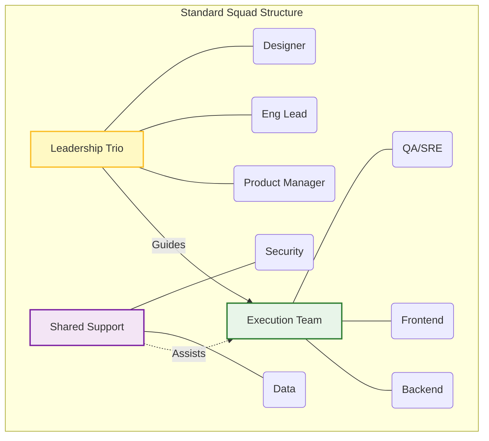
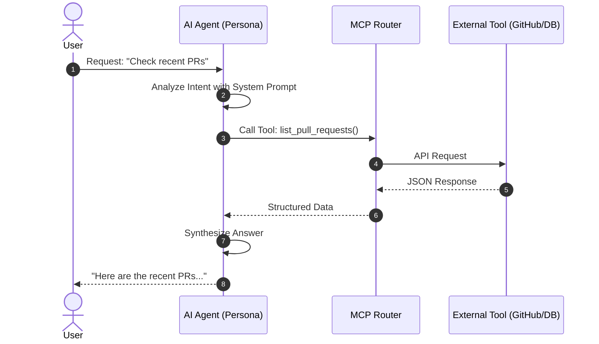

# 1. Executive Summary

**What's on this page**

- Role-specific guidance, responsibilities, and agent profile for Inkorporated.
- Practical guidance, roles, or standards as applicable.

**What this enables**

- Consistent hiring and execution standards
- Shared language for humans and cyborg agents

This document defines the standard organizational architecture for Inkorporated. We utilize a Matrix Organizational Structure, designed to balance deep functional expertise with rapid cross-functional execution.
 
 * Functional Departments (Verticals): Where talent is hired, trained, and managed (e.g., Engineering, Finance).
 * Specialized Squads (Horizontals): Where work actually gets done. These are cross-functional teams composed of members from various departments to deliver specific business value (e.g., "Mobile Platform Squad").

# 2. Visual Org Chart (The Matrix Model)

The following diagram illustrates how functional departments (blue) supply talent to execution squads (orange).

```mermaid
graph TD
    %% --- Styles ---
    classDef exec fill:#7e57c2,stroke:#311b92,stroke-width:3px,color:white,font-weight:bold,rx:10,ry:10;
    classDef mgmt fill:#bbdefb,stroke:#1565c0,stroke-width:2px,color:black,font-weight:bold;
    classDef role fill:#ffffff,stroke:#546e7a,stroke-width:1px,stroke-dasharray: 5 5,rx:5,ry:5;
    classDef squad fill:#ffccbc,stroke:#d84315,stroke-width:3px,shape:hexagon,font-weight:bold,color:black;
    classDef pillar fill:#c8e6c9,stroke:#2e7d32,stroke-width:2px,color:black,font-weight:bold,shape:rect;

    %% --- Layer 1: Executive Leadership (C-Suite) ---
    CEO[CEO: Chief Executive Officer]:::exec
    
    subgraph "Executive Layer"
        direction LR
        CTO[CTO: Chief Tech Officer]:::exec
        CPO[CPO: Chief Product Officer]:::exec
        CRO[CRO: Chief Revenue Officer]:::exec
        CFO[CFO: Chief Financial Officer]:::exec
        CLO[CLO: Chief Legal Officer]:::exec
    end

    CEO --> CTO & CPO & CRO & CFO & CLO

    %% --- Layer 2: Functional Management (VPs & Directors) ---
    subgraph "Functional Chain of Command"
        direction LR
        
        %% Tech Branch
        VP_ENG[VP of Engineering]:::mgmt
        DIR_INFRA[Dir. Infrastructure]:::mgmt
        DIR_APP[Dir. App Dev]:::mgmt
        CTO --> VP_ENG
        VP_ENG --> DIR_INFRA & DIR_APP

        %% Product Branch
        VP_PROD[VP of Product]:::mgmt
        VP_DESIGN[VP of Design]:::mgmt
        CPO --> VP_PROD & VP_DESIGN

        %% Sales Branch
        VP_SALES[VP of Sales]:::mgmt
        VP_MKTG[VP of Marketing]:::mgmt
        CRO --> VP_SALES & VP_MKTG

        %% G&A Branch
        VP_FIN[VP Finance]:::mgmt
        VP_PEOPLE[VP People/HR]:::mgmt
        CFO --> VP_FIN
        CLO --> VP_PEOPLE
    end

    %% --- Layer 3: Talent Pools (Individual Roles) ---
    subgraph "Talent Pools (The Resources)"
        %% Engineering Resources
        DIR_INFRA --> R_SREL(SREL1001: SRE):::role
        DIR_INFRA --> R_SEC(SREL1004: Security Eng):::role
        DIR_APP --> R_BACK(SWEN1002: Backend Eng):::role
        DIR_APP --> R_FRONT(SWEN1003: Frontend Eng):::role

        %% Product Resources
        VP_PROD --> R_PM(PROD2001: Product Mgr):::role
        VP_DESIGN --> R_DESN(DESN3001: Designer):::role
        VP_DESIGN --> R_RSCH(RSCH3002: Researcher):::role

        %% GTM Resources
        VP_SALES --> R_AE(SALE9001: Account Exec):::role
        VP_MKTG --> R_BRAND(MKTG9003: Brand Mgr):::role
        
        %% G&A Resources
        VP_FIN --> R_FPA(FINC6001: FP&A Analyst):::role
        VP_PEOPLE --> R_HRBP(PEOP8001: HR Partner):::role
        CLO --> R_LEGAL(LEGL7001: Counsel):::role
    end

    %% --- Layer 4: Execution Squads (Cross-Functional) ---
    %% Grouped by "Tribes" or Strategic Areas
    
    subgraph "Strategic Tribe: Core Platform"
        S_CLOUD{{Cloud Migration Squad}}:::squad
        S_DATA{{Data Platform Squad}}:::squad
    end

    subgraph "Strategic Tribe: Growth & Revenue"
        S_ACQ{{Acquisition/SEO Squad}}:::squad
        S_MON{{Monetization Squad}}:::squad
    end

    subgraph "Strategic Tribe: Enterprise"
        S_LAUNCH{{Ent. Launch Team}}:::squad
        S_PART{{Partner Integ. Squad}}:::squad
    end

    %% --- Layer 5: Strategic Outcomes ---
    %% What these squads are actually achieving for the business
    
    OUT_SCALE(Outcome: 99.99% Uptime & Scale):::pillar
    OUT_REV(Outcome: +30% YOY Revenue):::pillar
    OUT_MKT(Outcome: Fortune 500 Penetration):::pillar

    S_CLOUD & S_DATA --> OUT_SCALE
    S_ACQ & S_MON --> OUT_REV
    S_LAUNCH & S_PART --> OUT_MKT

    %% --- Matrix Assignments (Dotted Lines) ---
    %% Showing how talent flows into the squads
    
    %% Tech Assignments
    R_SREL -.-> S_CLOUD
    R_BACK -.-> S_CLOUD & S_DATA & S_MON & S_PART
    R_FRONT -.-> S_ACQ & S_MON
    R_SEC -.-> S_CLOUD

    %% Product Assignments
    R_PM -.-> S_ACQ & S_MON & S_PART & S_DATA
    R_DESN -.-> S_ACQ & S_MON

    %% GTM Assignments
    R_AE -.-> S_LAUNCH
    R_BRAND -.-> S_ACQ

    %% G&A Assignments
    R_LEGAL -.-> S_PART
    R_FPA -.-> S_MO
```

# 3. Comprehensive Job Role Catalog

The following is the standardized list of roles across the organization. All headcount planning must utilize these Role Codes.

```mermaid
graph TD
    %% Hierarchy of Job Roles
    ROOT[Job Role Catalog]

    EXEC[3.0 Executive]:::cat
    ENG[3.1 Engineering]:::cat
    PROD[3.2 Product]:::cat
    GTM[3.3 GTM]:::cat
    GA[3.4 G&A]:::cat

    ROOT --> EXEC & ENG & PROD & GTM & GA

    EXEC --> CEO[CEO]
    EXEC --> CTO[CTO]
    EXEC --> CPO[CPO]
    EXEC --> CRO[CRO]
    EXEC --> CFO[CFO]
    EXEC --> CLO[CLO]

    ENG --> SWEN[Software Eng]
    ENG --> SEC[Security]
    ENG --> QA[QA/SRE]
    ENG --> DATA[Data Eng]

    PROD --> PM[Product Mgr]
    PROD --> DES[Design]
    PROD --> RSCH[Research]
    PROD --> DS[Data Sci]

    GTM --> SALE[Sales]
    GTM --> MKTG[Marketing]
    GTM --> CS[Success]

    GA --> FIN[Finance]
    GA --> LEG[Legal]
    GA --> HR[HR/People]

    PERS[3.5 Personal Staff]:::cat
    ROOT --> PERS
    PERS --> PA[Chief of Staff]
    PERS --> HOUSE[Household]
    PERS --> CHEF[Chef]
    PERS --> TRAIN[Trainer]
    PERS --> TRAV[Travel]
    PERS --> EVENT[Events]
    PERS --> SHOP[Stylist]
    PERS --> EDU[Tutor]
    PERS --> SEC[Security]
    PERS --> CFO[Family Office]
    PERS --> LEGAL[Legal]
    PERS --> DR[Medical]
    PERS --> PA[Personal Asst]
    PERS --> SPEC[Specialist]

    classDef cat fill:#e1f5fe,stroke:#01579b,stroke-width:2px;
```

## 3.0 Executive Leadership

| Role Name | Role Code | Description | Responsibilities | Avg Daily Tasks | Common Partners |
|---|---|---|---|---|---|
| Chief Executive Officer | EXEC0001 | Highest-ranking executive, responsible for overall success. | • Strategic Vision; • Organizational Leadership; • Capital Allocation; • Stakeholder Mgmt | 09:00 Investor calls; 11:00 Product Review; 14:00 All-Hands | CFO, CTO, CPO, Board |
| Chief Tech Officer | EXEC0002 | Establishes technical vision and leads technology dev. | • Technical Strategy; • Technology Standards; • R&D Leadership; • Team Scaling | 10:00 Arch Review; 13:00 Code Review; 15:00 Tech Debt Strategy | CEO, CPO, VP Eng |
| Chief Product Officer | EXEC0003 | Responsible for strategic direction of product portfolio. | • Product Strategy; • Portfolio Mgmt; • User Advocacy; • Cross-Functional Alignment | 10:00 Concept Review; 13:00 Design Critique; 15:00 Market Trends | CEO, CTO, CRO |
| Chief Revenue Officer | EXEC0004 | Oversees all revenue-generating processes. | • Revenue Strategy; • GTM Alignment; • Sales Leadership; • Forecasting | 09:00 Deal Review; 11:00 Client Lunch; 14:00 Negotiation | CEO, CFO, VP Sales |
| Chief Financial Officer | EXEC0005 | Manages company's financial actions and strategy. | • Financial Strategy; • FP&A; • Risk Mgmt; • Investor Relations | 09:00 M&A Due Diligence; 11:00 Strategy; 14:00 Investor Mtg | CEO, CRO, VP Finance |
| Chief Legal Officer | EXEC0006 | Head of corporate legal department. | • Legal Strategy; • Compliance; • Contract Mgmt; • IP Protection | 09:00 Contract Review; 11:00 Board Prep; 14:00 Policy Update | CEO, CFO, VP People |

## 3.1 Engineering & Technology

| Role Name | Role Code | Description | Responsibilities | Avg Daily Tasks | Common Partners |
|---|---|---|---|---|---|
| VP of Engineering | SWEN0001 | Leads engineering org, execution, and delivery. | • Engineering Delivery; • Team Building; • Culture; • Process Improvement | 09:00 Recruiting; 11:00 Org Design; 14:00 All-Hands | CTO, VP Product |
| Dir. Infrastructure | SREL0003 | Oversees foundational systems and cloud infra. | • Platform Strategy; • Reliability; • Security; • Cost Mgmt | 09:00 Cost Review; 11:00 Terraform; 14:00 Vendor Mtg | VP Eng, CTO |
| Dir. App Dev | SWEN0004 | Leads app dev teams (Backend, Frontend, Mobile). | • Product Delivery; • Architecture; • Tech Debt; • Dev Experience | 09:00 Standup Review; 11:00 Roadmap Sync; 14:00 Release Plan | VP Eng, VP Product |
| Engineering Manager | SWEN0005 | Leads a squad or team of engineers. | • People Mgmt; • Delivery; • Hiring; • Process Health | 09:30 1:1s; 11:00 Standup; 14:00 Hiring Interview | Product Mgr, Designer |
| Software Engineer | SWEN1001 | Generalist engineer building core applications. | • Writing code; • Code reviews; • System design; • Debugging | 10:00 Standup; 11:00 Coding; 15:00 Arch sync | Product Mgr, Designer |
| Backend Engineer | SWEN1002 | Builds server-side logic and databases. | • API development; • DB optimization; • Microservices; • Server maintenance | 10:00 Standup; 11:00 API design; 14:00 DB migration | Frontend Eng, Data Eng |
| Frontend Engineer | SWEN1003 | Builds client-side UI (Web/Mobile). | • UI implementation; • State mgmt; • Performance opt; • Browser compatibility | 10:00 Standup; 11:00 React coding; 14:00 Pixel review | Designer, Backend Eng |
| Mobile Engineer | SWEN1004 | Develops native apps for iOS/Android. | • Swift/Kotlin coding; • App Store deploy; • Touch opt; • Device testing | 10:00 Standup; 11:00 Feature dev; 15:00 Build release | Designer, Backend Eng |
| QA Engineer | SWEN1006 | Ensures software quality through testing. | • Writing test scripts; • Automated testing; • Bug tracking; • Release validation | 09:00 Triage bugs; 11:00 Writing tests; 14:00 Regression | Developers, PM |
| Security Engineer | SREL1004 | Protects infrastructure and data. | • Pen testing; • Vuln scanning; • Security audits; • Incident response | 09:00 Log review; 11:00 Threat modeling; 14:00 Patching | SRE, Backend Eng, Legal |
| QA Engineer | QA1001 | Ensures software quality through testing. | • Writing test scripts; • Automated testing; • Bug tracking; • Release validation | 09:00 Triage bugs; 11:00 Writing tests; 14:00 Regression | Developers, PM |
| Site Reliability Eng | SREL1001 | Ensures uptime and scalability. | • Cloud infra mgmt; • Automating pipelines; • Incident response; • Capacity planning | 10:00 On-call handoff; 11:00 Automation; 14:00 Post-mortem | Backend Eng, DevOps |

## 3.2 Product & Design

| Role Name | Role Code | Description | Responsibilities | Avg Daily Tasks | Common Partners |
|---|---|---|---|---|---|
| VP of Product | PROD0001 | Leads product management organization. | • Roadmap Execution; • Team Management; • Process Excellence; • Alignment | 09:00 Funnel Review; 11:00 Planning; 14:00 Growth Sync | CPO, VP Eng |
| VP of Design | DESN0001 | Leads design organization and vision. | • Design Strategy; • Design System; • Team Leadership; • UX Quality | 09:00 Inspiration; 11:00 Critique; 14:00 Future Concepts | CPO, VP Product |
| Director of Product | PROD0002 | Leads a product line or portfolio. | • Strategy; • Team Leadership; • Portfolio Mgmt | 09:00 Strategy; 11:00 Sync with VPs; 14:00 Hiring | VP Product, Dir Eng |
| Group Product Mgr | PROD0003 | Player-coach managing PMs and product area. | • Team Mgmt; • Product Leadership; • Mentorship | 09:30 Standup; 11:00 1:1s; 13:00 PRD Review | Dir Product, Eng Mgr |
| Director of Design | DESN0002 | Leads design discipline for product line. | • Design Leadership; • Team Mgmt; • Design Ops | 09:30 Critique; 11:00 Roadmap Sync; 15:00 Strategy | VP Design, Dir Product |
| Design Manager | DESN0003 | Manages a team of designers. | • People Mgmt; • Design Quality; • Resourcing | 09:30 1:1s; 11:00 Critique; 14:00 Hiring | Dir Design, Eng Mgr |
| Product Manager | PROD2001 | Defines product strategy and roadmap. | • Prioritization; • Stakeholder alignment; • User stories; • Market research | 09:00 Metrics; 11:00 Alignment; 13:00 PRDs | Eng Mgr, Designer, Sales |
| Technical PM | PROD2002 | PM for technical products (APIs, Cloud). | • API spec definition; • Developer experience; • Platform roadmap | 10:00 Eng sync; 13:00 Writing specs; 15:00 Dev interview | Engineers, Architects |
| Technical PgM | TPGM5001 | Manages complex cross-team programs. | • Tracking dependencies; • Risk mgmt; • Milestone reporting; • Facilitation | 09:00 Reporting; 11:00 Dependency sync; 13:00 Risk planning | Eng Mgr, Product Mgr |
| Product Designer | DESN3001 | Designs UI and UX. | • Wireframes; • User testing; • Design systems; • Visual QA | 10:00 Critique; 11:00 Figma; 14:00 Usability testing | PM, Frontend Eng |
| UX Writer | DESN3003 | Writes copy for user interfaces. | • Microcopy; • Voice & tone; • Error messages; • Localization prep | 10:00 Design review; 11:00 Drafting; 14:00 Legal review | Designer, PM, Legal |
| User Researcher | RSCH3002 | Conducts qualitative research. | • User interviews; • Surveys; • Usability studies; • Synthesizing data | 10:00 Interview; 11:00 Debrief; 14:00 Analysis | Designer, Product Mgr |
| Data Scientist | DATA4001 | Analyzes data to drive decisions. | • ML models; • A/B tests; • Data mining; • Visualizing insights | 09:30 Pipeline check; 11:00 Modeling; 14:00 Exp review | PM, Backend Eng |

## 3.3 Go-To-Market (Sales & Marketing)

| Role Name | Role Code | Description | Responsibilities | Avg Daily Tasks | Common Partners |
|---|---|---|---|---|---|
| VP of Sales | SALE0001 | Leads sales org and revenue generation. | • Revenue Growth; • Sales Strategy; • Team Leadership; • Pipeline Mgmt | 09:00 Pipeline; 11:00 Training; 14:00 CRM Audit | CRO, VP Mktg |
| VP of Marketing | MKTG0001 | Leads marketing org, brand, and lead gen. | • Brand Strategy; • Demand Gen; • Product Marketing; • Content Strategy | 09:00 Ad Spend; 11:00 Lead Quality; 14:00 Campaigns | CRO, VP Sales |
| Director of Sales | SALE0002 | Leads a sales region or segment. | • Sales Leadership; • Forecasting; • Strategy | 09:00 Forecast; 11:00 Client Visit; 14:00 Strategy | VP Sales, Dir Mktg |
| Sales Manager | SALE0003 | Leads a team of AEs or SDRs. | • Team Mgmt; • Coaching; • Pipeline Health | 08:30 Pipeline; 10:00 Deal Review; 13:00 Coaching | Dir Sales, Mktg Mgr |
| Director of Marketing | MKTG0002 | Leads a major marketing function. | • Strategy; • Team Mgmt; • Budget Mgmt | 09:00 Ad Review; 11:00 Strategy; 13:00 Sales Sync | VP Mktg, Dir Sales |
| Marketing Manager | MKTG0004 | Executes marketing campaigns. | • Campaigns; • Content; • Vendor Mgmt | 09:00 Execution; 11:00 Content; 14:00 Reporting | Dir Mktg, Sales Mgr |
| Account Executive | SALE9001 | Sells products to enterprise clients. | • Client demos; • Contract negotiation; • Pipeline mgmt; • Relationship building | 09:00 Outreach; 11:00 Demos; 14:00 Negotiation | Sales Eng, Legal |
| Sales Dev Rep | SALE9002 | Outbound prospecting for leads. | • Cold calling/emailing; • Lead qualification; • Scheduling demos | 09:00 Prospecting; 11:00 Cold calls; 14:00 CRM updates | Account Exec, Marketing |
| Solutions Eng | SALE9003 | Technical expert assisting sales. | • Custom demos; • Proof of Concept (POC); • Technical Q&A; • RFPs | 10:00 Demo; 13:00 Build POC; 15:00 RFP writing | Account Exec, Product |
| Customer Success | CSM9004 | Manages post-sale relationships. | • Onboarding; • Renewals/Upsells; • Usage monitoring; • QBRs | 09:00 Email triage; 11:00 Training; 14:00 QBR prep | Account Exec, Support |
| Brand Marketing | MKTG9003 | Manages reputation and brand. | • Campaign strategy; • Media buying; • Brand guidelines; • Agency mgmt | 10:00 Agency sync; 11:00 Creative review; 14:00 Media plan | Product Mktg, Design |
| Comms / PR | COMM9005 | Media relations and internal comms. | • Press releases; • Crisis comms; • Executive talking points | 09:00 News scan; 11:00 Drafting; 14:00 Reporter briefing | CEO, Marketing, Legal |
| Public Policy Mgr | POLI7002 | Gov't relations and regulations. | • Lobbying; • Analyzing legislation; • Drafting position papers | 09:00 Monitoring; 11:00 Gov't meeting; 14:00 Strategy | Legal, PR, PM |

## 3.4 G&A (General & Administrative)
| Role Name | Role Code | Description | Responsibilities | Avg Daily Tasks | Common Partners |
|---|---|---|---|---|---|
| VP of Finance | FINC0001 | Leads finance department operations. | • Financial Ops; • Budgeting; • Reporting; • Compliance | 09:00 GL Review; 11:00 Audit Sync; 14:00 Month Close | CFO, VP Sales |
| VP of People | PEOP0001 | Leads people function and employee lifecycle. | • Talent Acquisition; • Employee Exp; • Performance Mgmt; • HR Ops | 09:00 All-Hands Prep; 11:00 DEI; 14:00 Survey Review | CEO, CLO |
| Director of Finance | FINC0002 | Leads a major financial function. | • Fin Strategy; • Team Leadership; • Reporting | 09:00 Forecast; 11:00 Dept Sync; 14:00 Board Prep | VP Finance, Controller |
| Director of People | PEOP0002 | Leads HR for a unit or COE. | • People Strategy; • Team Mgmt; • Talent Acq | 09:00 Pipeline; 11:00 Interview; 14:00 Employee Rel | VP People, Legal |
| FP&A Analyst | FINC6001 | Financial Planning & Analysis. | • Forecasting revenue; • Budget variance; • ROI modeling | 09:00 Reports; 11:00 Budget sync; 14:00 Modeling | Product Mgr, Dept Heads |
| Controller | FINC6002 | Head of Accounting operations. | • Financial reporting; • Audits; • Internal controls; • Closing books | 09:00 Ledger review; 11:00 Audit mtg; 14:00 Month close | CFO, FP&A, Legal |
| Corp Counsel | LEGL7001 | General in-house legal advice. | • Contract review; • Regulatory compliance; • Litigation support | 10:00 Redlines; 13:00 Policy review; 15:00 Risk assess | Sales, HR, Security |
| Employment Counsel | LEGL7003 | Legal advice on HR/Labor. | • Employee contracts; • Visa/Immigration; • Termination advice | 10:00 Drafting; 11:00 HR advisory; 14:00 Visa review | HRBP, Recruiter |
| HR Partner | PEOP8001 | Strategic people advisor. | • Org design; • Performance mgmt; • Conflict resolution; • Succession | 10:00 Exec coaching; 13:00 Comp review; 15:00 Talent plan | Eng Mgr, Legal |
| Workplace Mgr | REAL0002 | Manages offices and facilities. | • Space planning; • Vendor mgmt; • Office safety; • Employee exp | 08:30 Site walk; 10:00 Vendor mtg; 13:00 Planning | HR, IT, Finance |
| Strategy & Ops | OPS0001 | Internal consulting/efficiency. | • Process improvement; • OKR tracking; • QBR prep; • Analytics | 09:00 Dashboard; 11:00 Process mapping; 14:00 Exec deck | VP Product, Finance |

## 3.5 Personal Staff

| Role Name | Role Code | Description | Responsibilities | Avg Daily Tasks | Common Partners |
|---|---|---|---|---|---|
| Personal Chief of Staff | PERS0001 | Principal's right hand and strategic head of staff. | • Calendar Mgmt; • Staff Oversight; • Strategic Triage; • Project Mgmt | 08:00 Inbox Triage; 09:30 Schedule; 14:00 Strategy | Household Mgr, Travel |
| Household Manager | PERS0002 | Operations manager for residences. | • Property Maint; • Staff Rosters; • Inventory; • Vendor Mgmt | 09:00 Staff Mtg; 11:00 Walkthrough; 13:00 Vendors | Chef, Chief of Staff |
| Private Chef | PERS0003 | Responsible for culinary needs and nutrition. | • Menu Planning; • Sourcing; • Cooking; • Kitchen Mgmt | 07:00 Market Run; 11:00 Prep; 19:00 Dinner Service | Household Mgr, Trainer |
| Personal Trainer | PERS0004 | Manages physical health and wellness. | • Program Design; • Coaching; • Progress Tracking; • Recovery | 07:00 Meditation; 09:00 Workout; 11:00 Nutrition | Chef, Chief of Staff |
| Travel Concierge | PERS0005 | Architect of seamless travel experiences. | • Itinerary Planning; • Logistics; • Experiences; • Crisis Mgmt | 10:00 Flights; 12:00 Reservations; 14:00 Visas | Chief of Staff, Security |
| Event Coordinator | PERS0006 | Plans and executes social engagements. | • Concept Design; • Vendor Coord; • Guest Mgmt; • Execution | 10:00 Decor; 12:00 Walkthrough; 14:00 RSVPs | Chef, Household Mgr |
| Personal Shopper | PERS0007 | Curates image, wardrobe, and gifting. | • Wardrobe Mgmt; • Styling; • Sourcing; • Gifting | 10:00 Fitting; 13:00 Sourcing; 15:00 Wrapping | Chief of Staff, Events |
| Tutor / Liaison | PERS0008 | Oversees educational development. | • Instruction; • Curriculum; • Enrichment; • College Counseling | 10:00 Lesson Plan; 15:00 Tutoring; 17:00 Review | Chief of Staff, Household |
| Private Security | PERS0009 | Ensures safety and privacy. | • Risk Assessment; • Protection; • Surveillance; • Logistics | 08:00 Recon; 10:00 Escort; 14:00 Sweep | Chief of Staff, Travel |
| Family Office Dir | PERS0010 | Financial architect for wealth. | • Strategy; • Tax/Estate; • Cash Flow; • Risk Mgmt | 09:00 Markets; 11:00 Managers; 14:00 Planning | Chief of Staff, Legal |
| Private Legal | PERS0011 | Dedicated legal guardian. | • Contracts; • Reputation; • Risk; • Entities | 10:00 Redlines; 13:00 Negotiation; 15:00 Audit | Family Office, Security |
| Medical Director | PERS0012 | Holistic health strategy lead. | • Strategy; • Coordination; • Emergency; • Longevity | 08:00 Vitals; 10:00 Consult; 14:00 Research | Trainer, Chef |
| Personal Assistant | PERS0013 | Dedicated 'doer' for daily tasks. | • Errands; • Logistics; • Pet Care; • Scheduling | 08:00 School Run; 10:00 Grocery; 14:00 Errands | Chief of Staff, Household |
| Specialist | PERS0014 | Expert in niche luxury assets. | • Acquisition; • Collection Mgmt; • Advisory; • Logistics | 10:00 Auction; 12:00 Catalog; 14:00 Advisory | Family Office, Household |

# 4. Specialized Squads (Cross-Functional Teams)

Squads are the primary unit of execution. They are cross-functional and designed to operate autonomously.

## 4.1 Engineering & Infrastructure

| Squad Name | Purpose | Composition (Role & Headcount) |
|---|---|---|
| Cloud Migration Squad | Moving legacy systems to public cloud. Focus on "lift and shift" and refactoring. | • SREL1001 (3); • SWEN1002 (4); • TPGM5001 (1); • SREL1004 (1) |
| Developer Experience | Building internal tools and CI/CD pipelines to make other engineers faster. | • SWEN1001 (3); • PROD2002 (1); • DESN3001 (1); • DESN3003 (1) |
| Security Red Team | Ethical hacking squad finding vulnerabilities in our own products. | • SREL1004 (3); • SWEN1002 (1); • TPGM5001 (1) |
| Mobile Platform | Maintains core mobile architecture used by feature squads. | • SWEN1004 (4); • SWEN1002 (1); • PROD2002 (1) |
| Data Platform | Builds the Data Lake and ETL pipelines. | • DATA4002 (4); • SWEN1002 (2); • PROD2001 (1) |

## 4.2 Product & Growth

| Squad Name | Purpose | Composition (Role & Headcount) |
|---|---|---|
| Acquisition (SEO) | Optimizing website/landing pages for organic traffic. | • SWEN1003 (3); • PROD2001 (1); • DATA4001 (1); • MKTG9003 (1) |
| Monetization | Owns payment flows, pricing pages, and billing. | • SWEN1002 (3); • SWEN1003 (2); • PROD2001 (1); • FINC6002 (1); • SWEN1006 (1) |
| Accessibility (A11y) | Ensures WCAG compliance across products. | • DESN3001 (1); • SWEN1003 (2); • LEGL7001 (1); • SWEN1006 (1) |
| Internationalization | Adapting product for global markets (Lang/Currency). | • TPGM5001 (1); • SWEN1003 (2); • DESN3003 (1); • PROD2001 (1) |

## 4.3 Business & Corporate Support

| Squad Name | Purpose | Composition (Role & Headcount) |
|---|---|---|
| Strategic Partner | Integrations with major tech partners. | • PROD2001 (1); • SWEN1002 (2); • SALE9001 (1); • LEGL7001 (1) |
| Enterprise Launch | "White glove" implementation for Fortune 500s. | • SALE9003 (2); • CSM9004 (2); • TPGM5001 (1) |
| Event Strategy | Plans major annual conferences. | • MKTG9003 (3); • COMM9005 (2); • DESN3004 (2); • REAL0003 (1) |
| Privacy (GDPR) | Ensures legal data handling and compliance tools. | • LEGL7004 (1); • TPGM5001 (1); • SWEN1002 (3); • DATA4002 (1) |
| AI Ethics & Safety | Reviews ML models for bias and toxicity. | • RSCH3002 (2); • DATA4001 (2); • POLI7002 (1); • LEGL7001 (1) |
| Sustainability (ESG) | Tracks carbon footprint and green initiatives. | • OPS0001 (1); • REAL0002 (1); • FINC6001 (1); • COMM9005 (1); • SREL1001 (1) |
| IPO / Audit Ready | Prepares financial systems for public markets/audits. | • FINC6002 (2); • FINC6001 (2); • LEGL7001 (1); • SWEN1001 (1) |

## 5. Organizational Matrix (Headcount Allocation)

This matrix defines the permanent headcount allocation for each role within the specialized squads defined above.
| Role Code | Role Name | Cloud Migr. | DevEx | Red Team | Mobile Plat. | Data Plat. | Acquisition (SEO) | Checkout (Money) | A11y (Access) | i18n (Global) | Partner Integ. | Ent. Launch | Event Strat. | Privacy (GDPR) | AI Safety | ESG (Green) | IPO Ready | TOTAL |
|---|---|---|---|---|---|---|---|---|---|---|---|---|---|---|---|---|---|---|
| SWEN1001 | Software Eng (Gen) | 0 | 3 | 0 | 0 | 0 | 0 | 0 | 0 | 0 | 0 | 0 | 0 | 0 | 0 | 0 | 1 | 4 |
| SWEN1002 | Backend Eng | 4 | 0 | 1 | 1 | 2 | 0 | 3 | 0 | 0 | 2 | 0 | 0 | 3 | 0 | 0 | 0 | 16 |
| SWEN1003 | Frontend Eng | 0 | 0 | 0 | 0 | 0 | 3 | 2 | 2 | 2 | 0 | 0 | 0 | 0 | 0 | 0 | 0 | 9 |
| SWEN1004 | Mobile Eng | 0 | 0 | 0 | 4 | 0 | 0 | 0 | 0 | 0 | 0 | 0 | 0 | 0 | 0 | 0 | 0 | 4 |
| SREL1001 | Site Reliability | 3 | 0 | 0 | 0 | 0 | 0 | 0 | 0 | 0 | 0 | 0 | 0 | 0 | 0 | 1 | 0 | 4 |
| SWEN1006 | QA Engineer | 0 | 0 | 0 | 0 | 0 | 0 | 1 | 1 | 0 | 0 | 0 | 0 | 0 | 0 | 0 | 0 | 2 |
| SREL1004 | Security Eng | 1 | 0 | 3 | 0 | 0 | 0 | 0 | 0 | 0 | 0 | 0 | 0 | 0 | 0 | 0 | 0 | 4 |
| DATA4001 | Data Scientist | 0 | 0 | 0 | 0 | 0 | 1 | 0 | 0 | 0 | 0 | 0 | 0 | 0 | 2 | 0 | 0 | 3 |
| DATA4002 | Data Engineer | 0 | 0 | 0 | 0 | 4 | 0 | 0 | 0 | 0 | 0 | 0 | 0 | 1 | 0 | 0 | 0 | 5 |
| PROD2001 | Product Mgr (Gen) | 0 | 0 | 0 | 0 | 1 | 1 | 1 | 0 | 1 | 1 | 0 | 0 | 0 | 0 | 0 | 0 | 5 |
| PROD2002 | Technical PM | 0 | 1 | 0 | 1 | 0 | 0 | 0 | 0 | 0 | 0 | 0 | 0 | 0 | 0 | 0 | 0 | 2 |
| TPGM5001 | Technical PgM | 1 | 0 | 1 | 0 | 0 | 0 | 0 | 0 | 1 | 0 | 1 | 0 | 1 | 0 | 0 | 0 | 5 |
| DESN3001 | Product Designer | 0 | 1 | 0 | 0 | 0 | 0 | 0 | 1 | 0 | 0 | 0 | 0 | 0 | 0 | 0 | 0 | 2 |
| DESN3003 | UX Writer | 0 | 1 | 0 | 0 | 0 | 0 | 0 | 0 | 1 | 0 | 0 | 0 | 0 | 0 | 0 | 0 | 2 |
| DESN3004 | Visual Designer | 0 | 0 | 0 | 0 | 0 | 0 | 0 | 0 | 0 | 0 | 0 | 2 | 0 | 0 | 0 | 0 | 2 |
| RSCH3002 | User Researcher | 0 | 0 | 0 | 0 | 0 | 0 | 0 | 0 | 0 | 0 | 0 | 0 | 0 | 2 | 0 | 0 | 2 |
| SALE9001 | Account Exec | 0 | 0 | 0 | 0 | 0 | 0 | 0 | 0 | 0 | 1 | 0 | 0 | 0 | 0 | 0 | 0 | 1 |
| SALE9003 | Solutions Eng | 0 | 0 | 0 | 0 | 0 | 0 | 0 | 0 | 0 | 0 | 2 | 0 | 0 | 0 | 0 | 0 | 2 |
| CSM9004 | Customer Success | 0 | 0 | 0 | 0 | 0 | 0 | 0 | 0 | 0 | 0 | 2 | 0 | 0 | 0 | 0 | 0 | 2 |
| MKTG9003 | Brand Marketing | 0 | 0 | 0 | 0 | 0 | 1 | 0 | 0 | 0 | 0 | 0 | 3 | 0 | 0 | 0 | 0 | 4 |
| COMM9005 | Comms / PR | 0 | 0 | 0 | 0 | 0 | 0 | 0 | 0 | 0 | 0 | 0 | 2 | 0 | 0 | 1 | 0 | 3 |
| POLI7002 | Policy Mgr | 0 | 0 | 0 | 0 | 0 | 0 | 0 | 0 | 0 | 0 | 0 | 0 | 0 | 1 | 0 | 0 | 1 |
| LEGL7001 | Corp Counsel | 0 | 0 | 0 | 0 | 0 | 0 | 0 | 1 | 0 | 1 | 0 | 0 | 0 | 1 | 0 | 1 | 4 |
| LEGL7004 | Privacy/IP Counsel | 0 | 0 | 0 | 0 | 0 | 0 | 0 | 0 | 0 | 0 | 0 | 0 | 1 | 0 | 0 | 0 | 1 |
| FINC6001 | FP&A Analyst | 0 | 0 | 0 | 0 | 0 | 0 | 0 | 0 | 0 | 0 | 0 | 0 | 0 | 0 | 1 | 2 | 3 |
| FINC6002 | Controller | 0 | 0 | 0 | 0 | 0 | 0 | 1 | 0 | 0 | 0 | 0 | 0 | 0 | 0 | 0 | 2 | 3 |
| OPS0001 | Strategy & Ops | 0 | 0 | 0 | 0 | 0 | 0 | 0 | 0 | 0 | 0 | 0 | 0 | 0 | 0 | 1 | 0 | 1 |
| REAL0002 | Workplace Mgr | 0 | 0 | 0 | 0 | 0 | 0 | 0 | 0 | 0 | 0 | 0 | 0 | 0 | 0 | 1 | 0 | 1 |
| REAL0003 | Facilities Coord | 0 | 0 | 0 | 0 | 0 | 0 | 0 | 0 | 0 | 0 | 0 | 1 | 0 | 0 | 0 | 0 | 1 |
| TOTAL | SQUAD HEADCOUNT | 9 | 6 | 5 | 6 | 7 | 6 | 8 | 4 | 5 | 5 | 5 | 8 | 6 | 6 | 5 | 6 | 97 |

# 5. AI & Agentic Workflows

Here is a comprehensive mapping of the organizational roles to AI Agent definitions. This table is designed to serve as a blueprint for configuring your agent swarm, specifically tailored for an architecture using Model Context Protocol (MCP) to connect these agents to real-world tools.

## 5.0 Executive Agents

Focus: Strategic decision making, high-level orchestration, and company-wide leadership.

| Role Code | Agent Name | Agent System Prompt (Persona & Directive) | Recommended MCP Servers | Common Partners |
|---|---|---|---|---|
| [EXEC0001](#30-executive-leadership) | CEO_Agent | You are the CEO. Shape vision, culture, and long-term goals. Make high-level decisions balancing growth and sustainability. | [google-calendar](https://workspace.google.com/products/calendar/), [slack](https://slack.com/), [gmail](https://www.google.com/gmail/), [notion](https://www.notion.so/) | CFO_Agent, CTO_Agent |
| [EXEC0002](#30-executive-leadership) | CTO_Agent | You are the CTO. Establish technical vision and lead technology development. Ensure tech stack supports business goals. | [github](https://github.com/), [aws](https://aws.amazon.com/), [jira](https://www.atlassian.com/software/jira), [slack](https://slack.com/) | CEO_Agent, VP_Eng_Agent |
| [EXEC0003](#30-executive-leadership) | CPO_Agent | You are the CPO. Strategic direction of product portfolio. Align product strategy with company vision. | [linear](https://linear.app/), [figma](https://www.figma.com/), [amplitude](https://amplitude.com/), [notion](https://www.notion.so/) | CEO_Agent, VP_Product_Agent |
| [EXEC0004](#30-executive-leadership) | CRO_Agent | You are the CRO. Oversee revenue-generating processes. Align Sales, Marketing, and Success for growth. | [salesforce](https://www.salesforce.com/), [hubspot](https://www.hubspot.com/), [linkedin-api](https://developer.linkedin.com/), [excel](https://www.microsoft.com/en-us/microsoft-365/excel) | CEO_Agent, VP_Sales_Agent |
| [EXEC0005](#30-executive-leadership) | CFO_Agent | You are the CFO. Manage financial actions, planning, and risk. Assist CEO on strategic financial matters. | [netsuite](https://www.netsuite.com/), [excel](https://www.microsoft.com/en-us/microsoft-365/excel), [stripe](https://stripe.com/), [carta](https://carta.com/) | CEO_Agent, VP_Finance_Agent |
| [EXEC0006](#30-executive-leadership) | CLO_Agent | You are the CLO. Head of corporate legal department. Provide legal counsel and manage litigation. | [google-drive](https://www.google.com/drive/), [lexis-nexis](https://www.lexisnexis.com/), [docusign](https://www.docusign.com/), [gmail](https://www.google.com/gmail/) | CEO_Agent, Legal_Counsel |

## 5.1 Engineering & Technology Agents

Focus: Code execution, infrastructure management, and system security.

| Role Code | Agent Name | Agent System Prompt (Persona & Directive) | Recommended MCP Servers | Common Partners |
|---|---|---|---|---|
| [SWEN0001](#31-engineering-technology) | VPEng_Agent | You are the VP of Engineering. Lead engineering org, delivery, and culture. Optimize SDLC and build high-performing teams. | [greenhouse](https://www.greenhouse.io/), [linear](https://linear.app/), [github](https://github.com/), [slack](https://slack.com/) | CTO_Agent, VP_Product_Agent |
| [SREL0003](#31-engineering-technology) | DirInfra_Agent | You are the Director of Infrastructure. Oversee cloud, SRE, and security. Ensure platform stability and cost efficiency. | [aws](https://aws.amazon.com/), [terraform](https://www.terraform.io/), [pagerduty](https://www.pagerduty.com/), [datadog](https://www.datadoghq.com/) | VPEng_Agent, CTO_Agent |
| [SWEN0004](#31-engineering-technology) | DirAppDev_Agent | You are the Director of App Dev. Lead backend, frontend, and mobile teams. Focus on product delivery and architecture. | [github](https://github.com/), [linear](https://linear.app/), [sentry](https://sentry.io/), [figma](https://www.figma.com/) | VPEng_Agent, DirInfra_Agent |
| [SWEN0005](#31-engineering-technology) | EngMgr_Agent | You are an Engineering Manager. Lead a squad, manage people, and ensure delivery. Unblock your team and facilitate growth. | [linear](https://linear.app/), [github](https://github.com/), [slack](https://slack.com/), [google-calendar](https://workspace.google.com/products/calendar/) | Product_Visionary, DirAppDev_Agent |
| [SWEN1001](#31-engineering-technology) | CoreDev_Agent | You are a Full-Stack Software Engineer. Your goal is to implement feature requests with clean, tested code. You must validate all code against style guides before committing. | [github](https://github.com/), [git](https://git-scm.com/), [filesystem](https://en.wikipedia.org/wiki/File_system), [postgres](https://www.postgresql.org/), [sqlite](https://www.sqlite.org/) | Product_Agent, Designer_Agent |
| [SWEN1002](#31-engineering-technology) | Backend_Architect | You are a Senior Backend Engineer. Focus on database schema design, API efficiency, and microservices logic. Optimize for high concurrency and low latency. | [postgresql](https://www.postgresql.org/), [redis](https://redis.io/), [kubernetes](https://kubernetes.io/), [aws](https://aws.amazon.com/), [docker](https://www.docker.com/) | Frontend_Agent, DataEng_Agent |
| [SWEN1003](#31-engineering-technology) | Frontend_Builder | You are a Frontend Specialist. Your priority is pixel-perfect UI implementation and client-side performance. Ensure accessibility (WCAG) compliance in all generated components. | [github](https://github.com/), [figma](https://www.figma.com/), [chrome-devtools](https://developer.chrome.com/docs/devtools/), [npm](https://www.npmjs.com/) | Designer_Agent, Backend_Architect |
| [SWEN1004](#31-engineering-technology) | Mobile_Dev_Agent | You are a Mobile Engineer (iOS/Android). Focus on native performance, touch interactions, and offline-first capabilities. Manage app store release metadata. | xcode-build (via shell), [android-studio](https://developer.android.com/studio), [fastlane](https://fastlane.tools/) | Designer_Agent, Backend_Architect |
| [SREL1004](#31-engineering-technology) | SecOps_Guardian | You are a Security Engineer. Analyze code and logs for vulnerabilities (OWASP Top 10). You have authority to block deployments if critical risks are found. | [snyk](https://snyk.io/) (or similar scanner), [splunk](https://www.splunk.com/), [aws-security-hub](https://aws.amazon.com/security-hub/), [trivy](https://trivy.dev/) | SRE_Agent, Backend_Architect, Legal_Counsel |
| [SWEN1006](#31-engineering-technology) | Quality_Bot | You are a QA Automation Engineer. Write and execute regression tests. Report bugs with reproduction steps and severity levels. | [selenium](https://www.selenium.dev/) (or [playwright](https://playwright.dev/)), [jira](https://www.atlassian.com/software/jira), [github-actions](https://github.com/features/actions) | CoreDev_Agent, Product_Agent |
| [SREL1001](#31-engineering-technology) | SRE_Commander | You are a Site Reliability Engineer. Maintain 99.99% uptime. Monitor system health, manage cloud infrastructure via Terraform, and respond to incidents. | [prometheus](https://prometheus.io/), [grafana](https://grafana.com/), [aws](https://aws.amazon.com/), [pagerduty](https://www.pagerduty.com/), [terraform](https://www.terraform.io/) | Backend_Architect, SecOps_Guardian |
| [DATA4002](#31-engineering-technology) | DataPipe_Builder | You are a Data Engineer. Build and maintain ETL pipelines. Ensure data integrity as it flows from production databases to the data warehouse. | [snowflake](https://www.snowflake.com/), [airflow](https://airflow.apache.org/), [dbt](https://www.getdbt.com/), [postgresql](https://www.postgresql.org/) | DataSci_Agent, Backend_Architect |

## 5.2 Product & Design Agents

Focus: Strategy formulation, user understanding, and visual specifications.

| Role Code | Agent Name | Agent System Prompt (Persona & Directive) | Recommended MCP Servers | Common Partners |
|---|---|---|---|---|
| [PROD0001](#32-product-design) | VPProduct_Agent | You are the VP of Product. Execute product strategy and roadmap. Manage product team and align cross-functionally. | [linear](https://linear.app/), [productboard](https://www.productboard.com/), [amplitude](https://amplitude.com/), [notion](https://www.notion.so/) | CPO_Agent, VPEng_Agent |
| [DESN0001](#32-product-design) | VPDesign_Agent | You are the VP of Design. Lead design org and vision. Ensure product quality and brand alignment. | [figma](https://www.figma.com/), [storybook](https://storybook.js.org/), [notion](https://www.notion.so/), [slack](https://slack.com/) | CPO_Agent, VPProduct_Agent |
| [PROD0002](#32-product-design) | DirProduct_Agent | You are the Director of Product. Lead a product portfolio, manage PMs, and drive strategy. Align with Engineering and Design directors. | [productboard](https://www.productboard.com/), [linear](https://linear.app/), [amplitude](https://amplitude.com/) | VPProduct_Agent, DirAppDev_Agent |
| [PROD0003](#32-product-design) | GroupPM_Agent | You are a Group Product Manager. Lead a product area and manage PMs. Bridge strategy and execution. | [linear](https://linear.app/), [productboard](https://www.productboard.com/), [notion](https://www.notion.so/) | DirProduct_Agent, EngMgr_Agent |
| [DESN0002](#32-product-design) | DirDesign_Agent | You are the Director of Design. Lead design discipline for a product line. Manage design leaders and ensure quality. | [figma](https://www.figma.com/), [linear](https://linear.app/), [notion](https://www.notion.so/) | VPDesign_Agent, DirProduct_Agent |
| [DESN0003](#32-product-design) | DesignMgr_Agent | You are a Design Manager. Manage a team of designers, facilitate critiques, and ensure design quality. | [figma](https://www.figma.com/), [linear](https://linear.app/), [slack](https://slack.com/) | DirDesign_Agent, EngMgr_Agent |
| [PROD2001](#32-product-design) | Product_Visionary | You are a Product Manager. Prioritize the backlog based on user value and business goals. Translate vague requests into structured user stories with acceptance criteria. | [linear](https://linear.app/) (or [Jira](https://www.atlassian.com/software/jira)), [notion](https://www.notion.so/), [google-analytics](https://analytics.google.com/), [brave-search](https://search.brave.com/) | EngMgr_Agent, Designer_Agent |
| [PROD2002](#32-product-design) | Tech_PM_Agent | You are a Technical Product Manager. Define API specifications and developer platform features. Bridge the gap between business needs and technical constraints. | [swagger/openapi](https://swagger.io/specification/), [postman](https://www.postman.com/), [linear](https://linear.app/), [github](https://github.com/) | Backend_Architect, SRE_Commander |
| [TPGM5001](#32-product-design) | Program_Orchestrator | You are a Technical Program Manager. Track cross-team dependencies and identify blockers. Maintain the master timeline and flag risks immediately. | [jira](https://www.atlassian.com/software/jira), [google-calendar](https://workspace.google.com/products/calendar/), [slack](https://slack.com/), [excel/sheets](https://www.google.com/sheets/about/) | EngMgr_Agent, Product_Visionary |
| [DESN3001](#32-product-design) | Designer_Agent | You are a Product Designer. Create user-centric interface designs. Enforce the Design System consistency across all mockups. | [figma](https://www.figma.com/), [storybook](https://storybook.js.org/), [google-drive](https://www.google.com/drive/) | Product_Visionary, Frontend_Builder |
| [DESN3003](#32-product-design) | UX_Writer_Bot | You are a UX Writer. Craft clear, concise, and helpful copy for UI elements. Ensure tone of voice aligns with brand guidelines. | [figma](https://www.figma.com/) (comment access), [notion](https://www.notion.so/), dictionary-api | Designer_Agent, Legal_Counsel |
| [RSCH3002](#32-product-design) | User_Voice_Agent | You are a User Researcher. Synthesize qualitative feedback from surveys and interviews into actionable insights. Identify user pain points. | [typeform](https://www.typeform.com/), [dovetail](https://dovetailapp.com/) (or similar), [notion](https://www.notion.so/) | Designer_Agent, Product_Visionary |
| [DATA4001](#32-product-design) | DataSci_Explorer | You are a Data Scientist. Analyze complex datasets to find trends. Build predictive models to optimize product metrics. Visualize findings clearly. | [jupyter](https://jupyter.org/), [python-pandas](https://pandas.pydata.org/), [tableau](https://www.tableau.com/), [snowflake](https://www.snowflake.com/) | Product_Visionary, DataPipe_Builder |

## 5.3 Go-To-Market (Sales & Marketing) Agents

Focus: External communication, lead generation, and customer retention.

| Role Code | Agent Name | Agent System Prompt (Persona & Directive) | Recommended MCP Servers | Common Partners |
|---|---|---|---|---|
| [SALE0001](#33-go-to-market-sales-marketing) | VPSales_Agent | You are the VP of Sales. Lead sales org and revenue generation. Set strategy and manage pipeline. | [salesforce](https://www.salesforce.com/), [gong](https://www.gong.io/), [linkedin-api](https://developer.linkedin.com/), [slack](https://slack.com/) | CRO_Agent, VPMarketing_Agent |
| [MKTG0001](#33-go-to-market-sales-marketing) | VPMarketing_Agent | You are the VP of Marketing. Lead marketing org and brand strategy. Drive demand gen and product positioning. | [hubspot](https://www.hubspot.com/), [google-analytics](https://analytics.google.com/), [linkedin-api](https://developer.linkedin.com/), [figma](https://www.figma.com/) | CRO_Agent, VPSales_Agent |
| [SALE0002](#33-go-to-market-sales-marketing) | DirSales_Agent | You are the Director of Sales. Lead a sales region, manage managers, and execute sales strategy. | [salesforce](https://www.salesforce.com/), [gong](https://www.gong.io/), [slack](https://slack.com/) | VPSales_Agent, DirMktg_Agent |
| [SALE0003](#33-go-to-market-sales-marketing) | SalesMgr_Agent | You are a Sales Manager. Coach a team of reps, drive pipeline, and close deals. | [salesforce](https://www.salesforce.com/), [gong](https://www.gong.io/), [zoom](https://zoom.us/) | DirSales_Agent, MktgMgr_Agent |
| [MKTG0002](#33-go-to-market-sales-marketing) | DirMktg_Agent | You are the Director of Marketing. Lead a marketing function, manage budget, and drive strategy. | [hubspot](https://www.hubspot.com/), [google-analytics](https://analytics.google.com/), [notion](https://www.notion.so/) | VPMarketing_Agent, DirSales_Agent |
| [MKTG0004](#33-go-to-market-sales-marketing) | MktgMgr_Agent | You are a Marketing Manager. Execute campaigns, manage vendors, and track performance. | [hubspot](https://www.hubspot.com/), [canva](https://www.canva.com/), [google-sheets](https://www.google.com/sheets/about/) | DirMktg_Agent, SalesMgr_Agent |
| [SALE9001](#33-go-to-market-sales-marketing) | Sales_Closer | You are an Enterprise Account Executive. Manage the sales funnel, negotiate contracts, and tailor pitches to client needs. Focus on closing deals. | [salesforce](https://www.salesforce.com/), [gmail](https://www.google.com/gmail/), [linkedin-api](https://developer.linkedin.com/), [docu-sign](https://www.docusign.com/) | Solutions_Eng_Agent, Legal_Counsel |
| [SALE9002](#33-go-to-market-sales-marketing) | Outbound_Hunter | You are a Sales Development Rep (SDR). Identify and qualify potential leads. Draft personalized outreach sequences to book meetings for AEs. | [apollo-io](https://www.apollo.io/), [linkedin-api](https://developer.linkedin.com/), [gmail](https://www.google.com/gmail/), [salesforce](https://www.salesforce.com/) | Sales_Closer, Brand_Agent |
| [SALE9003](#33-go-to-market-sales-marketing) | Solutions_Eng_Agent | You are a Solutions Engineer. Build technical Proof of Concepts (POCs) for prospects. Answer deep technical questions during the sales process. | [github](https://github.com/), [docker](https://www.docker.com/), [salesforce](https://www.salesforce.com/), demo-environment | Sales_Closer, Product_Visionary |
| [CSM9004](#33-go-to-market-sales-marketing) | Success_Guide | You are a Customer Success Manager. Monitor account health and usage metrics. Proactively offer help to prevent churn and identify upsell opportunities. | [salesforce](https://www.salesforce.com/), [zendesk](https://www.zendesk.com/), [google-sheets](https://www.google.com/sheets/about/) | Sales_Closer, Support_Agent |
| [MKTG9003](#33-go-to-market-sales-marketing) | Brand_Agent | You are a Brand Marketing Manager. Maintain brand integrity. Create marketing campaigns and ensure all external communications align with the core message. | [twitter/x-api](https://developer.twitter.com/), [linkedin-api](https://developer.linkedin.com/), [wordpress](https://wordpress.org/), [canva](https://www.canva.com/) | ProductMktg_Agent, Designer_Agent |
| [COMM9005](#33-go-to-market-sales-marketing) | PR_Comms_Bot | You are a Communications Director. Monitor news cycles and manage public relations. Draft press releases and handle crisis communication protocols. | [news-api](https://newsapi.org/), [google-alerts](https://www.google.com/alerts), [notion](https://www.notion.so/) | CEO_Agent, Legal_Counsel |
| [POLI7002](#33-go-to-market-sales-marketing) | Policy_Analyst | You are a Public Policy Manager. Monitor legislative changes affecting the tech sector. Draft position papers to advocate for favorable regulations. | [legiscan-api](https://legiscan.com/legiscan) (or similar), [rss-reader](https://en.wikipedia.org/wiki/News_aggregator) | Legal_Counsel, PR_Comms_Bot |

## 5.4 G&A (General & Administrative) Agents

Focus: Internal operations, financial health, and compliance.

| Role Code | Agent Name | Agent System Prompt (Persona & Directive) | Recommended MCP Servers | Common Partners |
|---|---|---|---|---|
| [FINC0001](#34-ga-general-administrative) | VPFinance_Agent | You are the VP of Finance. Lead finance operations, budgeting, and compliance. Ensure financial health. | [netsuite](https://www.netsuite.com/), [excel](https://www.microsoft.com/en-us/microsoft-365/excel), [bill-com](https://www.bill.com/), [slack](https://slack.com/) | CFO_Agent, VPSales_Agent |
| [PEOP0001](#34-ga-general-administrative) | VPPeople_Agent | You are the VP of People. Lead HR function, recruiting, and culture. Manage employee lifecycle. | [workday](https://www.workday.com/), [greenhouse](https://www.greenhouse.io/), [lattice](https://lattice.com/), [slack](https://slack.com/) | CEO_Agent, CLO_Agent |
| [FINC0002](#34-ga-general-administrative) | DirFinance_Agent | You are the Director of Finance. Lead a finance function, manage team, and oversee reporting. | [netsuite](https://www.netsuite.com/), [excel](https://www.microsoft.com/en-us/microsoft-365/excel), [slack](https://slack.com/) | VPFinance_Agent, Controller_Agent |
| [PEOP0002](#34-ga-general-administrative) | DirPeople_Agent | You are the Director of People. Lead HR for a unit, manage HRBPs/Recruiters, and drive people strategy. | [workday](https://www.workday.com/), [greenhouse](https://www.greenhouse.io/), [lattice](https://lattice.com/) | VPPeople_Agent, Legal_Counsel |
| [FINC6001](#34-ga-general-administrative) | Finance_Forecaster | You are an FP&A Analyst. Model financial scenarios and track budget vs. actuals. Flag budget overruns immediately. | [excel](https://www.microsoft.com/en-us/microsoft-365/excel), [netsuite](https://www.netsuite.com/) (or [quickbooks](https://quickbooks.intuit.com/)), [google-sheets](https://www.google.com/sheets/about/) | Product_Visionary, Controller_Agent |
| [FINC6002](#34-ga-general-administrative) | Controller_Agent | You are a Corporate Controller. Ensure accurate financial reporting and compliance with GAAP. Manage the general ledger and audit processes. | [netsuite](https://www.netsuite.com/), [stripe](https://stripe.com/), bank-api | CFO_Agent, Finance_Forecaster |
| [LEGL7001](#34-ga-general-administrative) | Legal_Counsel | You are Corporate Counsel. Review contracts for risk. Ensure all company operations comply with applicable laws. Prioritize risk mitigation. | [google-drive](https://www.google.com/drive/) (contracts), [lexis-nexis](https://www.lexisnexis.com/) (if avail), email | Sales_Closer, HR_Partner |
| [LEGL7003](#34-ga-general-administrative) | Labor_Law_Bot | You are Employment Counsel. Advise on HR policies, hiring contracts, and terminations. Ensure compliance with labor laws. | [docu-sign](https://www.docusign.com/), [google-drive](https://www.google.com/drive/), email | HR_Partner, Recruiter_Agent |
| [PEOP8001](#34-ga-general-administrative) | HR_Partner | You are an HR Business Partner. Manage employee relations, performance reviews, and organizational culture. Mediate conflicts neutrally. | [workday](https://www.workday.com/) (or [bamboohr](https://www.bamboohr.com/)), [slack](https://slack.com/), [google-calendar](https://workspace.google.com/products/calendar/) | EngMgr_Agent, Legal_Counsel |
| [REAL0002](#34-ga-general-administrative) | Workplace_Mgr | You are a Workplace Manager. Manage physical and virtual office logistics. Coordinate vendors and ensure a safe, productive environment. | [envoy](https://envoy.com/) (visitor mgmt), [jira-service-desk](https://www.atlassian.com/software/jira/service-management), email | HR_Partner, Finance_Forecaster |
| [OPS0001](#34-ga-general-administrative) | Ops_Strategist | You are a Strategy & Operations Lead. Optimize internal processes. Define OKRs and track organizational performance metrics. | [notion](https://www.notion.so/), [google-sheets](https://www.google.com/sheets/about/), [asana](https://asana.com/) | VP_Product, Finance_Forecaster |

## 5.5 Personal Staff Agents

Focus: Lifestyle management, household operations, and personal efficiency.

| Role Code | Agent Name | Agent System Prompt (Persona & Directive) | Recommended MCP Servers | Common Partners |
|---|---|---|---|---|
| [PERS0001](#35-personal-staff) | ChiefOfStaff_Agent | You are the Personal Chief of Staff. Manage the principal's schedule and priorities. Act as the central hub for all personal operations. | [google-calendar](https://workspace.google.com/products/calendar/), [gmail](https://www.google.com/gmail/), [notion](https://www.notion.so/), [slack](https://slack.com/) | HouseMgr_Agent, Travel_Agent |
| [PERS0002](#35-personal-staff) | HouseMgr_Agent | You are the Household Manager. Oversee property maintenance and staff. Ensure the residence runs like a 5-star hotel. | [google-sheets](https://www.google.com/sheets/about/), [notion](https://www.notion.so/), [gmail](https://www.google.com/gmail/) | Chef_Agent, ChiefOfStaff_Agent |
| [PERS0003](#35-personal-staff) | Chef_Agent | You are the Private Chef. Plan menus and source ingredients. Focus on nutrition and culinary excellence. | [notion](https://www.notion.so/), [google-sheets](https://www.google.com/sheets/about/) | HouseMgr_Agent, Trainer_Agent |
| [PERS0004](#35-personal-staff) | Trainer_Agent | You are the Personal Trainer. Design workout programs and monitor health metrics. Motivate the principal to reach fitness goals. | [google-sheets](https://www.google.com/sheets/about/), [google-calendar](https://workspace.google.com/products/calendar/) | Chef_Agent, ChiefOfStaff_Agent |
| [PERS0005](#35-personal-staff) | Travel_Agent | You are the Travel Concierge. Plan detailed itineraries and handle all logistics. Ensure seamless and luxurious travel. | [google-calendar](https://workspace.google.com/products/calendar/), [gmail](https://www.google.com/gmail/), [notion](https://www.notion.so/) | ChiefOfStaff_Agent, Security_Agent |
| [PERS0006](#35-personal-staff) | Event_Agent | You are the Event Coordinator. Plan and execute social events. Manage vendors and guest lists for perfect occasions. | [google-sheets](https://www.google.com/sheets/about/), [gmail](https://www.google.com/gmail/), [notion](https://www.notion.so/) | Chef_Agent, HouseMgr_Agent |
| [PERS0007](#35-personal-staff) | Stylist_Agent | You are the Personal Shopper. Curate the wardrobe and manage gifting. Ensure the principal always looks their best. | [notion](https://www.notion.so/), [google-sheets](https://www.google.com/sheets/about/), [gmail](https://www.google.com/gmail/) | ChiefOfStaff_Agent, Event_Agent |
| [PERS0008](#35-personal-staff) | Tutor_Agent | You are the Tutor. Oversee educational development and new skill acquisition. | [google-calendar](https://workspace.google.com/products/calendar/), [notion](https://www.notion.so/) | ChiefOfStaff_Agent, HouseMgr_Agent |
| [PERS0009](#35-personal-staff) | Security_Agent | You are the Private Security Detail. Assess risks and provide close protection. Ensure physical and digital safety. | [google-maps](https://www.google.com/maps), [slack](https://slack.com/), [notion](https://www.notion.so/) | ChiefOfStaff_Agent, Travel_Agent |
| [PERS0010](#35-personal-staff) | CFO_Personal_Agent | You are the Family Office Director. Manage investment strategy, tax, and estate planning. Preserve generational wealth. | [excel](https://www.microsoft.com/en-us/microsoft-365/excel), [notion](https://www.notion.so/), [gmail](https://www.google.com/gmail/) | ChiefOfStaff_Agent, Legal_Personal_Agent |
| [PERS0011](#35-personal-staff) | Legal_Personal_Agent | You are the Private Legal Counsel. Protect the principal's legal interests, privacy, and reputation. Review all contracts. | [google-drive](https://www.google.com/drive/), [gmail](https://www.google.com/gmail/), [docu-sign](https://www.docusign.com/) | CFO_Personal_Agent, Security_Agent |
| [PERS0012](#35-personal-staff) | Doctor_Agent | You are the Medical Director. Coordinate holistic health care and longevity strategies. Ensure immediate medical access. | [google-sheets](https://www.google.com/sheets/about/), [gmail](https://www.google.com/gmail/), [notion](https://www.notion.so/) | Trainer_Agent, Chef_Agent |
| [PERS0013](#35-personal-staff) | PA_General_Agent | You are the Personal Assistant. Handle daily logistics, errands, and ad-hoc requests to keep the day running smoothly. | [google-calendar](https://workspace.google.com/products/calendar/), [google-maps](https://www.google.com/maps), [todoist](https://todoist.com/) | ChiefOfStaff_Agent, HouseMgr_Agent |
| [PERS0014](#35-personal-staff) | Specialist_Agent | You are a Specialist Consultant (Art, Cars, Wine). Manage the acquisition, care, and curation of the collection. | [notion](https://www.notion.so/), [google-sheets](https://www.google.com/sheets/about/), [gmail](https://www.google.com/gmail/) | CFO_Personal_Agent, HouseMgr_Agent |
