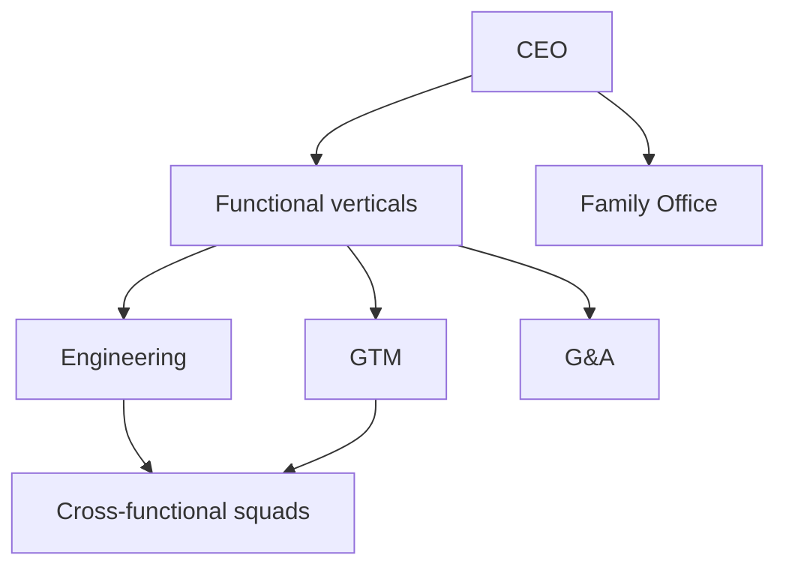

# Organization system

**What's on this page**

- How Inkorporated organizes people, squads, and AI cyborg personas
- Links to org charts, leveling, headcount, RACI, and coverage matrix
- How Family Office integrates under the CEO

**What this enables**

## Matrix at a glance

- Spinning up a coherent global enterprise structure from a single repo
- Clear reporting lines for humans and agent personas
- Scaling from seed team to multi-geo enterprise without rewriting culture

## Philosophy

Inkorporated uses a **matrix organization**:

1. **Functional verticals** — Engineering, Product, Design, GTM, G&A, Security, Data, Customer, Corporate IT, Regional Ops, Family Office.
2. **Squad horizontals** — Cross-functional teams that ship outcomes (platform, growth, trust & safety, IPO readiness, and more).

Every individual (and every cyborg) has:

- A **manager** (career, quality, compensation)
- A **squad** (mission, backlog, delivery) when assigned to product work

Family Office staff report through the **Family Office Director** to the **CEO**, fully integrated on the master chart while maintaining asset and confidentiality firewalls described in [Family office strategy](../corporate_strategy/family_office_strategy.md).

## Navigation

| Document | Purpose |
| --- | --- |
| [Master org chart](org_chart_master.md) | Board → CEO → C-Suite + Family Office |
| [Matrix model](matrix_model.md) | Vertical × squad mechanics |
| [Leveling framework](leveling_framework.md) | IC L3–L8 and manager dual track |
| [Headcount model](headcount_model.md) | Roles unlock by stage |
| [RACI & decision rights](raci_decision_rights.md) | Who decides what |
| [Cyborg deployment map](cyborg_deployment_map.md) | Agent namespaces and gates |
| [Coverage matrix](coverage_matrix.md) | Role ↔ job doc ↔ interview ↔ cyborg |
| [Template variables](template_variables.md) | `{{ORG_LEGAL_NAME}}` and related |
| [Research bibliography](research_bibliography.md) | Frameworks consulted |

## Related catalogs

- [Job role organization](../job_roles/job_role_organization.md)
- [Cyborg overview](../cyborgs/index.md)
- [Project conventions](../project-conventions.md)
