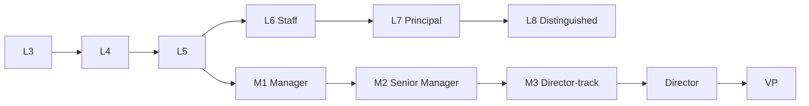

# Leveling framework

**What's on this page**

- IC track L3–L8 (and Distinguished where used)
- Manager track M1–M3, Director, VP
- Promotion signals and anti-patterns
- Mapping to role codes and cyborg personas

**What this enables**

- Fair, portable career conversations across functions
- Headcount planning without inventing infinite titles

## Dual track

| Band | Scope of impact |
| --- | --- |
| L3 | Team tasks with guidance |
| L4 | Independent ownership of projects |
| L5 | Complex multi-quarter work; mentors others |
| L6 Staff | Cross-team technical/product leadership |
| L7 Principal | Org-level direction in a domain |
| L8 Distinguished | Company-defining technical or domain leadership |
| M1–M3 | People leadership depth |
| Director / VP | Org design, multi-team outcomes, exec partnership |

## Principles

1. **Levels are about scope and impact**, not years of experience alone.
2. **Manager and IC tracks are peer tracks** — switching is a transfer, not a demotion.
3. **Not every L×track pair is a separate job page** — use this framework plus exemplar roles (Staff, Principal) and specialized titles.
4. **Cyborgs** may represent a role archetype at a default band; level is adjusted in deployment metadata when needed.

## Promotion packets (minimum)

- Outcomes and evidence (not activity lists)
- Scope expansion examples
- Collaboration and culture signals
- Calibration notes from skip-level or committee
