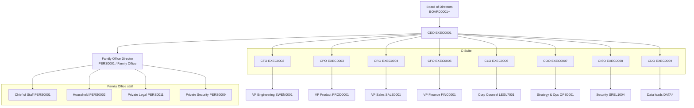

# Master organization chart

**What's on this page**

- Board and CEO reporting structure
- C-Suite and primary vertical heads
- Integrated Family Office branch under the CEO
- Mermaid overview (detail charts live per pillar)

**What this enables**

- Instant orientation for new leaders, auditors, and AI agents
- Consistent role codes across job docs and cyborgs

## Overview chart

!!! note "Expanded role codes"
    New C-Suite codes (COO, CISO, CDO, and others) are part of the saturation catalog. See [Coverage matrix](coverage_matrix.md) and `cyborgs/` for the machine catalog.

## Design rules

1. **Single CEO** is the primary executive node under the Board.
2. **Family Office is first-class** under the CEO — not hidden, not optional in this template.
3. **Dotted lines** (security, privacy, internal audit) may report to Board committees; document in RACI.
4. **Squads** do not appear on this vertical chart; see [Matrix model](matrix_model.md).

## Pillar detail

| Pillar | Entry |
| --- | --- |
| Executive | [Executive roles](../job_roles/executive_leadership/index.md) |
| Engineering | [Engineering roles](../job_roles/engineering_technology/index.md) |
| Product & design | [Product & design](../job_roles/product_design/index.md) |
| GTM | [GTM roles](../job_roles/go_to_market_sales_marketing/index.md) |
| G&A | [G&A roles](../job_roles/ga_general_administrative/index.md) |
| Family Office | [Personal staff](../job_roles/personal_staff/index.md) |
