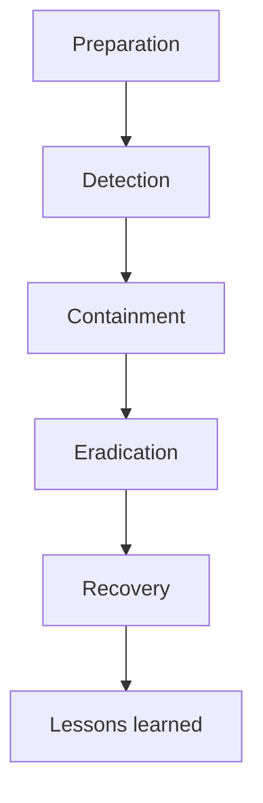

# Incident Response Plan

**What's on this page**

- Core content for this topic in the Inkorporated enterprise OS.
- Practical guidance, roles, or standards as applicable.

**What this enables**

## IR phases

- Consistent enterprise operations and decision-making.
- Shared language for humans and cyborg AI agents.

## 1. Purpose
The purpose of this Incident Response Plan (IRP) is to provide a structured approach for handling security incidents. The goals are to minimize damage, reduce recovery time and costs, and ensure effective communication.

## 2. Roles and Responsibilities
*   **Incident Commander (IC)**: The primary leader responsible for managing the incident response.
*   **Incident Response Team (IRT)**: Technical staff responsible for investigating and remediating the incident (Security, IT, Engineering).
*   **Legal Counsel**: Advises on legal obligations, regulatory reporting, and liability.
*   **Communications**: Manages internal and external communications (PR, HR).

## 3. Incident Response Phases

### Phase 1: Preparation
*   Maintain an up-to-date contact list for the IRT.
*   Ensure monitoring and logging tools are active and effective.
*   Conduct regular table-top exercises to test the plan.

### Phase 2: Identification & Detection
*   Monitor systems for anomalies (IDS/IPS, log analysis).
*   Encourage employee reporting of suspicious activities.
*   **Triage**: Verify if the event is a genuine security incident and classify its severity (Low, Medium, High, Critical).

### Phase 3: Containment
*   **Short-term Containment**: Immediate actions to stop the spread (e.g., disconnecting a compromised host from the network).
*   **System Backup**: Take a forensic image of the affected systems if necessary for legal evidence.
*   **Long-term Containment**: Apply temporary fixes to allow operations to continue while the root cause is addressed.

### Phase 4: Eradication
*   Remove the root cause of the incident (e.g., delete malware, disable breached accounts, patch vulnerabilities).
*   Verify that the threat is completely eliminated.

### Phase 5: Recovery
*   Restore systems from clean backups.
*   Monitor the systems closely for any signs of re-infection or residual threat.
*   Declare the incident closed when operations return to normal.

### Phase 6: Lessons Learned (Post-Incident)
*   Conduct a "Post-Mortem" meeting within 2 weeks of incident closure.
*   Document what happened, what went well, and what needs improvement.
*   Update the IRP and security controls based on findings.

## 4. Reporting Requirements
*   **Internal**: Update the Executive Team regularly during Critical/High incidents.
*   **External**: Notify regulatory bodies (e.g., GDPR authorities) within 72 hours if personal data is compromised. Notify affected customers/partners as required by law and contracts.

## 5. Contact Information
*   **Security Emergency**: `security-emergency@company.com` or call `+1-555-0199`.
