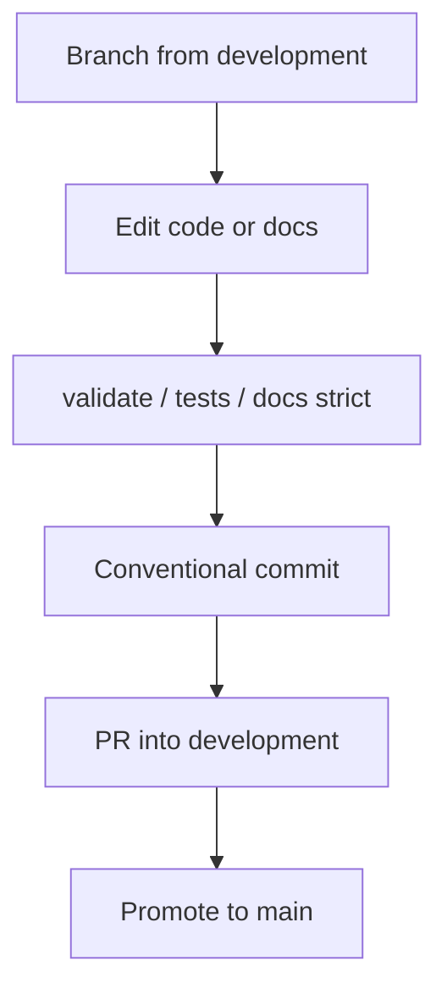

# Project conventions & style guide

**What's on this page**

- Core principles and sources of truth
- Naming, formatting, and linting across stacks
- Documentation coverage requirements
- Change discipline and non-negotiable safety invariants

**What this enables**


## Contribution flow



- Consistent contributions without hunting scattered READMEs
- Safer changes to GitOps, domains, secrets, and cyborgs

This is the **canonical human reference**. AI agents should also read root [AGENTS.md](https://github.com/toxicoder/inkorporated/blob/main/AGENTS.md). Contribution hub: root [CONTRIBUTING.md](https://github.com/toxicoder/inkorporated/blob/main/CONTRIBUTING.md).

---

## 1. Core principles

| Principle | Meaning |
| --- | --- |
| **Stability first** | Prefer reversible changes; protect prod access paths |
| **GitOps as SoT** | Desired cluster state lives in git (`apps/`) |
| **No hardcoded domains** | Use config / `{{DOMAIN_BASE}}` templates |
| **Secrets out of git** | `.env` examples only; chmod 600 local secrets |
| **Hermetic tests** | Validation runs without a live cluster when possible |
| **Docs as code** | MkDocs strict builds; enterprise OS + infra in one site |
| **Bazel-friendly** | Prefer Bazel targets for tests; WORKSPACE mode (not bzlmod) |
| **Least privilege agents** | Cyborg tools allowlisted; CRITICAL requires HITL |

---

## 2. Sources of truth

| Path | Authoritative for |
| --- | --- |
| `infrastructure/terraform/` | Cloud/Proxmox provisioning |
| `infrastructure/ansible/` | k3s and host configuration |
| `apps/` | ArgoCD Applications / ApplicationSets |
| `config/environments/` | Environment configuration |
| `.devcontainer/.env.example` | Documented secret *keys* (not values) |
| `docs/` | Human documentation site content |
| `cyborgs/*.yaml` | Machine agent persona specs |
| `mkdocs.yml` | Docs navigation and site config |

---

## 3. Naming conventions

| Area | Pattern | Examples |
| --- | --- | --- |
| Directories | `snake_case` or established tree names | `job_roles/`, `corporate_strategy/` |
| Shell scripts | `snake_case.sh` | `validate_domain_config.sh` |
| Terraform | `snake_case` resources | `module.network` |
| K8s manifests | descriptive YAML | `argocd-appset.yaml` |
| Cyborg IDs | `PREFIX####` | `EXEC0001`, `SWEN1001`, `PERS0001` |
| Branches | `type/kebab-description` | `docs/enterprise-os-and-practices` |

### Role ID prefixes

`BOARD`, `EXEC`, `SWEN`, `SREL`, `DATA`, `PROD`, `DESN`, `RSCH`, `SALE`, `MKTG`, `COMM`, `CSM`, `FINC`, `PEOP`, `LEGL`, `OPS`, `REAL`, `POLI`, `PERS`, `ITOP`, `CUST`, `REGN`, `SQAD`, `TPGM`.

---

## 4. Bazel and validation entrypoints

Workspace mode: `common --enable_workspace`, bzlmod disabled (see `.bazelrc` / `AGENTS.md`).

```bash
./run_all_tests.sh
./validate_config.sh
./validate_domain_config.sh
bazel test //:all_tests
./docs/manage-docs.sh build --strict
```

Prefer adding new checks as Bazel `sh_test` targets with **direct labels** in `data` (no `glob()` in data).

---

## 5. Formatting and linting

| Stack | Tooling |
| --- | --- |
| Shell | `shfmt` (`-i 2 -ci`), `shellcheck` (warnings are defects) |
| YAML | `prettier` + `yamllint` (2-space indent) |
| Terraform | `terraform fmt` / repo validate targets |
| Ansible | `ansible-lint` via wrapper |
| Bazel | `buildifier` |
| Markdown docs | language fences; MkDocs strict |

Pre-commit config: `.pre-commit-config.yaml` (optional local install).

---

## 6. Shell scripts

- `set -euo pipefail` on entry scripts
- Quote expansions; log diagnostics to **stderr**
- Prefer small functions; document public helpers
- No secrets in scripts or sample output

---

## 7. Terraform

- Modules under `infrastructure/terraform/`
- Use `moved` blocks when refactoring addresses
- Validate via `validate_terraform.sh` / Bazel targets
- Never commit backend credentials

---

## 8. Ansible

- Roles and playbooks under `infrastructure/ansible/`
- Use `ansible_lint_wrapper.sh` (skips if binary missing)
- Inventory secrets stay local / example-only in git

---

## 9. Kubernetes / GitOps

- Manifests in `apps/shared` + `apps/environments`
- **Never** hardcode customer domains in Ingress
- Prefer ApplicationSets for multi-env
- Document PDB, resources, and secrets patterns consistently

---

## 10. Config and secrets

- Sensitive values: `.devcontainer/.env` (gitignored), mode `600`
- Validate with `validate_config.sh`
- Run security scan tests (`//tests/config:config_security_scan`) when touching config paths

---

## 11. Documentation coverage

| Stack | Requirement |
| --- | --- |
| Shell | Purpose header; comment public functions |
| Python | Module + function docstrings (Args/Returns/Raises) where present |
| Terraform | Variable/output descriptions; module README |
| Ansible | Clear task names; role README |
| YAML GitOps | Top-of-file purpose when non-obvious |
| Cyborg YAML | Full schema; system_prompt required |
| Markdown (`docs/`) | Frontmatter + “What's on this page” / “What this enables”; listed in `mkdocs.yml` nav when user-facing |

Docs engine: **MkDocs Material** + **mike** versioning. See [docs/CONTRIBUTING.md](CONTRIBUTING.md).

### Docs linking (branch-aware)

- **Between docs pages:** relative `.md` links only (never hardcode `https://toxicoder.github.io/inkorporated/...` for in-site navigation).
- **Repo paths outside `docs/`:** GitHub URLs using branch **`main`** as the canonical form; `docs/hooks.py` stamps `main` → `development` when building the development docs alias.
- **Do not** commit `blob/development` / `tree/development` source links; use `main` and let the hook bind the branch.
- Generated HTML (cyborg roster) must use directory URLs (`personas/ID/`), not `.md` hrefs.
- Checker: `docs/validate_docs_links.py`.

---

## 12. Testing

- Prefer hermetic script tests
- Bazel `sh_test` for wrappers
- Domain validation on every PR that touches apps/config
- Docs strict build on docs changes

---

## 13. Change discipline

1. Branch from `development`
2. Small focused commits (conventional style)
3. Update docs when behavior or public contracts change
4. Run relevant validate/tests
5. PR into `development` (not `main`) unless hotfix
6. **Agents must not push or open PRs unless the user explicitly requests**

---

## 14. Non-negotiable safety invariants

1. No live secrets in git  
2. No hardcoded production domains in Ingress  
3. `.devcontainer/.env` never committed  
4. Cyborg CRITICAL actions require human approval  
5. Family Office agents restricted invokers  
6. Do not weaken security scan or domain validation without explicit design review  
