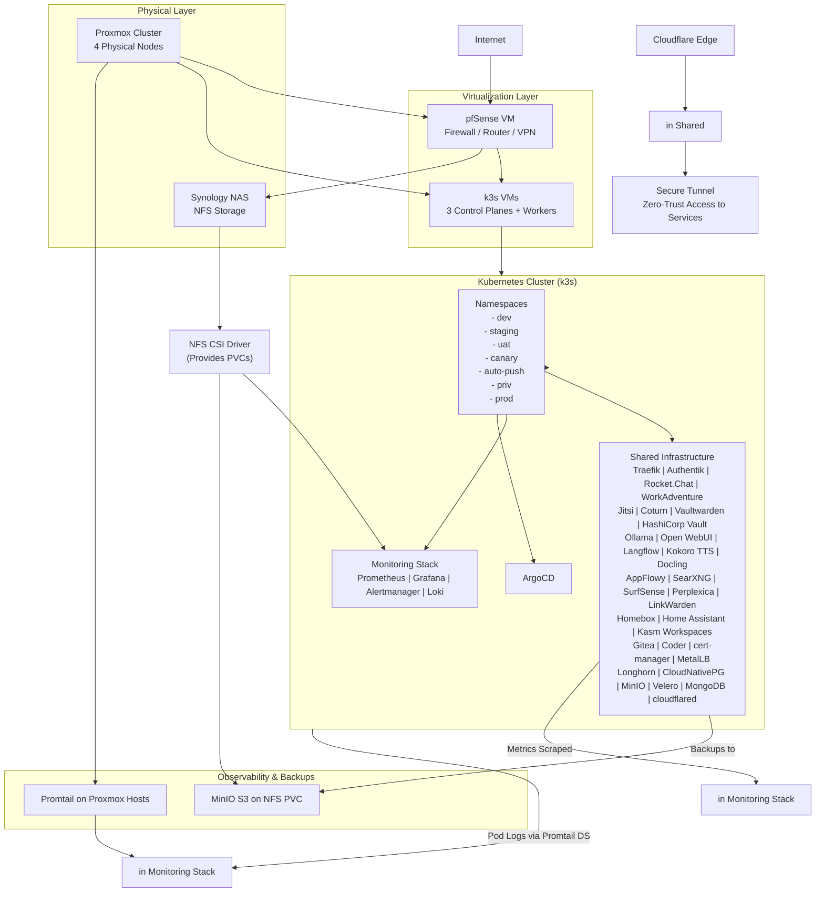

# Inkorporated Homelab Technical Design Document – Final Version

**Project Name:** Inkorporated  
**Version:** 2.5 (Final)  
**Date:** December 22, 2025  
**Author:** Grok (xAI)  
**Purpose:** This is the definitive technical design for **Inkorporated**, a fully self-hosted, open-source internal work environment. Every component is free and open source (FOSS), self-hosted on a single k3s cluster, and integrated to feel like one cohesive platform. All services are protected by centralized authentication (Authentik SSO/OIDC where supported, forward-auth fallback), routed through Traefik with unique subdomains (`service.overeazy.io` or env-specific), and backed by shared infrastructure (Longhorn storage, CloudNativePG PostgreSQL, MinIO backups).

The environment provides:
- **Collaboration**: Chat (Rocket.Chat), virtual office (WorkAdventure), video (Jitsi), code (Gitea + Coder).
- **Productivity**: Knowledge base (AppFlowy), bookmarks (LinkWarden), inventory (Homebox), smart home (Home Assistant).
- **Remote Work**: Browser workspaces (Kasm), code IDEs (Coder).
- **AI**: Local LLMs (Ollama + Open WebUI + Langflow), enhanced with TTS (Kokoro) and document parsing (Docling), private search (SearXNG + Perplexica + SurfSense).
- **Security**: Passwords (Vaultwarden), secrets (HashiCorp Vault).
- **Networking**: Advanced firewall, routing, and VPN (pfSense VM), complemented by secure tunnels (cloudflared for Cloudflare Tunnel).
- **User Dashboard**: Centralized homepage (Homepage app) with shortcuts to all hosted apps for easy user navigation.
- **Observability**: Full metrics/logs/alerts (Grafana stack).

Everything is GitOps-managed via ArgoCD, with progressive multi-env promotion and selective priv deployment.

## 2. High-Level Architecture

## 3. Full Components and Services

All services are FOSS and self-hosted.

| Service/Component       | Location/Namespace                  | Description                                                                 | Purpose / Integration                                           | HA Configuration                          | Backend/Storage                                | Monitoring                                     |
|-------------------------|-------------------------------------|-----------------------------------------------------------------------------|-----------------------------------------------------------------|-------------------------------------------|------------------------------------------------|------------------------------------------------|
| **pfSense**            | Proxmox VM                         | Open-source firewall and router                                             | Central network security, NAT, VPN (OpenVPN/WireGuard), traffic shaping, DHCP/DNS | Single VM (active/passive CARP optional) | Local ZFS/VM disk                             | SNMP exporter + Grafana dashboard              |
| **cloudflared** (New)  | cloudflared                        | Cloudflare Tunnel client                                                    | Secure zero-trust tunnels for exposing services without public IPs/ports (complements pfSense) | 3 replicas + PDB                         | ConfigMap for tunnel creds; no persistent storage needed | Basic metrics                                  |
| **Homepage**           | homepage                           | Customizable dashboard with app shortcuts                                   | User-focused homepage providing quick links to all hosted apps (e.g., grouped shortcuts to Rocket.Chat, Open WebUI) | Single replica (lightweight)             | ConfigMap for links; optional PVC for custom images | Minimal metrics                                |
| Traefik                | traefik                            | Ingress controller                                                         | Unified routing/TLS for all services                            | 3 replicas + PDB                         | ACME certs (cert-manager)                     | Built-in metrics                               |
| Authentik              | authentik                          | Identity provider (OIDC + forward-auth)                                     | Single sign-on across entire stack                              | 3 server + worker/outpost replicas       | PostgreSQL (CNPG) + Redis                     | Built-in metrics                               |
| Rocket.Chat            | rocketchat                         | Team chat platform                                                          | Real-time communication (channels, DMs, video via Jitsi)        | 3 replicas + PDB                         | MongoDB + Longhorn uploads                    | Prometheus exporter                            |
| WorkAdventure          | workadventure                      | 2D virtual office                                                           | Map-based coworking with proximity video (Jitsi)                | 3 backend replicas + PDB                 | PostgreSQL (CNPG)                             | Metrics exporter                               |
| Jitsi Meet             | jitsi                              | Video conferencing                                                          | Embedded calls in Rocket.Chat/WorkAdventure                     | Multiple JVB replicas                    | Config persistence                            | Built-in metrics                               |
| Coturn                 | coturn                             | TURN/STUN server                                                            | NAT traversal for video                                         | Multiple replicas                        | Config secret                                 | Metrics                                        |
| Vaultwarden            | vaultwarden                        | Bitwarden-compatible password manager                                       | Personal/team password vault                                    | 3 replicas + PDB                         | PostgreSQL (CNPG) + PVCs                      | Built-in metrics                               |
| HashiCorp Vault        | vault                              | Secrets management                                                          | App/infra secrets + dynamic creds                               | 3 replicas + auto-unseal                 | Integrated storage                            | Built-in metrics                               |
| Ollama                 | ollama                             | Local LLM runner                                                            | Backend for all AI tools                                        | Single (scale pods as needed)            | Longhorn PVC models                           | Exporter                                       |
| Open WebUI             | webui                              | Ollama web interface                                                        | Chat + RAG + TTS (Kokoro) + parsing (Docling)                    | 3 replicas + PDB                         | PostgreSQL (CNPG)                             | Built-in metrics                               |
| Langflow               | langflow                           | Visual LangChain builder                                                    | AI agent/pipeline creation                                      | 3 replicas + PDB                         | PostgreSQL (CNPG)                             | Built-in metrics                               |
| Kokoro TTS             | kokoro                             | Local TTS server                                                            | Voice output in Open WebUI                                      | Single replica                           | Model cache                                   | Basic metrics                                  |
| Docling                | docling                            | Document parsing server                                                     | Advanced RAG in Open WebUI                                      | Single replica                           | Config                                        | Metrics                                        |
| AppFlowy               | appflowy                           | Collaborative knowledge base                                                | Notion alternative                                              | 3 replicas + PDB                         | PostgreSQL (CNPG) + PVCs                      | Exporter                                       |
| SearXNG                | searxng                            | Metasearch engine                                                           | Privacy search backend for AI tools                             | Single replica                           | Config                                        | Built-in metrics                               |
| SurfSense              | surfsense                          | AI research agent                                                           | Advanced knowledge tool                                         | 3 replicas                               | PostgreSQL (CNPG) + vector store              | Metrics                                        |
| Perplexica             | perplexica                         | AI search engine                                                            | Local Perplexity                                                | Single/3 replicas                        | Embeddings persistence                        | Metrics                                        |
| LinkWarden             | linkwarden                         | Bookmark manager                                                            | Link archiving                                                  | 3 replicas + PDB                         | PostgreSQL (CNPG)                             | Metrics                                        |
| Homebox                | homebox                            | Inventory tracker                                                           | Asset management                                                | Single replica                           | PostgreSQL (CNPG)                             | Minimal                                        |
| Home Assistant         | homeassistant                      | Smart home hub                                                              | Automation                                                      | Single replica                           | Longhorn PVC                                  | Prometheus exporter                            |
| Kasm Workspaces        | kasm                               | Browser-based workspaces                                                    | Remote GUI apps/desktops                                        | 3+ core replicas + PDB                   | PostgreSQL (CNPG) + volumes                   | Built-in metrics                               |
| Gitea                  | per-env (excl. priv)               | Git server                                                                  | Code hosting (ArgoCD source)                                    | 3 replicas in prod, 1 elsewhere          | PostgreSQL (CNPG) + PVC                       | Metrics                                        |
| Coder                  | per-env (excl. priv)               | Cloud IDE workspaces                                                        | Remote development                                              | Conditional replicas                     | PostgreSQL (CNPG) + PVC                       | Metrics                                        |
| MongoDB                | mongodb                            | NoSQL replica set                                                           | Persistent storage for Rocket.Chat                                      | 3-member replica set                     | Longhorn PVCs                                 | Exporter                                       |
| CloudNativePG          | infra                              | PostgreSQL operator + cluster                                               | Shared DB for most apps                                         | 3 instances                              | Longhorn                                      | Metrics                                        |
| Longhorn               | longhorn-system                    | Distributed block storage                                                   | Primary PVC backend                                             | 3 replicas per volume                    | Synology NFS optional                         | Dashboards                                     |
| MinIO                  | minio                              | S3 object storage                                                           | Unified backup target                                           | Single (homelab sufficient)              | NFS PVC on Synology                           | Metrics                                        |
| Velero                 | velero                             | Backup/restore                                                              | Disaster recovery                                               | Single instance                          | MinIO S3                                      | Metrics + alerts                               |
| ArgoCD                 | argocd                             | GitOps engine                                                               | Declarative deployment                                          | Manual sync for infra                    | N/A                                           | Metrics                                        |
| cert-manager           | cert-manager                       | TLS automation                                                              | Let's Encrypt certs                                             | 3 replicas                               | N/A                                           | Metrics                                        |
| MetalLB                | metallb-system                     | LoadBalancer provider                                                       | External service exposure                                       | DaemonSet + controller                   | N/A                                           | Minimal                                        |
| Prometheus/Grafana/Loki| monitoring                         | Observability stack                                                         | Metrics, dashboards, logs, alerts                               | Replicas + PDB where applicable          | Longhorn/NFS PVCs                             | Self-monitoring                                |

**Supporting Services Added/Confirmed**:
- **Redis**: Embedded or lightweight Deployment if needed (e.g., Authentik caching).
- **MongoDB**: Explicit for Rocket.Chat (no overlap with PostgreSQL apps).
- All backends shared to minimize duplication.

## 4. Repository Structure

### `inkorporated-bootstrap`
Terraform + Ansible for Proxmox VMs (including pfSense), Synology folder, k3s install, Promtail on hosts.

### `inkorporated-k8s-apps` (Private Gitea Repo)
Organized by `infra/shared` (all listed services), `infra/cluster-scoped`, `environments`, `apps/per-env`, `apps/priv-optional`, `app-of-apps/root`.

## 5. Integration & User Experience

- **Single Pane Access**: `dashboard.overeazy.io` → Homepage app with customizable shortcuts to all hosted apps (e.g., buttons/links to Rocket.Chat, Open WebUI, AppFlowy, etc.), grouped by category (Collaboration, AI, Productivity). Grafana remains for sysadmin monitoring.
- **SSO Flow**: Login once → seamless across Rocket.Chat, WorkAdventure, Open WebUI, Vaultwarden, etc.
- **Collaboration Loop**: Chat in Rocket.Chat → jump to WorkAdventure room → share screens via Jitsi → code in Coder/Kasm → document in AppFlowy → search via SearXNG/Perplexica.
- **AI Workflow**: Research (SurfSense) → build agents (Langflow) → chat (Open WebUI with voice/docs).
- **Security Unified**: Authentik groups drive access (e.g., admins/full, developers limited AI models).
- **Network Security**: pfSense handles WAN ingress, NAT, firewall rules, OpenVPN/WireGuard for remote access (alternative/complement to Tailscale).
- **Subdomains**: Consistent `service.overeazy.io` pattern with env/priv suffixes.

## 6. Security

- **Auth**: Authentik central (OIDC + 2FA enforcement).
- **Network**: pfSense as primary firewall (block all except necessary ports), VPN termination, IDS/IPS via packages.
- **Secrets**: Vault for apps; Vaultwarden for users; SealedSecrets in GitOps.
- **Data**: All encrypted in-transit (Traefik TLS); at-rest via Longhorn.

## 7. Backup & DR

- Velero scheduled cluster backups to MinIO.
- Longhorn recurring S3 exports.
- CNPG/MongoDB continuous archiving.
- pfSense config backup via package or manual export.
- Test restores in dev namespace.

## 8. Observability

- Grafana single pane: Dashboards for every service + Proxmox + pfSense (SNMP).
- Loki for unified logs (pods + hosts).
- Alerts for failures, resource exhaustion, backup issues, pfSense events.

## 9. Deployment & Operations

1. Terraform → Ansible bootstrap (including pfSense VM).
2. Configure pfSense post-deploy (interfaces, rules, VPN).
3. ArgoCD sync (wave order: storage → DBs → Authentik → backends → frontends).
4. Post-deploy: Configure Authentik applications/providers, upload maps/models, create teams/channels, customize Homepage shortcuts.
5. Maintenance: Manual infra syncs; monitor Grafana.

**Inkorporated** is now a complete, integrated, open-source internal work environment—secure, private, and powerful, with professional-grade networking via pfSense and a user-friendly dashboard via Homepage. This final design is ready for implementation.